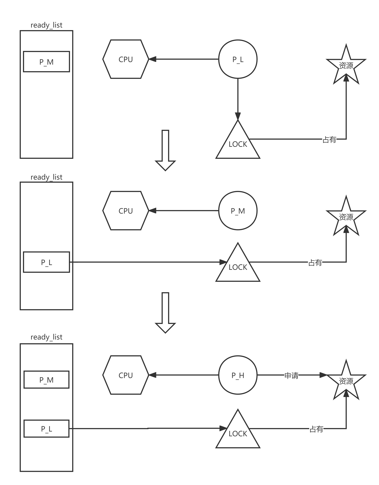
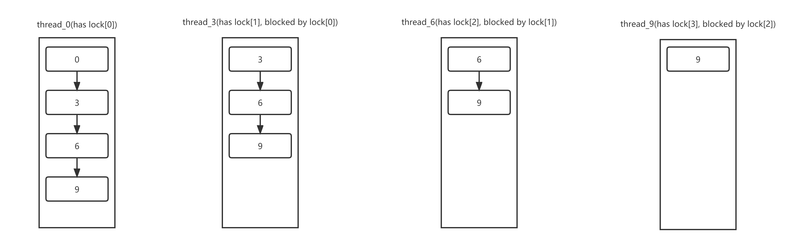

# **`ZJUT`操作系统课程设计** #
**班级：大数据分析2101**

**姓名：温家伟**

**学号：202103151422**


## **1.项目介绍**

操作系统课设内容是实现`pintos`操作系统。通过对`pintos`的设计开发与运行，加深自身对操作系统的理解与认知。

本实验完成了`shell`、`thread`和`userprog`三个部分。

## 2.`shell`

`shell`部分主要需要完成五个`Mission`

1.  `Add support for cd and pwd`
2.  `Program execution`
3.  `Path resolution`
4.  `Input/Output Redirection`
5.  `Signal Handling and Terminal Control`

`shell`的大致工作流程如下图：

```flow
st=>start: 开始
op1=>operation: 读取输入行
op2=>operation: 分词
op3=>operation: 寻找内建命令
cond1=>condition: 是否有内建命令？
op4=>operation: 执行内建命令
op5=>operation: 运行外部程序
op6=>operation: 创建子进程
op7=>operation: 子进程执行程序
op8=>operation: 管道处理
op9=>operation: 等待子进程结束
e=>end: 结束

st->op1->op2->cond1
cond1(yes)->op4->op2
cond1(no)->op5->op2
op5->op6->op7->op9
op6->op8
op8->op9
op9->op2
op4(right)->op2
```

### 2.1 `Add support for cd and pwd`

- 实现`cd`命令

  - 参数解析

    首先要实现`cd`命令，需要对输入的参数进行解析。因为`cd`命令只能跟一个参数，所以如果解析出两个以上参数就直接返回错误码`-1`。如果参数为空，那么就返回家目录路径。

    ```c
    if (tokens->tokens_length > 2) 
    {
      fprintf(stderr, "cd: 太多的参数个数\n");
      // 异常退出，错误码返回-1
      return -1;
    }
    else if (tokens->tokens_length == 1) 
    { 
      // 如果只有一个选项，那么返回家目录
      // "cd" == "cd ~"
      // 获取家目录的环境变量
      const char* homepath = getenv("HOME");
      if (homepath == NULL) 
      {
        fprintf(stderr, "cd: 家目录不存在\n");
        // 异常退出，错误码返回-1
        return -1;
      }
      // 移动值家目录
      chdir(homepath);
      // 正常结束，返回0
      return 0;
    } 
    ```

  - 处理路径

    如果参数不为空，那么就需要处理路径。如果参数以 "~" 开头，则将 "~" 替换为用户的家目录路径，然后将此路径与 "~" 后面的相对路径连接起来；如果不是以 "~" 开头，则直接使用该路径。

    ```c
    else 
    {
      const char* path = (tokens->tokens[1]);
      size_t path_len = strlen(path);
      char* dir;
      if (path[0] == '~') 
      { 
        // 如果参数以 "~" 开头，则将 "~" 替换为用户的家目录路径，然后将此路径与 "~" 后面的相对路径连接起来
        uid_t uid = getuid();
        struct passwd* pwd = getpwuid(uid);
        // 如果pwd失败
        if (!pwd) 
        {
          printf("ID 为 %u 的用户未知\n", uid);
          return -1;
        }
        // 成功
        const char* home = pwd->pw_dir;
        size_t home_len = strlen(home);
        dir = malloc(home_len + path_len);
        strcpy(dir, home);
        strcpy(dir + home_len, path + 1);
      } 
      else 
      {
        dir = malloc(path_len + 1);
        strcpy(dir, path);
      }
    ```

  - 移动路径

    最后调用`chdir`函数进行路径移动。

    ```c
    if (chdir(dir) == -1) 
    {
      fprintf(stderr, "cd: ");
      perror(path);
      free(dir);
      return -1;
    }
    free(dir);
    return 0;
    ```

- 实现`pwd`命令

  实现`pwd`命令比较简单，只需要调用`getcwd`函数获取当前工作目录并打印出来即可。

  ```c
  int cmd_pwd(unused struct tokens* tokens) {
    char* currentpath = getcwd(NULL, 0);
    puts(currentpath);
    free(currentpath);
    return 0;
  }
  ```

### 2.2  `Program execution`

我们知道`linux`执行指令都是找到相应的位置，然后执行它，这里分为内建命令和自定义命令，我们执行内建命令的时候不需要带路径，这是因为环境变量帮我们维护好了，而执行自定义命令时，需要带路径。

- 内建命令

  首先，通过 `getenv("PATH")` 获取环境变量 `PATH` 的值，并将其保存在 `env_path` 变量中。

  然后，使用 `strtok` 函数以 `:` 作为分隔符将 `env_path` 字符串分割成多个路径字符串，并依次遍历每个路径。

  对于每个路径，首先计算出拼接后的路径长度，并使用 `malloc` 分配内存。然后将临时路径字符串复制到新分配的内存空间中，并在末尾添加 `/` 字符和要执行的命令字符串。

  接下来，使用 `access` 函数检查该路径是否可执行。如果可执行，就使用 `execv` 函数来执行该命令。

  执行完毕后，释放路径的内存空间，并继续下一个路径的搜索。

  如果没有找到可执行的路径，就输出一条错误信息。

  最后，释放命令和参数的内存空间，销毁解析命令的 `tokens` 对象，然后退出程序（返回值为 -1）。

  ```c
   char* env_path = getenv("PATH");
      size_t cmd_len = strlen(cmd);
      char* temp = strtok(env_path, ":");
      while (temp != NULL) {
        size_t temp_len = strlen(temp);
        char* path = malloc(temp_len + 1 + cmd_len + 1);
        strcpy(path, temp);
        path[temp_len] = '/';
        strcpy(path + temp_len + 1, cmd);
        if (access(path, X_OK) == 0)
        {
          execv(path, argv);
        }
        free(path);
        temp = strtok(NULL, ":");
      }
      printf("%s: command not found\n", cmd);
    }
    free(cmd);
    free(argv);
    tokens_destroy(tokens);
    exit(-1);
  ```

- 自定义命令

  首先，使用 `fork` 函数创建一个新的子进程，该函数会返回两次，一次在父进程中返回子进程的 PID，另一次在子进程中返回 0。

  如果 `fork` 调用失败，输出错误信息并返回 -1。

  如果 `fork` 调用成功，并且当前进程是子进程，则进行以下操作：

  - 如果 `read_fd` 不等于 -1，使用 `dup2` 函数将标准输入文件描述符 `STDIN_FILENO` 重定向到 `read_fd` 所表示的文件描述符。
  - 如果 `pipe_fd` 不为 NULL，使用 `dup2` 函数将标准输出文件描述符 `STDOUT_FILENO` 重定向到 `pipe_fd[1]` 所表示的文件描述符。
  - 如果 `session_pgid` 的值为 0，则调用 `setpgrp` 函数将子进程设置为新的进程组的组长；否则，调用 `setpgid` 函数将子进程加入到 `session_pgid` 所表示的进程组中。
  - 重置 `SIGINT` 和 `SIGTTOU` 信号处理函数为默认处理函数。
  - 调用 `child_process` 函数执行指定范围内的命令。

  如果当前进程是父进程，则进行以下操作：

  - 如果 `session_pgid` 的值为 0，将 `session_pgid` 赋值为子进程的 PID，并使用 `tcsetpgrp` 函数将当前终端的前台进程组设置为 `session_pgid` 所表示的进程组。

  最后，返回 0 表示执行成功。

  ```c
  int execute(int read_fd, int* pipe_fd, int start, int end, struct tokens* tokens) 
  {
    // 执行的时候先 fork 创建子进程
    pid_t child_pid = fork();
    if (child_pid == -1) 
    {
      perror("fork");
      return -1;
    } 
    else if (child_pid == 0) 
    { 
      // 子进程
      if (read_fd != -1) 
      {
        // 重定向
        dup2(read_fd, STDIN_FILENO); 
      }
      if (pipe_fd != NULL) 
      {
        // 重定向
        dup2(pipe_fd[1], STDOUT_FILENO); 
      }
      if (session_pgid == 0) 
      {
        setpgrp();
      } else 
      {
        setpgid(0, session_pgid);
      }
      signal(SIGINT, SIG_DFL);
      signal(SIGTTOU, SIG_DFL);
      child_process(start, end, tokens); 
    } else 
    {                             
      // 父进程
      if (session_pgid == 0) 
      {
        session_pgid = child_pid;
        tcsetpgrp(STDIN_FILENO, session_pgid);
      }
    }
    return 0;
  }
  ```

### 2.3 `Path resolution`

1. 调用 `getenv` 函数获取 PATH 环境变量的值。
2. 使用 `strtok` 函数依次遍历 PATH 环境变量中的每个目录，将目标命令名拼接在每个目录名之后，以构建完整的文件路径。
3. 使用 `access` 函数检查该文件路径是否存在。
4. 如果存在，则返回该路径；否则继续遍历下一个目录，直到找到可执行文件或遍历完所有目录。
5. 如果所有目录都被遍历了仍未找到可执行文件，则返回 `NULL`。

```c
char* path_env = getenv("PATH");
  if (path_env == NULL) {
    return NULL;
  }

  char* start = path_env;
  char* end = path_env;

  char* path = (char*)malloc(MAX_PATH_LEN * sizeof(char));
  if (path == NULL) {
    return NULL;
  }
  path[0] = '\0';

  while (*end != '\0') {
    // 找到路径分隔符
    while (*end != ':' && *end != '\0') {
      end++;
    }

    // 拼接路径
    strncpy(path, start, end - start);
    path[end - start] = '/';
    strncat(path, cmd, MAX_PATH_LEN - strlen(path) - 1);

    // 检查文件是否存在、是否可执行
    struct stat file_stat;
    if (stat(path, &file_stat) == 0 && S_ISREG(file_stat.st_mode) && (file_stat.st_mode & S_IXUSR)) {
      return path;
    }

    // 继续检查下一个路径
    if (*end == ':') {
      start = end + 1;
      end++;
    }
  }

  free(path);
```

### 2.4  `Input/Output Redirection`

重定向，分为输入重定向和输出重定向。

首先，根据 `end` 和 `start` 的值计算需要分配的 `argv` 数组的大小，并使用 `malloc` 分配内存空间。

然后，使用循环遍历从 `start` 到 `end` 的每个索引，获取对应索引处的命令行标记（token）。

如果该标记以 `>` 开头，表示输出重定向操作。下一个标记是文件名，使用 `open` 函数打开该文件，并设置适当的权限和标志。然后，将文件描述符 `fd` 与标准输出文件描述符 `STDOUT_FILENO` 进行重定向。

如果该标记以 `<` 开头，表示输入重定向操作。下一个标记是文件名，使用 `open` 函数打开该文件。如果打开失败，输出错误信息并释放内存空间，销毁解析命令的 `tokens` 对象，然后退出程序。然后，将文件描述符 `fd` 与标准输入文件描述符 `STDIN_FILENO` 进行重定向。

否则，将该标记添加到 `argv` 数组中。

循环结束后，将 `argv` 数组的最后一个元素设为 `NULL`，以符合 `execv` 函数的参数要求。

接下来，根据 `start` 的值获取命令（可执行文件）的字符串，并计算字符串的长度。

如果命令以 `~` 开头，表示使用绝对路径。首先获取当前用户的用户 ID，并使用 `getpwuid` 函数根据用户 ID 获取用户信息。如果获取失败，输出错误信息并释放内存空间，销毁解析命令的 `tokens` 对象，然后退出程序。然后，将主目录路径和命令字符串拼接到新分配的内存空间中。

否则，直接将命令字符串拷贝到新分配的内存空间中。

如果命令字符串中包含 `/` 字符，表示使用相对或绝对路径。使用 `execv` 函数尝试执行该命令。

如果执行失败，根据 `errno` 的值判断错误类型，并输出相应的错误信息。

最后，释放内存空间，销毁解析命令的 `tokens` 对象，并退出程序（返回值为 -1）。

```c
char** argv = malloc(sizeof(char*) * (end - start + 1));
  int k = 0;
  for (int i = start; i < end; i++) 
  {
    char* token = tokens_get_token(tokens, i);
    if (token[0] == '>') 
    {
      token = tokens_get_token(tokens, ++i);
      int fd = open(token, O_WRONLY | O_CREAT | O_TRUNC, 0664);
      // 重定向
      dup2(fd, STDOUT_FILENO);
    } 
    else if (token[0] == '<') 
    {
      token = tokens_get_token(tokens, ++i);
      int fd = open(token, O_RDONLY);
      if (fd == -1) 
      {
        perror(token);
        free(argv);
        tokens_destroy(tokens);
        exit(-1);
      }
      dup2(fd, STDIN_FILENO);
    } else 
    {
      argv[k++] = token;
    }
  }
  argv[k] = NULL;
  const char* exe = tokens_get_token(tokens, start);
  size_t exe_len = strlen(exe);
  char* cmd;
  if (exe[0] == '~') 
  { 
    // 把 ~ 替换路径
    uid_t uid = getuid();
    struct passwd* pwd = getpwuid(uid);
    if (pwd == NULL) 
    {
      printf("User with %u ID is unknown.\n", uid);
      free(argv);
      tokens_destroy(tokens);
      exit(-1);
    }
    const char* home = pwd->pw_dir;
    size_t home_len = strlen(home);
    cmd = malloc(home_len + exe_len);
    strcpy(cmd, home);
    strcpy(cmd + home_len, exe + 1);
  } 
  else 
  {
    cmd = malloc(exe_len + 1);
    strcpy(cmd, exe);
  }

  if (strchr(cmd, '/')) 
  {
    if (execv(cmd, argv) == -1) 
    {
      if (errno == 13) 
      { 
        // P权限拒绝
        struct stat stat_buf;
        stat(cmd, &stat_buf);
        if (S_ISDIR(stat_buf.st_mode)) 
        { 
          printf("%s: Is a directory\n", cmd);
        } else { // A file
          perror(cmd);
        }
      } 
      else if (exe[0] == '~') 
      {
        printf("%s: No such file or directory\n", exe);
      } 
      else 
      {
        perror(cmd);
      }
    }
  } 
```

### 2.5 `Signal Handling and Terminal Control`

1. 在 `init_shell` 函数中，通过 `signal(SIGTTIN, SIG_IGN)` 来忽略对于后台进程组中的作业的终端写入操作阻塞。
2. 在 `child_process` 函数和 `execute` 函数中，通过设置子进程的信号处理器来忽略 `SIGINT` 和 `SIGTTOU` 信号，保证子进程在执行命令时不会受到这些信号的影响。
3. 在 `main` 函数中，通过 `signal(SIGINT, SIG_IGN)` 和 `signal(SIGTTOU, SIG_IGN)` 来忽略 `SIGINT` 和 `SIGTTOU` 信号，以确保在交互式shell模式下，父进程和子进程都不会受到这些信号的影响。

## 3.`threads` ##
`proj1-threads`部分主要需要完成三个`Mission`：

1. `Alarm Clock`
2. `Priority Scheduling`
3. `Advanced Scheduler` 
### 3.1 Mission 1 Alarm Clock
**实验说明**

重新实现`timer_sleep`函数，在`devices / timer.c`中定义。当前代码的实现方式我们称为“忙等待”，即它在循环中检查当前时间是否已经过去`ticks`个时钟，并循环调用`thread_yield`函数直到循环结束，这种实现方式是十分低效的。我们需要重新实现`timer_sleep`函数，使之高效且避免忙等待。

**实验过程**

- 代码分析

  1. `timer_sleep`

     ```c
     void timer_sleep (int64_t ticks) 
     {
       int64_t start = timer_ticks ();
     
       ASSERT (intr_get_level () == INTR_ON);  
       while (timer_elapsed (start) < ticks) 
       {
           thread_yield (); 
       }
     }
     ```

  2. `thread_yield`

     ```c
     void thread_yield (void) 
     {
       struct thread *cur = thread_current ();
       enum intr_level old_level;               
       ASSERT (!intr_context ());     
       old_level = intr_disable ();   
       if (cur != idle_thread)         
         list_push_back (&ready_list, &cur->elem);
       cur->status = THREAD_READY;
       schedule ();
       intr_set_level (old_level);               
     }
     ```

  3. `schedule`

  	```c
  	static void schedule (void) 
  	{
  	  struct thread *cur = running_thread ();        
  	  struct thread *next = next_thread_to_run ();  
  	  struct thread *prev = NULL;            
  	  ASSERT (intr_get_level () == INTR_OFF);       
  	  ASSERT (cur->status != THREAD_RUNNING);      
  	  ASSERT (is_thread (next));                      
  	  if (cur != next)
  	   prev = switch_threads (cur, next);   
  	  thread_schedule_tail (prev);    
  	```

  观察代码我们可以发现，`timer_sleep`函数的作用是等待一段时间，并在此期间不断调用`thread_yield`函数。如果当前进程不是空闲进程，它会将进程放入就绪队列中。另外，`schedule`函数用于进行进程间的切换和恢复操作。

  然而，`timer_sleep`函数存在一个问题，即线程在就绪态和运行态之间频繁切换，这样会占用大量CPU资源，效率较低。为了解决这个问题，我们希望引入一种机制，实现高效的闹钟功能，即**Efficient Alarm Clock**机制。


- 具体实现

  1. 在`thread.h`的线程结构体中，我们需要添加一个`blocked_ticks`成员变量，用于记录每个线程阻塞的时间。这个成员变量的单位是`timer_ticks`，也就是时钟中断发生的次数。通过记录阻塞的时间，我们可以更好地实现高效的闹钟功能，即**Efficient Alarm Clock**机制。

     ```c
     int64_t blocked_ticks;
     ```

  2. 在`time.c`文件中，我们需要添加一个名为`sleep_list`的链表结构体。这个链表将用于存储处于睡眠状态的线程。在`timer_init`函数中，我们需要对`sleep_list`进行初始化。

     通过引入`sleep_list`链表，我们可以更好地管理处于睡眠状态的线程，并实现高效的闹钟功能，即**Efficient Alarm Clock**机制。

     ```c
     void timer_init (void) 
     {
       pit_configure_channel (0, 2, TIMER_FREQ);
       intr_register_ext (0x20, timer_interrupt, "8254 Timer");
       list_init(&sleep_list);
     }
     ```

  3. 修改`timer_sleep`函数:

     ```c
     void timer_sleep (int64_t ticks) 
     {
       if(ticks>0)
       {
       ASSERT (intr_get_level () == INTR_ON);
       struct thread *h = thread_current();
       enum intr_level old_level = intr_disable();
       int64_t now = timer_ticks();   
       h->blocked_ticks = now + ticks; 
       list_insert_ordered(&sleep_list, &h->elem, time_less, NULL);
       thread_block();
       intr_set_level(old_level);
       }
     }
     ```
  4. 修改`timer_interrupt`函数:

     ```c
     static void
     timer_interrupt (struct intr_frame *args UNUSED)
     {
       ticks++;
       thread_tick ();
         if (thread_mlfqs)
       {
         thread_mlfqs_increment();
         if (ticks % TIMER_FREQ == 0)
           thread_mlfqs_recalc();
         else if (ticks % 4 == 0)
           thread_mlfqs_priority(thread_current());
       }
       struct thread *h;
       while(!list_empty(&sleep_list)) 
       {  
         h = list_entry(list_front(&sleep_list),struct thread, elem);
         if (timer_ticks() < h->blocked_ticks)break; 
         list_pop_front (&sleep_list);
         thread_unblock(h);
       }
     }
     ```


### 3.2 Mission 2 Priority Scheduling

- 实验说明

  `pintos`的原始调度机制是先来先服务（`First-Come-First-Serve，FCFS`）。然而，在实验中我们需要实现优先级调度（`Priority Scheduling`），与`FCFS`有较大的差异。

  为了实现优先级调度，我们可以在原始的线程结构体中添加一个整数类型的成员变量`priority`，用于表示每个线程的优先级大小。通过比较各个线程的优先级大小，我们可以维护一个优先级从大到小的优先级队列。

  通过这种方式，我们可以更好地管理线程的优先级，实现优先级调度机制。

- 实验过程

  在`pintos`中，调度函数`schedule`中使用了`next_thread_to_run`函数获取下一个需要调度执行的进程。而在`thread.c`中，我们可以找到与`ready_list`相关的函数，包括`init_thread()`、`thread_unblock()`和`thread_yield()`等函数，它们都使用`list_push_back`函数将元素添加到队列的尾部。

  为了实现优先级调度，我们可以使用`list.c`中的`list_sort`和`list_insert_ordered`函数来维护优先级队列。其中，`list_sort`函数用于对队列进行排序，而`list_insert_ordered`函数则用于按序插入元素。同时，我们还需要实现一个比较函数`priority_higher`，用于在队列中进行元素比较。

  通过这些操作，我们就可以初步完成优先级队列的维护，这也是实现优先级调度的第一步。

  通过阅读`pintos`的官方文档，我们可以发现：

  > Implement priority scheduling in Pintos. When a thread is added to the ready list that has a higher priority than the currently running thread, the current thread should immediately yield the processor to the new thread. Similarly, when threads are waiting for a lock, semaphore, or condition variable, the highest priority waiting thread should be awakened first. A thread may raise or lower its own priority at any time, but lowering its priority such that it no longer has the highest priority must cause it to immediately yield the CPU.

  在`pintos`中，当前系统并不会马上对优先级大小的改变进行调度变化。为了解决这个问题，我们可以在任何与线程优先级改变相关的操作发生时进行比较分析。如果新的优先级高于当前线程的优先级，就可以调用`thread_yield`函数进行线程调度，并维护优先级队列，实现线程的抢占式调度。

  为了实现这一功能，我们可以修改`thread_create`函数和`thread_set_priority`函数。在这两个函数中，我们可以加入对就绪队列的维护以及线程的优先级调度的逻辑。

  通过这样的修改，我们可以实现当优先级更高的线程出现时，系统立刻进行调度，并执行优先级较高的线程。这样，优先级较低的线程就会放弃CPU，实现了线程的抢占式调度。

  在完成抢占式调度的任务后，我们接着分析官方文档给出的提示：

  > When threads are waiting for a lock, semaphore, or condition variable, the highest priority waiting thread should be awakened first. A thread may raise or lower its own priority at any time, but lowering its priority such that it no longer has the highest priority must cause it to immediately yield the CPU.

  在原始的`pintos`中，锁的申请只涉及信号量的`PV`操作和设置锁的拥有线程。例如，在`lock_acquire`函数中，我们可以看到对信号量的P操作以及将当前线程设置为锁的拥有者。

  为了实现线程优先级与锁的同步，我们需要修改锁的相关代码。具体来说，我们可以在锁的申请与释放过程中考虑线程优先级的调度。

  对于锁的申请过程，我们可以在调用`sema_down`函数之前先保存当前线程的优先级，然后根据锁的持有者是否为空以及当前线程的优先级是否高于锁的持有者的优先级来决定是否进行线程调度。

  对于锁的释放过程，我们可以在调用`sema_up`函数之后根据就绪队列中存在优先级更高的线程来决定是否进行线程调度。如果存在优先级更高的线程，则调用`thread_yield`函数进行线程调度。

  通过这样的修改，我们可以实现线程优先级与锁的同步，确保优先级较高的线程能够及时获得锁资源，并在释放锁后让优先级更高的线程有机会抢占`CPU`执行。

  我们可以看一下`lock_acquire`函数的源代码：

  ```c
  	/* Acquires LOCK, sleeping until it becomes available if
  	   necessary.  The lock must not already be held by the current
  	   thread.
  	
  	   This function may sleep, so it must not be called within an
  	   interrupt handler.  This function may be called with
  	   interrupts disabled, but interrupts will be turned back on if
  	   we need to sleep. */
  	void
  	lock_acquire (struct lock *lock)
  	{
  	  ASSERT (lock != NULL);
  	  ASSERT (!intr_context ());
  	  ASSERT (!lock_held_by_current_thread (lock));
  	
  	  sema_down (&lock->semaphore);
  	  lock->holder = thread_current ();
  	}
  ```

  在信号量结构体中，我们可以发现信号量中维持了一个等待队列`waiters`，而其实现机制与就绪队列相同——先来先服务，这显然不满足优先级调度的要求，需要我们进行改进。

  接着阅读文档：

  >One issue with priority scheduling is “priority inversion”. Consider high, medium, and low priority threads H, M, and L, respectively. If H needs to wait for L (for instance, for a lock held by L), and M is on the ready list, then H will never get the CPU because the low priority thread will not get any CPU time. A partial fix for this problem is for H to “donate” its priority to L while L is holding the lock, then recall the donation once L releases (and thus H acquires) the lock.

  这里提到了线程优先级的捐赠，我们可以进行简单地分析：

   假设优先级分别为高中低的三个线程`P_H`，`P_M`，`P_L`。如果`P_H`需要等待`P_L`(因为`P_L`占有锁)，
  而`P_M`此时在`ready_list` 中，如果按照优先级高低调度，那么`P_L`优先级小于`P_M`，CPU被`P_M`拿去，最后`P_H`得到`CPU`。过程如下图所示：

  

  解决方法就是，`P_H`将自己的优先级先给`P_L`(当`P_L`占有锁的时候)，并且`P_L`释放锁后应立即调整回他原来的优先级。

  `pintos`系统给出了测试函数，我们可以根据测试函数进行分析，通过分析以上测试函数，我们可以将问题简化，因为前几个测试点比较简单，其实处理完复杂的测试之后简单的测试也能通过。所以我们主要思考复杂的测试点：
  `priority-donate-multiple`和`priority-donate-chain`

  `test_priority-donte-multiple`函数：

  ```c
  void test_priority_donate_multiple(void)
  {
      struct lock a, b;
      /* This test does not work with the MLFQS. */
      ASSERT(!thread_mlfqs);
      /* Make sure our priority is the default. */
      ASSERT(thread_get_priority() == PRI_DEFAULT);
      lock_init(&a);
      lock_init(&b);
      lock_acquire(&a);
      lock_acquire(&b);
      thread_create("a", PRI_DEFAULT + 1, a_thread_func, &a);
      msg("Main thread should have priority %d.  Actual priority: %d.",
          PRI_DEFAULT + 1, thread_get_priority());
      thread_create("b", PRI_DEFAULT + 2, b_thread_func, &b);
      msg("Main thread should have priority %d.  Actual priority: %d.",
          PRI_DEFAULT + 2, thread_get_priority());
      lock_release(&b);
      msg("Thread b should have just finished.");
      msg("Main thread should have priority %d.  Actual priority: %d.",
          PRI_DEFAULT + 1, thread_get_priority());
      lock_release(&a);
      msg("Thread a should have just finished.");
      msg("Main thread should have priority %d.  Actual priority: %d.",
          PRI_DEFAULT, thread_get_priority());
  }
  ```

  `test_priority_donate_chain`函数：

  ```c
  void test_priority_donate_chain (void) 
  {
      int i;  
      struct lock locks[NESTING_DEPTH - 1];
      struct lock_pair lock_pairs[NESTING_DEPTH];
      ASSERT (!thread_mlfqs);
  
      thread_set_priority (PRI_MIN);
  
      for (i = 0; i < NESTING_DEPTH - 1; i++)
          lock_init (&locks[i]);
  
      lock_acquire (&locks[0]);
      msg ("%s got lock.", thread_name ());
  
      for (i = 1; i < NESTING_DEPTH; i++)
      {
          char name[16];
          int thread_priority;
          snprintf (name, sizeof name, "thread %d", i);
          thread_priority = PRI_MIN + i * 3;
          lock_pairs[i].first = i < NESTING_DEPTH - 1 ? locks + i: NULL;
          lock_pairs[i].second = locks + i - 1;
  
          thread_create (name, thread_priority, donor_thread_func, lock_pairs + i);
          msg ("%s should have priority %d.  Actual priority: %d.",
               thread_name (), thread_priority, thread_get_priority ());
  
          snprintf (name, sizeof name, "interloper %d", i);
          thread_create (name, thread_priority - 1, interloper_thread_func, NULL);
      }
      lock_release (&locks[0]);
      msg ("%s finishing with priority %d.", thread_name (),
           thread_get_priority ());
  }
  ```
   我们可以根据下图进行分析理解：

  

  `thread_0`的线程拥有了`lock[0]`，`thread_3`的线程拥有`lock[1]`，并因为`thread_0`的`lock[0]`而阻塞，因此将`thread_0`优先级提升到3，`thread_6`因为`thread_3`的`lock[1]`而阻塞。

  所以`thread_3`和`thread_0`将优先级提升到6，以此类推。这里我们提取到的关键信息是，优先级的更新操作是需要循环的，而循环的关键点在于知道当前锁的拥有者。

  如`thread_9`就需要知道`lock[2]`的所有者是谁(`thread_6`)，以及`thread_6`在等待哪个锁(`lock[1]`)。

  通过对以上问题的分析，我们做一个总结：

    1.  在一个线程获取一个锁的时候， 如果拥有这个锁的线程优先级比自己低就提高它的优先级，并且如果这个锁还被别的锁锁着， 将会递归地捐赠优先级， 然后在这个线程释放掉这个锁之后恢复未捐赠逻辑下的优先级。
    2.  如果一个线程被多个线程捐赠， 将当前的优先级为捐赠优先级中的最大值。
    3.  在对一个线程进行优先级设置的时候， 如果这个线程处于被捐赠状态， 则对`base_priority`进行设置， 然后如果设置的优先级大于当前优先级， 则改变当前优先级， 否则在捐赠状态取消的时候恢复`base_priority`。
    4.  在释放锁对一个锁优先级有改变的时候应考虑其余被捐赠优先级和当前优先级，优先级嵌套的问题。
    5.  将信号量的`waiters`队列实现为优先级队列。
    6.  将`condition`的`waiters`队列实现为优先级队列。
    7.  释放锁的时候若优先级改变则可以发生抢占。

- 具体实现

  - `Alarm Priority`

    1. 添加`priority_higher`函数（比较两个进程的优先级，若`a1`的优先级大于`b1`，则返回true。）：

       ```c
       bool priority_higher (const struct list_elem *a, const struct list_elem *b)
       {
         struct thread *a1 = list_entry(a, struct thread, elem);
         struct thread *b1 = list_entry(b, struct thread, elem);
         
         return a1->priority > b1->priority;
       }
       ```

    1. 将`thread_unblock`，`thread_yield`，`init_thread`函数中的`list_push_back`改为`list_insert_ordered`:

       ```c
       /* thread_unblock */
       list_insert_ordered (&ready_list, &t->elem, (list_less_func *) &priority_higher, NULL);
       /* thread_yield */
       list_insert_ordered (&ready_list, &t->elem, (list_less_func *) &priority_higher, NULL);
       /* `init_thread */
       list_insert_ordered (&all_list, &t->elem, (list_less_func *) &priority_higher, NULL);
       ```

  - `Priority Change&&Priority Preempt`

    1. 修改`thread_set_priority`函数

       ```c
       void
       thread_set_priority (int new_priority) 
       {
         enum intr_level old_level = intr_disable ();
         struct thread *h = thread_current ();
         int old_priority = h->priority;
         h->base_priority = new_priority;
       
         if (list_empty (&h->locks) || new_priority > old_priority)
         {
           h->priority = new_priority;
           thread_yield ();
         }
         intr_set_level (old_level);
       }
       ```

    2. 在`thread_create`函数的`thread_unblock(t);`语句之后加入代码：

       ```c
       if (thread_current ()->priority < priority)
       {
       	thread_yield ();
       }
       ```

  - `Priority Sema`

    1. 修改`sema_up`函数：

       ```c
       void sema_up (struct semaphore *sema)
       {
         enum intr_level old_level;
       
         ASSERT (sema != NULL);
       
         old_level = intr_disable ();
         if (!list_empty (&sema->waiters))
         {
           list_sort (&sema->waiters, priority_higher, NULL);
           thread_unblock (list_entry (list_pop_front (&sema->waiters), struct thread, elem));
         }
       
         sema->value++;
          if (ready_to_run && !intr_context())
         thread_yield ();
         intr_set_level (old_level);
       }
       ```

  - `Priority Condvar`
  
    1. 添加`cond_sema_priority_higher`函数（比较两个进程的优先级，若a1的优先级大于b1，则返回true。）：
  
       ```c
       bool cond_sema_priority_higher (const struct list_elem *a, const struct list_elem *b)
       {
         struct semaphore_elem *a1 = list_entry(a, struct semaphore_elem, elem);
         struct semaphore_elem *b1 = list_entry(b, struct semaphore_elem, elem);
          int a2 = list_entry(list_front(&a1->semaphore.waiters), struct thread, elem)->priority;
          int b2 = list_entry(list_front(&b1->semaphore.waiters), struct thread, elem)->priority;
         return  a2>b2; 
       }
       ```
  
    2. 修改`cond_signal`函数：
  
       ```c
       void cond_signal (struct condition *cond, struct lock *lock UNUSED)
       {
         ASSERT (cond != NULL);
         ASSERT (lock != NULL);
         ASSERT (!intr_context ());
         ASSERT (lock_held_by_current_thread (lock));
       
         if (!list_empty (&cond->waiters))
         {
           list_sort (&cond->waiters, cond_sema_priority_higher, NULL);
           sema_up (&list_entry (list_pop_front (&cond->waiters), struct semaphore_elem, elem)->semaphore);
         }
       }
       ```
    
  - `Priority Donate`
  
    1. 在`thread.h`的线程结构体中添加`base_priority`，`locks`，`lock_waiting`成员：
  
       ```c
       /*thread.h*/
       int base_priority; 
       struct list locks;
       struct lock *lock_waiting;
       /*thread.h*/
       ```
  
    2. 在`synch.h`的锁结构体中添加`elem`，`max_priority`成员：
    
       ```c
       /*synch.h*/
       struct list_elem elem;      
       int max_priority;  
       /*synch.h*/      
       ```
    
    3. 添加`lock_priority_less`函数（比较两个进程的优先级，若`a1`的优先级小于`b1`，则返回`true`。）：
    
       ```c
       bool lock_priority_less (const struct list_elem *a, const struct list_elem *b)
       {
         struct lock *a1 = list_entry(a, struct lock, elem);
         struct lock *b1 = list_entry(b, struct lock, elem);
         return a1->max_priority < b1->max_priority;
       }
       ```
    
    4. 修改`lock_acquire`函数：
    
       ```c
       void lock_acquire (struct lock *lock)
       {
         enum intr_level old_level;
         ASSERT (lock != NULL);
         ASSERT (!intr_context ());
         ASSERT (!lock_held_by_current_thread (lock));
         struct thread *h= thread_current ();
         struct lock *l = lock;
         if (lock->holder != NULL && !thread_mlfqs)
         {
           h->lock_waiting = lock;
           while (l && h->priority > l->max_priority)
           {
             l->max_priority = h->priority;
             struct list_elem *lock_max_priority = list_max(&l->holder->locks,lock_priority_less,NULL);
             int Max = list_entry(lock_max_priority,struct lock,elem)->max_priority;
             if(l->holder->priority < Max)
                l->holder->priority = Max;
             l = l->holder->lock_waiting;
           }
         }
         sema_down (&lock->semaphore);
         lock->holder = thread_current ();
         if (!thread_mlfqs)
         {
           h->lock_waiting = NULL;
           lock->max_priority = h->priority;
           list_push_back(&h->locks,&lock->elem);
           if(lock->max_priority > h->priority)
           {
              h->priority = lock->max_priority;
              thread_yield();
           }
         }
       }
       ```
    
    5. 修改`lock_release`函数：
    
       ```c
       void lock_release (struct lock *lock) 
       {
         ASSERT (lock != NULL);
         ASSERT (lock_held_by_current_thread (lock));
         if (!thread_mlfqs)
         {
          list_remove(&lock->elem);
          struct thread *h= thread_current ();
          int Maxx = h->base_priority;
          if(!list_empty(&h->locks))
          {
              struct list_elem *lock_max_priority = list_max(&h->locks,lock_priority_less,NULL);
             int Max = list_entry(lock_max_priority,struct lock,elem)->max_priority;
             if(Maxx<Max)Maxx=Max;
          }
          h->priority = Maxx;
          }
         lock->holder = NULL;
         sema_up (&lock->semaphore);
       }
       ```
  

### 3.3 Mission 3  Advanced Scheduler

- 实验说明

  与优先级调度调度程序一样，`MLFQ`同样基于进程的优先级来调度进程。但是多级反馈队列不会执行优先级捐赠。因此，`MLFQ`调度的关键在于调度程序如何设置优先级。`MLFQ`并没有将每个工作的固定优先级放在首位，而是根据其观察到的行为来改变工作的优先级。例如，如果一个作业在等待键盘输入时重复地放弃了`CPU`，那么`MLFQ`将保持它的优先级高，因为这是一个交互过程的行为方式。相反，如果一份工作长期频繁地使用`CPU`， `MLFQ`将会降低它的优先级。这样，`MLFQ`将尝试在运行过程中了解进程，从而使用任务的历史来预测其未来的行为。

- 实验过程
  
  - 公式描述
    每个线程在其直接控制下都有一个介于`-20`和`20`之间的 `nice`和介于`PRI_MIN`到`PRI_MAX`之间的`priority`。
  
    其中`priority`的计算公式1为：
    $$
    priority = PRI\_MAX - \dfrac{recent\_cpu}{4} - 2nice
    $$
    `priority`每四个`ticks`需要使用公式1重新计算一次；公式1中的`recent_cpu`是指每个进程“最近”收到多少CPU运行时间。
  
    `recent_cpu`的计算公式2为：
    $$
    recent\_cpu = \dfrac{2load\_avg}{2load\_avg + 1}\times recent\_cpu + nice
    $$
    `load_avg`是估计过去一分钟内准备运行的线程的平均数量。
  
    `load_avg`的计算公式2为：
    $$
    load\_avg = \frac{59}{60}\times load\_avg + \frac{1}{60}\times ready\_threads
    $$
  
    其中`ready_threads`是就绪态和运行态的线程数量之和。
  
  - 实现浮点型运算
  
    在`Pintos`操作系统中没有浮点型数据，我们要使用整型数据完成以上公式的计算。可以将`32`位的整型，分为两部分，`1~16`位代表小数部分，`17~32`位代表整数部分。
  
    `pintos`的官方文档给出了浮点数运算的公式：
    
    ```shell
    The following table summarizes how fixed-point arithmetic operations can be implemented in 
    C. ln the table, and are fixed-point numbers, is an integer, fixed-point numbers are in signed p.q 
    format where p + q = 31, and is : xynf1 << q
    Convert to fixed point:n                      n *f 
    Convert to integer (rounding toward zero):x   x / f
    Convert to integer (rounding to nearest):x    (x + f / 2) / f if,
                                                  if.x>= 0(x - f / 2) /fx <= 0
    Add and :xy                                   x +y 
    Subtract from :yx                             x- y 
    Add and :xn                                   x+n*f 
    Subtract from :nx                             x-n*f 
    Multiply by :xy                               ((int64_t) x) *y/f 
    Multiply by :xn                               x*n 
    Divide by :xy                                 ((int64_t) x) * f / y 
    Divide by :xn                                 x/n
    ```
    
    根据这个思路，我们可以定义浮点运算逻辑。
  
- 具体实现

  1. 在`thread.h`的线程结构体中中添加`nice`和`recent_cpu`成员，在`thread.c`中添加`load_avg`并在`thread_start`函数中初始化：

     ```c
     /*thread.h*/
     int nice;                  
     int32_t recent_cpu;
     
     /*thread.c*/
     int32_t load_avg;
     
     /*thread_start*/
     load_avg = 0;
     ```

  1. 定义浮点运算逻辑，在thread.h中引用该头文件：

     ```c
     #define F (1 << 14)
     #define INT_MAX ((1 << 31) - 1)
     #define INT_MIN (-(1 << 31))
     
     int int_to_fp (int n)
     {
       return n * F;
     }
     
     int fp_to_int_round (int x)
     {
       return x / F;
     }
     
     int fp_to_int (int x)
     {
       return x / F;
     }
     
     int add_fp (int x, int y)
     {
       return x + y;
     }
     
     int add_mixed (int x, int n)
     {
       return add_fp (x, int_to_fp (n));
     }
     
     int sub_fp (int x, int y)
     {
       return x - y;
     }
     
     int sub_mixed (int x, int n)
     {
       return sub_fp (x, int_to_fp (n));
     }
     
     int mult_fp (int x, int y)
     {
       return (int) ((long long) x * y / F);
     }
     
     int mult_mixed (int x, int y)
     {
       return mult_fp (x, int_to_fp (y));
     }
     
     int div_fp (int x, int y)
     {
       return (long long) x * F / y;
     }
     
     int div_mixed (int x, int n)
     {
       return div_fp (x, int_to_fp (n));
     }
     ```
     
  1. 修改`timer_interrupt`函数：

     ```c
     static void timer_interrupt (struct intr_frame *args UNUSED)
     {
       ticks++;
       thread_tick ();
       if (thread_mlfqs)
       {
         thread_mlfqs_increment();
         if (ticks % TIMER_FREQ == 0)
           thread_mlfqs_recalc();
         else if (ticks % 4 == 0)
           thread_mlfqs_priority(thread_current());
       }
       struct thread *h;
       while(!list_empty(&sleep_list)) 
       {  
         h = list_entry(list_front(&sleep_list),struct thread, elem);
         if (timer_ticks() < h->blocked_ticks)break; 
         list_pop_front (&sleep_list);
         thread_unblock(h);
       }
     }
     ```
     
  1. 添加`thread_mlfqs_priority`函数：

     ```c
     void thread_mlfqs_priority (struct thread *t)
     {
       if (t == idle_thread)
           return;
       int priority = int_to_fp (PRI_MAX);
       int Cpu = div_mixed (t->recent_cpu, 4);
       int Nice = mult_mixed (int_to_fp (t->nice), 2);
       t->priority = sub_fp (sub_fp (priority, Cpu), Nice);
     }
     ```

  1. 添加`thread_mlfqs_recent_cpu`函数：

     ```c
     void thread_mlfqs_recent_cpu (struct thread *t)
     {
        if (t == idle_thread)
           return;
       int Avg = mult_mixed (load_avg, 2);
       int Avg1 = add_mixed (mult_mixed (load_avg, 2), 1);
       int Cpu = t->recent_cpu;
       int Nice = int_to_fp (t->nice);
       t->recent_cpu = add_fp (mult_fp (div_fp (Avg, Avg1), Cpu), Nice);
     }
     ```
     
  1. 添加`thread_mlfqs_load_avg`函数：

     ```c
     void thread_mlfqs_load_avg (void)
     {
      
      int a = div_fp (int_to_fp (59), int_to_fp (60));
      int b = div_fp (int_to_fp (1), int_to_fp (60));
      int Avg = load_avg;
      size_t ready_threads = list_size (&ready_list);
      if (thread_current () != idle_thread)
         ready_threads++;
      
      load_avg = add_fp(mult_fp (a, Avg), mult_fp (b, int_to_fp(ready_threads)));
     
      if (load_avg < 0)
       load_avg = 0;
     }
     ```

  1. 添加`thread_mlfqs_increment`函数：

     ```c
     void thread_mlfqs_increment(void)
     {
       if (thread_current () == idle_thread)
         return;
       thread_current ()->recent_cpu = add_mixed (thread_current ()->recent_cpu, 1);
     }
     ```

  1. 添加`thread_mlfqs_recalc`函数：

     ```c
     void thread_mlfqs_recalc (void)
     {
     
       struct list_elem *e;
       thread_mlfqs_load_avg ();
       for (e = list_begin (&all_list); e != list_end (&all_list);
            e = list_next (e))
         {
           struct thread *t = list_entry (e, struct thread, allelem);
           thread_mlfqs_recent_cpu (t);
           thread_mlfqs_priority (t);
         }
     }
     ```

  1. 修改`thread_set_nice`函数：

     ```c
     void thread_set_nice (int nice UNUSED) 
     {
       ASSERT(-20 <= nice && nice <= 20);
       thread_current ()->nice = nice;
       thread_mlfqs_priority (thread_current ());
       thread_yield ();
     }
     ```

  1. 修改`thread_set_nice`函数：

     ```c
     int thread_get_nice (void) 
     {
       return thread_current()->nice;
     }
     ```

  1. 修改`thread_get_nice`函数：

     ```c
     int thread_get_nice (void) 
     {
       return thread_current()->nice;
     }
     ```

  1. 修改`thread_get_load_avg`函数：

     ```c
     int thread_get_load_avg (void) 
     {
       return  fp_to_int_round(mult_mixed(load_avg, 100));
     }
     ```

  1. 修改`thread_get_recent_cpu`函数：

     ```c
     int thread_get_recent_cpu (void) 
     {
       return fp_to_int_round(mult_mixed(thread_current()->recent_cpu, 100));
     }
     ```


## 4. userprog

`proj2-userprog`部分主要需要完成**四个Mission**：

1. Process Termination Messages
2. Argument Passing
3. System Calls
4. Denying Writes to Executables

### 4.1 Mission 1   Process Termination Messages
- 实验说明

  在操作系统中，当一个线程结束时，操作系统会调用`thread_exit()`函数。对于加载了用户进程的线程，在`thread_exit()`函数中会调用`process_exit()`函数。这个函数用于处理用户进程的终止情况。

  每当一个用户进程终止时，不论是通过显式调用`process_exit()`还是其他原因，都会在`process_exit()`函数中打印进程的名称和退出代码。具体地，采用了以下格式的打印语句：`printf ("%s: exit(%d)\n", ...);`。其中，`%s`代表进程的名称，`%d`代表退出代码。

  通过这样的处理，我们可以在用户进程终止时记录进程的名称和退出代码，以便进行后续的处理或输出。

- 具体实现

  1. 修改`process_exit()`函数

     ```c
     /* Free the current process's resources. */
     void process_exit (void)
     {
       struct thread *cur = thread_current ();
       uint32_t *pd;
     
       /* Destroy the current process's page directory and switch back
          to the kernel-only page directory. */
       pd = cur->pagedir;
       if (pd != NULL)
       {
        printf ("%s: exit(%d)\n",thread_name(), thread_current()->st_exit);
       
       /*Sema up the semaphore for the process*/
       thread_current ()->thread_child->store_exit = thread_current()->st_exit;
       sema_up (&thread_current()->thread_child->sema);
       /*Close owned files*/
       #ifdef FILESYS
       file_close (thread_current ()->file_owned);
       #endif
       struct list_elem *e;
       while(!list_empty (&thread_current()->files))
       {
         e = list_pop_front (&thread_current()->files);
         struct thread_file *f = list_entry (e, struct thread_file, file_elem);
         acquire_lock_f ();
         #ifdef FILESYS
         file_close (f->file);
         #endif
         release_lock_f ();
         /*Remove the file in the list*/
         list_remove (e);
         /*Free the resource the file obtain*/
         free (f);
       }
         /* Correct ordering here is crucial.  We must set
             cur->pagedir to NULL before switching page directories,
             so that a timer interrupt can't switch back to the
             process page directory.  We must activate the base page
             directory before destroying the process's page
             directory, or our active page directory will be one
             that's been freed (and cleared). */
         cur->pagedir = NULL;
         pagedir_activate (NULL);
         pagedir_destroy (pd);
       }
     }
     ```


### 4.2 Mission 2  Argument Passing

- 实验说明
  根据官方文档给出的提示：

  > Currently, does not support passing arguments to new processes. Implement this functionality, by extending so that instead of simply taking a program file name as its argument, it divides it into words at spaces. The first word is the program name, the second word is the first argument, and so on. That is, should run passing two arguments and . process_execute()process_execute()process_execute("grep foo bar")grepfoobar

  在`pintos`的原始代码中，当`process_execute`函数创建新线程后，用户程序并不会立即执行。相反，它会进入`start_process()`函数。这个函数会调用`load()`函数来为用户程序分配内存，并将程序的ELF文件加载到该内存中。
  
  在`load()`函数完成之后，我们需要设置新进程的堆栈。为此，`setup_stack()`函数被调用。这个函数会按照特定的顺序将参数和其他信息压入新进程的堆栈中。具体来说，它会依次将以下内容压入堆栈：
  
  1. 命令行参数的数量。
  2. 每个命令行参数的长度。
  3. 各个命令行参数的地址。
  4. `argv`指针数组的地址（即所有命令行参数的地址组成的数组）。
  5. 返回地址的值，即`0x00000000`。
  
  通过这些步骤，我们可以为新进程成功设置堆栈，使其能够正确地执行用户程序。
  
  ```mermaid
  flowchart TD
  	a["process_execute()"]--1-->b["start_process()"]--2-->c["load()"]--3-->d["setup_stack()"]
  	d--4-->c--5-->b
  	subgraph A 
  	direction LR
  	b--6-->e["push_arguement()"]
  	end
  ```

  首先，我们需要重写`process_execute()`函数及其相关函数，以便将传入的`filename`分割为文件名和参数，并将它们压入进程的栈中。这个过程主要在`start_process()`函数和`push_argument()`函数中完成。
  
  在`pintos`中，压栈的过程如下：
  
  1. 首先，在`load()`函数中，我们会将参数压入栈中。这些参数包括命令行参数的数量、每个参数的长度以及参数字符串本身。这些信息被依次压入栈中，从最后一个参数到第一个参数的顺序。
  
  2. 接下来，在`start_process()`函数中，我们会将栈指针（`esp`）指向栈的顶部，即用户态栈的底部。这样，当新进程开始执行时，它将从栈的顶部开始读取参数。
  
  3. 紧接着，在`push_argument()`函数中，我们会将参数字符串按照字符的顺序压入栈中。每个字符被压入栈之前，都会先被转换为字节并进行对齐操作。
  
  通过以上步骤，我们可以将传入的文件名和参数正确地压入进程的栈中，以供新进程在执行时使用。
  
  改写`process_execute()`：
  我们可以参考原本代码的注释对`process_execute()`函数进行修改：
  
  > Starts a new thread running a user program loaded from  FILE_NAME.  The new thread may be scheduled (and may even exit) before process_execute() returns.  Returns the new process's thread id, or TID_ERROR if the thread cannot be created.
  
  改写`start_process()`：
  
  改写的主要作用是使`load()`作用于用户进程。
  
- 具体实现

  1. 修改`start_process()`：

     ```c
     static void start_process (void *file_name_)
     {
       char *file_name = file_name_;
       struct intr_frame if_;
       bool success;
       uint32_t size = strlen(file_name)+1;
       char *fname1=(char*)malloc(size);
       strlcpy(fname1,file_name,size);
       /* Initialize interrupt frame and load executable. */
       memset (&if_, 0, sizeof if_);
       if_.gs = if_.fs = if_.es = if_.ds = if_.ss = SEL_UDSEG;
       if_.cs = SEL_UCSEG;
       if_.eflags = FLAG_IF | FLAG_MBS;
       char *save_ptr;
       file_name = strtok_r (file_name, " ", &save_ptr);
       success = load (file_name, &if_.eip, &if_.esp);
       struct thread *h = thread_current ();
       if (success)
       {
         push_argument (&if_.esp,fname1);
         h->parent->success = true;
         sema_up (&h->parent->sema);
       }
       else
       {
         h->parent->success = false;
         sema_up (&h->parent->sema);
         thread_exit ();
       }
        free (fname1);
       asm volatile ("movl %0, %%esp; jmp intr_exit" : : "g" (&if_) : "memory");
       NOT_REACHED ();
     }
     ```
     
  2. 修改`process_execute()`：
  
     ```c
     tid_t process_execute (const char *file_name)
     {
       tid_t tid;
       /* Make a copy of FILE_NAME.
          Otherwise there's a race between the caller and load(). */
       uint32_t size = strlen(file_name)+1;
       char *fname1 = (char*)malloc(size);
       strlcpy (fname1, file_name, size);
       char *fname2 = (char*)malloc(size);
       strlcpy (fname2, file_name, size);
       /* Create a new thread to execute FILE_NAME. */
       char * save_ptr;
       fname2 = strtok_r (fname2, " ", &save_ptr);
       tid = thread_create (fname2, PRI_DEFAULT, start_process, fname1);
       free (fname2);
       if(tid == TID_ERROR) 
           return TID_ERROR;
       sema_down(&thread_current()->sema);
       free (fname1);
       return (!thread_current()->success) ? TID_ERROR : tid;
     }
     ```
     
  3. 增加`push_argument()`：
  
     ```c
     void push_argument (void **esp,char*fname1)
     {
         int argc = 0;
         int argv[50];
         char *temp;
         char *save_ptr;
         for (temp = strtok_r (fname1, " ", &save_ptr); temp != NULL; temp = strtok_r (NULL, " ", &save_ptr))
         {
           *esp -= (strlen(temp)+1);
           memcpy (*esp, temp, strlen(temp)+1);
           argv[argc++] = (int) *esp;
         }
       *esp = (int)*esp & 0xbffffffc;
       *esp -= 4;
       *(int *) *esp = 0;
       for (int i = argc + 2; i >= 0; i--)
       {
         if(i>=3)
         {
         *esp -= 4;
         *(int *) *esp = argv[i-3];
         }
         else
         {
            *esp -= 4;
            switch (i)
            {
               case 2:
                 /* address */
                 *(int *) *esp = (int) *esp + 4;
                 break;
               case 1:
               /* number */
                 *(int *) *esp = argc;
                 break;
               case 0:
               /* return address */
                 *(int *) *esp = 0;
                 break;
            }
         }
       }
     }
     ```


### 4.3 Mission 3 System Calls 

- 实验说明

  为了为用户进程创建一个良好的运行环境，操作系统内核提供了一系列具备预定功能的函数，这些函数通过一组称为系统调用的接口呈现给用户。用户程序可以通过系统调用将自己的请求传递给内核，然后内核会调用相应的内核函数来完成所需的处理，并将处理后的结果返回给应用程序。

  系统调用是用户程序与内核之间的桥梁，它允许用户程序以安全和受控的方式访问内核的功能。用户程序可以使用系统调用来执行诸如内存访问或IO设备访问等操作，这些操作需要特权才能执行，而用户程序本身是没有权限进行这些操作的。
  
  通过系统调用，用户程序可以向内核请求执行特定的操作，例如读取或写入文件、创建或销毁进程、申请或释放内存等。内核会根据用户程序的请求，验证权限并执行相应的操作。系统调用还负责处理异常情况，如错误处理、进程同步等。
  
  通过提供系统调用接口，操作系统内核为用户进程提供了一个安全、可控的运行环境，使得用户程序可以利用内核的功能来完成各种任务，并且在执行过程中保证了系统的稳定性和安全性。
  
  下图是系统调用流程图：
  
  ```mermaid
  graph LR
  a[用户操作产生中断]
  b[中断识别]
  c[系统调用类别入栈]
  d["syscall_handler()"]
  e["syscall_init()"]
  f[执行相应的系统调用]
  a-->b-->c-->d-->e-->f
  ```
  
  在实现系统调用时，我们需要访问用户的内存。为了确保安全性，我们需要增加一个名为`check_problem()`的函数，用于判断指针指向的地址是否合法。
  
  此外，用户程序需要实现同步机制。在进程执行过程中，如果进程失败，`process_execute()`函数将返回-1，并且在其他情况下无法返回。为了解决这个问题，我们需要添加一些数据结构来记录线程是否成功执行。
  
  首先，我们可以添加一个结构体来记录线程的执行状态。这个结构体可以包含父线程和子线程的信息，并根据加载结果设置线程的状态。这样设计的好处是，我们可以将孩子线程的执行结果记录在父线程中，而不是孩子线程本身。
  
  另外，我们可以使用信号量来实现父进程等待子进程的功能。在创建子进程时，父进程会关闭一个信号量，从而阻塞自己。当子进程结束后，它会唤醒父进程，使其继续执行。
  
  通过以上措施，我们可以在实现系统调用时，确保访问用户内存的安全性，并实现进程的同步机制，使得父进程能够等待子进程的结束。
  
  根据任务要求，我们还需要补充以下函数：
  
  ```c
  void syscall_halt(); 
  void syscall_exit(struct intr_frame* f); 
  void syscall_exec(struct intr_frame* f); 
  	
  void syscall_create(struct intr_frame* f); 
  void syscall_remove(struct intr_frame* f); 
  void syscall_open(struct intr_frame* f);
  void syscall_wait(struct intr_frame* f); 
  void syscall_write(struct intr_frame* f); 
  void syscall_seek(struct intr_frame* f); 
  void syscall_tell(struct intr_frame* f); 
  void syscall_close(struct intr_frame* f); 
  void syscall_filesize(struct intr_frame* f);
  void syscall_read(struct intr_frame* f);
  ```
  其中 `syscall_wait()`最为关键，我们着重理解这个函数的实现。
  
  根据原本代码给出的注释：
  
  > Waits for thread TID to die and returns its exit status. If it was terminated by the kernel (i.e. killed due to an exception), returns -1. If TID is invalid or if it was not a child of the calling process, or if process_wait() has already been successfully called for the given TID, returns -1 immediately, without waiting.
  
  `syscall_wait()`会在以下三种情况返回`-1`：
  
    1. 内核终止时
    2. 子线程的tid不存在或其不是调用进程的子线程
    3. `process_wait()`被成功调用了，即子进程成功运行结束
  
  其他情况，会等待线程结束并返回退出状态。
  
  添加一些结构以满足`syscall_wait()`的需求：
  ```c
  struct list childs;                 /* 创建的所有子线程*/
  struct child * thread_child;        /* 存储线程的子进程,新建线程时用来存自己*/
  int st_exit;                        /* 退出状态 */
  struct semaphore sema;              /* 信号量 */
  bool success;                       /* 是否执行成功 */
  struct thread* parent;              /* 当前进程的父进程*/
  struct child
  {
      tid_t tid;                           /* tid of the thread */
      bool isrun;                          /* whether the child's thread is run successfully */
      struct list_elem child_elem;         /* list of children */
      struct semaphore sema;               /* semaphore to control waiting */
      int store_exit;                      /* the exit status of child thread */
  };
  ```


- 具体实现

  1. `syscall_halt ()`

     ```c
     void syscall_halt ()
     {
       shutdown_power_off();
     }
     
     /* sytem exit */
     void syscall_exit (struct intr_frame* f)
     {
       uint32_t *ptr = f->esp;
       if(check_problem (ptr + 1))
       {
          thread_current()->st_exit = *(++ptr);
          thread_exit ();
       }
     }
     ```
  
  2. `syscall_exec()`
  
     ```c
     void syscall_exec (struct intr_frame* f)
     {
       uint32_t *ptr = f->esp;
       if(check_problem (ptr + 1)&&check_problem (*(ptr + 1)))
       f->eax = process_execute((char*)* (++ptr));
     }
     
     /* sytem wait */
     void syscall_wait (struct intr_frame* f)
     {
       uint32_t *ptr = f->esp;
       if(check_problem (ptr + 1))
       f->eax = process_wait(*(++ptr));
     }
     ```
  
  3. `syscall_create()`
  
     ```c
     void syscall_create(struct intr_frame* f)
     {
       uint32_t *ptr = f->esp;
       if(check_problem(ptr + 5)&&check_problem (*(ptr + 4)))
       {
       *ptr++;
       acquire_lock_f ();
       f->eax = filesys_create ((const char *)*ptr, *(ptr+1));
       release_lock_f ();
       }
     }
     ```

  4. `syscall_remove()`

     ```c
     void syscall_remove(struct intr_frame* f)
     {
       uint32_t *ptr = f->esp;
       if(check_problem (ptr + 1)&&check_problem (*(ptr + 1)))
       {
          acquire_lock_f ();
          f->eax = filesys_remove ((const char *)*(++ptr));
          release_lock_f ();
       }
     }
     ```
  
  5. `syscall_open()`
  
     ```c
     void syscall_open (struct intr_frame* f)
     {
       uint32_t *ptr = f->esp;
       if(check_problem (ptr + 1)&&check_problem (*(ptr + 1)))
       {
           acquire_lock_f ();
           struct file * file_opened = filesys_open((const char *)*(++ptr));
           release_lock_f ();
           struct thread *h = thread_current ();
           if (!file_opened)
           {
             f->eax = -1;
           } 
           else
           { 
             struct thread_file *temp = malloc(sizeof(struct thread_file));
             temp->fd = h->file_fd;
             h->file_fd++;
             temp->file = file_opened;
             list_push_back (&h->files, &temp->file_elem);
             f->eax = temp->fd;
           }
       }
     }
     ```
  
  6. `syscall_write()`
  
     ```c
     void syscall_write (struct intr_frame* f)
     {
       uint32_t *ptr = f->esp;
       if(check_problem (ptr + 7)&&check_problem (*(ptr + 6)))
       {
           int temp2 = *(++ptr);
           const char * buffer = (const char *)*(ptr+1);
           struct thread_file * temp = find_file_id (*ptr);
           if (temp2!=1 && !temp) 
           {
             f->eax = 0;
           }
           else if(temp2!=1 && temp)
           {
               acquire_lock_f ();
               f->eax = file_write (temp->file, buffer, *(ptr+2));
               release_lock_f ();
            }
           else
           {      /* size */
             putbuf(buffer,*(ptr+2));
             f->eax = *(ptr+2);
           }
       }
     }
     ```

  7. `syscall_seek()`
  
     ```c
     void syscall_seek(struct intr_frame* f)
     {
       uint32_t *ptr = f->esp;
       if(check_problem (ptr + 5))
       {
           struct thread_file *temp = find_file_id (*(++ptr));
           if (temp)
           {
             acquire_lock_f ();
             file_seek (temp->file, *(ptr+1));
             release_lock_f ();
           }
       }
     }
     ```
  
  8. `syscall_tell()`
  
     ```c
     void syscall_tell (struct intr_frame* f)
     {
       uint32_t *ptr = f->esp;
       if(check_problem (ptr + 1))
       {
           struct thread_file *temp = find_file_id (*(++ptr));
           if (!temp)
           {
             f->eax = -1;
           }
           else
           {
             acquire_lock_f ();
             f->eax = file_tell (temp->file);
             release_lock_f ();
           }
       }
     }
     ```
  
  9. `syscall_close()`
  
     ```c
     void syscall_close (struct intr_frame* f)
     {
       uint32_t *ptr = f->esp;
       if(check_problem (ptr + 1))
       {
           struct thread_file * opened_file = find_file_id (*(++ptr));
           if (opened_file)
           {
             acquire_lock_f ();
             file_close (opened_file->file);
             release_lock_f ();
             /* Remove the opened file from the list */
             list_remove (&opened_file->file_elem);
             /* Free opened files */
             free (opened_file);
           }	
       }
     }
     ```
  
  10. `syscall_filesize()`
  
      ```c
      void syscall_filesize (struct intr_frame* f)
      {
        uint32_t *ptr = f->esp;
        if(check_problem (ptr + 1))
        {
            struct thread_file * temp = find_file_id (*(++ptr));
            if (!temp)
            {
               f->eax = -1;
            } 
            else
            {
              acquire_lock_f ();
              f->eax = file_length (temp->file);
              release_lock_f ();
            }	
        }
      }
      ```
  
  11. `syscall_read()`
  
      ```c
      void syscall_read (struct intr_frame* f)
      {
        uint32_t *ptr = f->esp;
        int fd = *(++ptr);
        uint8_t * buffer = (uint8_t*)*(ptr+1);
        /* bad read */
        if((!is_user_vaddr (buffer)) || (pagedir_get_page (thread_current()->pagedir, buffer)==NULL))
        {
            thread_current()->st_exit = -1;
            thread_exit ();
        }
        /* get the files buffer */
        struct thread_file * temp = find_file_id (*ptr);
        if (fd && temp) 
        {
            acquire_lock_f ();
            f->eax = file_read (temp->file, buffer, *(ptr+2));
            release_lock_f ();
        }
        else if (fd && !temp)
        {
            f->eax = -1;
        } 
        else 
        {
          for (int i = 0; i < *(ptr+2); i++)
          *buffer++ = input_getc();
          f->eax = *(ptr+2);
        }
      }
      ```
  
  12. `syscall_handler()`
  
      ```c
      tatic void syscall_handler (struct intr_frame *f UNUSED)
      {
          int * ptr = f->esp;
          check_problem (ptr + 1);
          int type = * (int *)f->esp;
          if(type <= 0 || type >= 20)
          {
              thread_current()->st_exit = -1;
              thread_exit ();
          }
          switch(type)
          {
              case SYS_HALT:
              syscall_halt();
              break;
              case SYS_EXIT:
              syscall_exit(f);
              break;
              case SYS_EXEC:
              syscall_exec(f);
              break;  
              case SYS_WAIT:
              syscall_wait(f);
              break;  	
              case SYS_CREATE:
              syscall_create(f);
              break;  	
              case SYS_REMOVE:
              syscall_remove(f);
              break;  	
              case SYS_OPEN:
              syscall_open(f);
              break;  	
              case SYS_WRITE:
              syscall_write(f);
              break;  	
              case SYS_SEEK:
              syscall_seek(f);
              break;
              case SYS_TELL:
              syscall_tell(f);
              break;
              case SYS_CLOSE:
              syscall_close(f);
              break;
              case SYS_READ:
              syscall_read(f);
              break;
              case SYS_FILESIZE:
              syscall_filesize(f);
              break;  	
          }
      }
      ```
  
  13. `find_file_id()`
  
      ```c
      truct thread_file * find_file_id (int file_id)
      {
          struct list *files = &thread_current ()->files;
          for (struct list_elem *e = list_begin (files); e != list_end (files); e = list_next (e))
          {
              if (file_id == list_entry (e, struct thread_file, file_elem)->fd)
              	return list_entry (e, struct thread_file, file_elem);
          }
          return false;
      }
      ```
  
### 4.4 Mission 4 Denying Writes to Executables

- 实验说明

  在`userprog`中，最简单的部分是要求禁止对正在被使用作为可执行文件的文件进行写操作。官方文档提示我们可以在`syscall`中添加一个名为`thread_file`的结构体来管理进程打开的文件。

  > Add code to deny writes to files in use as executables. Many OSes do this because of the unpredictable results if a process tried to run code that was in the midst of being changed on disk.

  在加载过程中，需要给文件操作加锁，并将`syscall_exec()`函数中的文件加入到文件队列中。在`process_exit()`函数中，需要自动删除这些文件。
  
  这样做的原因是避免进程尝试运行正在磁盘上被更改的代码时出现不可预测的结果，因为许多操作系统都会这样实现。

## 5.心得体会

操作系统课设难度非常之大，在做课设前，我对于操作系统的理解只停留在课本上的概念，做了课设之后，发现自己要学习的东西还有很多。将理论与实践结合，才能更好的理解操作系统这个学科。大数据专业之前没有开过`Linux`相关课程，所以在课设的开始阶段就困难重重，因为进度缓慢，还先去网上听了`Linux`指令的课程，收获也很大。而且在实际操作的过程中也学到了很多，比如：期末考试的分析题，目录重命名的问题，我结合做的`shell`的实验，写了`chdir`系统调用的相关问题（虽然不知道对不对🧐）。

这学期大数据专业有`5`个课设/大作业，虽然很早就配好了环境，但还是赶着`DDL`完成的操作系统课设。我也清楚自己这门课设做的效果不是特别好，希望在之后的学习生活中，我可以再对`pintos`进行深入理解，争取优化前三个`projects`，把后面几个`projects`也去完成。
