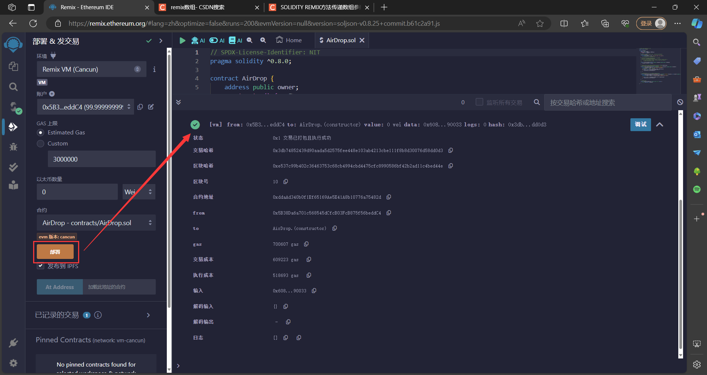
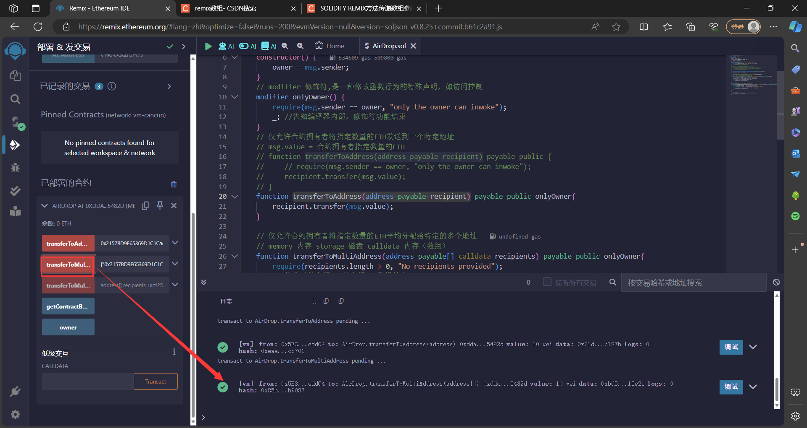

# 空投合约

## 实验要求

空投就是一种营销策路，通过空投活动将某种数字货币或代币分发给用户，尤其是在初创项目中，用来激励早期用户或奖励社区成员，这种合约允许合约拥有者将指定数量的代币发送到多个接收者的地址上。

**空投合约的主要功能：**

- 通过合约给单个地址转`ETH`
- 通过合约一次性给多个地址转`ETH`(平均分配金额)
- 通过合约一次性给多个地址转`ETH`(指定金额)
- 合约余额直询(`view`)
要求：上述功能仅允许合约拥有者调用

```javascript
// SPDX-License-Identifier: NIT
pragma solidity ^0.8.0;

contract AirDrop {
    address public owner;
    constructor() {
        owner = msg.sender;
    }
    // modifier 修饰符,是一种修改函数行为的特殊声明，如访问控制
    modifier onlyOwner() {
        require(msg.sender == owner, "only the owner can inwoke");
        _; //告知编译器内部，修饰符功能结束
    }
    // 仅允许合约拥有者将指定数量的ETH发送到一个特定地址
    // msg.value = 合约拥有者指定数量的ETH
    // function transferToAddress(address payable recipient) payable public {
    //     // require(msg.sender == owner, "only the owner can inwoke");
    //     recipient.transfer(msg.value);
    // }
    function transferToAddress(address payable recipient) payable public onlyOwner{
        recipient.transfer(msg.value);
    }

    // 仅允许合约拥有者将指定数量的ETH平均分配给特定的多个地址
    // memory 内存 storage 磁盘 calldata 内存（数组）
    function transferToMultiAddress(address payable[] calldata recipients) payable public onlyOwner{
        require(recipients.length > 0, "No recipients provided");
        // 均分后的金额 = 总金额 / 数组长度
        uint amount = msg.value / recipients.length;
        for (uint i = 0; i < recipients.length; i++) {
            recipients[i].transfer(amount);
        }
    }

    // 仅允许合约拥有者一次性给多个地址转ETH（指定金额）
    function transferToMultipleAddressesWithAmount(address payable[] calldata recipients, uint amount) payable public onlyOwner {
        require(recipients.length > 0, "No recipients provided");
        require(msg.value >= amount * recipients.length, "Insufficient funds");

        for (uint i = 0; i < recipients.length; i++) {
            recipients[i].transfer(amount);
        }
    }

    // 合约余额查询
    function getContractBalance() public view returns (uint) {
        return address(this).balance;
    }
}
```

## 部署



## 函数测试

```javascript
transferToAddress(address payable recipient)
```

向`0x2157BD9E65369D1C1CaeF981212748735F1C187B`转10`ETH`：


```javascript
transferToMultiAddress(address payable[] calldata recipients)
```

向`["0x2157BD9E65369D1C1CaeF981212748735F1C187B","0xCcd4BC74ebdEd88EAf9bAf49846b3a2257815E21"]`共转10个`ETH`



```javascript
transferToMultipleAddressesWithAmount(address payable[] calldata recipients, uint amount)
```

向`["0x2157BD9E65369D1C1CaeF981212748735F1C187B","0xCcd4BC74ebdEd88EAf9bAf49846b3a2257815E21"]`共转8个`ETH`


```javascript
getContractBalance()
```

这时，剩下 $10-4\times 2 = 2$ 个`ETH`：


