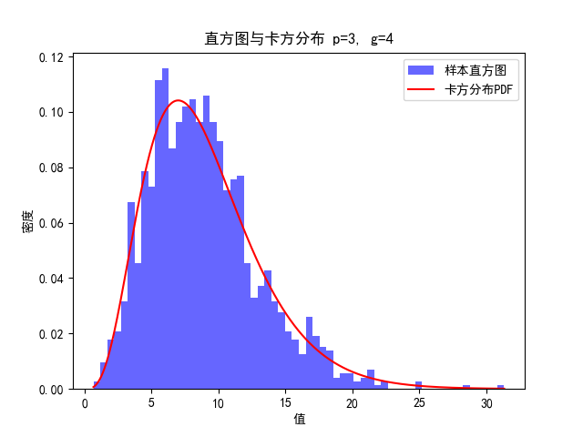
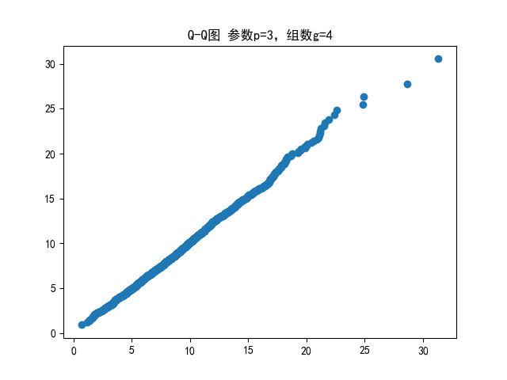
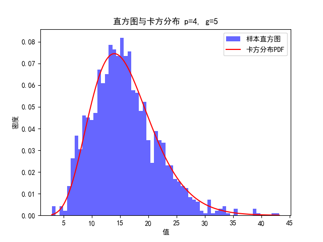
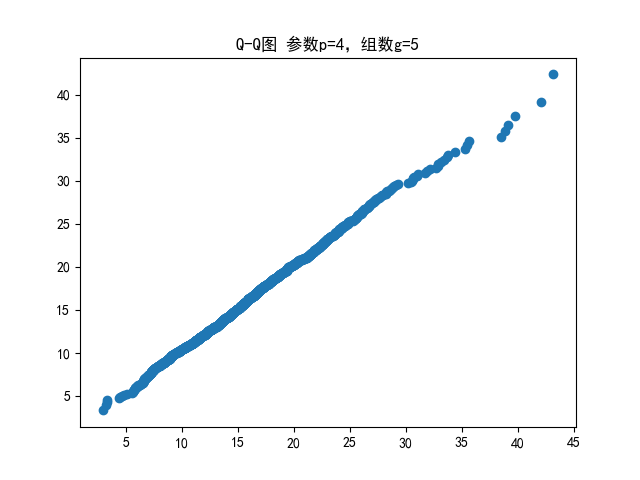
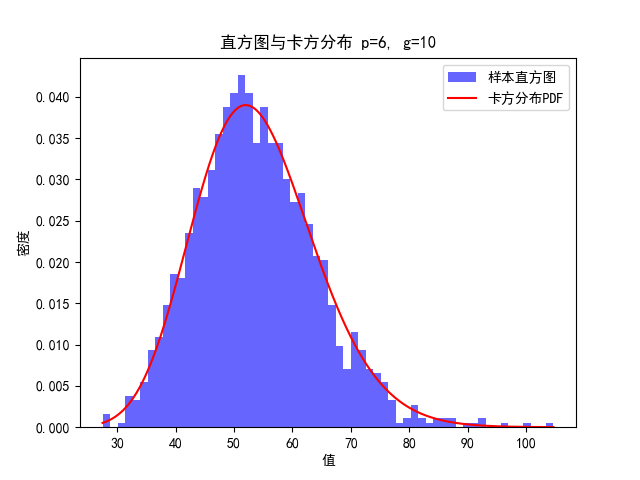
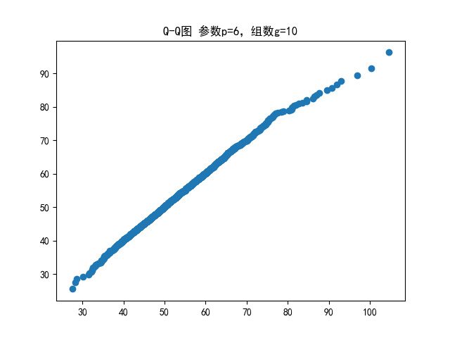
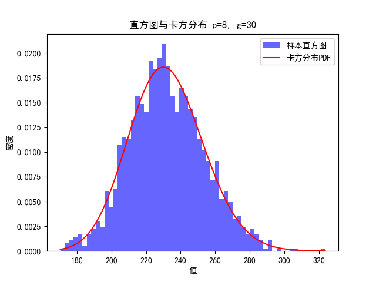
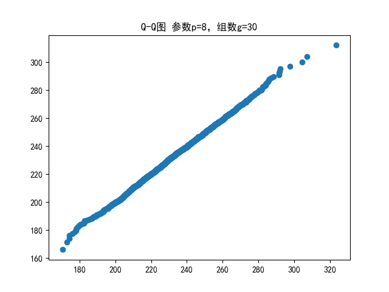

# Bartlett检验

## 理论推导

设从n个总体分别抽取的随机样本为
$$
\text{总体1：}X_{11},X_{12},\cdots,X_{1n}\\
\text{总体2：}X_{21},X_{22},\cdots,X_{2n}\\
\vdots\\
\text{总体g：}X_{g1},X_{g2},\cdots,X_{gn}\\
$$
处理效应的平方和：
$$
B=\sum_{l=1}^{g}n_l(\overline{x_l}-\overline{x})(\overline{x_l}-\overline{x})^T\\
$$
残差平方和：
$$
W=\sum_{l=1}^g\sum_{j=1}^{n_l}(x_{lj}-\overline{x_l})(x_{lj}-\overline{x_l})^T
$$
则
$$
\Lambda^*=\frac{|W|}{|B+W|}=\dfrac{|\sum_{l=1}^g\sum_{j=1}^{n_l}(x_{lj}-\overline{x_l})(x_{lj}-\overline{x_l})^T|}{|\sum_{l=1}^g\sum_{j=1}^{n_l}(x_{lj}-\overline{x})(x_{lj}-\overline{x})^T|}
$$
假设$H_0:\mu_1=\mu_2=\cdots=\mu_g$，则当$H_0$为真且$\sum n_l=n$充分大，则
$$
-\left(n-1-\frac{(p+g)}2\right)\mathrm{ln}\Lambda^*=-\left(n-1-\frac{(p+g)}2\right)\mathrm{ln}\left(\frac{|W|}{|B+W|}\right)
$$
近似服从自由度为$p(g-1)$的$\chi^2$分布，因此，当$\sum n_l=n$充分大时，若
$$
-\left(n-1-\frac{(p+g)}2\right)\mathrm{ln}\left(\frac{|W|}{|B+W|}\right)>\chi_{p(g-1)}^2(\alpha)
$$
我们就以显著性水平$\alpha$拒绝$H_0$，其中的$\chi_{p(g-1)}^2(\alpha)$为自由度为$p(g-1)$的$\chi^2$分布的上$100\alpha$百分位数。

## 代码

```python
from scipy.stats import norm, chi2
import numpy as np
import random
import matplotlib.pyplot as plt
import os

# 配置matplotlib以支持中文显示
plt.rcParams['font.sans-serif'] = ['SimHei']
plt.rcParams['axes.unicode_minus'] = False

# 数据生成器
def generate_dataset(count, distribution_type=None):
    if distribution_type == '正态分布':
        mean, std_dev = 0, 0.2
        return np.random.normal(loc=mean, scale=std_dev, size=count)
    elif distribution_type == '均匀分布':
        lower_bound, upper_bound = -1, 1
        return np.random.uniform(low=lower_bound, high=upper_bound, size=count)
    elif distribution_type == '泊松分布':
        lambda_param = 4
        return np.random.poisson(lam=lambda_param, size=count)
    elif distribution_type == '指数分布':
        scale_factor = 6
        return np.random.exponential(scale=scale_factor, size=count)
    elif distribution_type == 't-分布':
        degrees_of_freedom = 3
        return np.random.standard_t(df=degrees_of_freedom, size=count)
    elif distribution_type == '卡方分布':
        df_random = 5
        return np.random.chisquare(df=df_random, size=count)
    else:
        raise ValueError('未知分布类型')

# 计算统计量
def calculate_ld_statistic(dataset, parameters_count, group_count, sample_size):
    mean_per_group = np.mean(dataset, axis=2)
    overall_mean = np.mean(mean_per_group, axis=0)
    
    # 计算B
    delta_matrix_1 = (mean_per_group - overall_mean[None, :])[:, :, np.newaxis]
    delta_matrix_2 = (mean_per_group - overall_mean[None, :])[:, np.newaxis, :]
    B_matrix = (delta_matrix_1 @ delta_matrix_2).sum(axis=0) * sample_size
    
    # 计算W
    delta_data_1 = (dataset - mean_per_group[:, :, np.newaxis]).transpose(0, 2, 1)[:, :, :, np.newaxis]
    delta_data_2 = (dataset - mean_per_group[:, :, np.newaxis]).transpose(0, 2, 1)[:, :, np.newaxis, :]
    W_matrix = (delta_data_1 @ delta_data_2).sum(axis=(0, 1))
    
    # 计算Lambda_star
    det_W = np.linalg.det(W_matrix)
    det_B_plus_W = np.linalg.det(B_matrix + W_matrix)
    lambda_star = det_W / det_B_plus_W

    # 计算统计量
    n = group *  sample_size
    test_statistic = -(n - 1 - (parameters_count + group_count) / 2) * np.log(lambda_star)
    return test_statistic

# 计算数据的累积分布概率
def cumulative_distribution_probabilities(data_points):
    ordered_data = np.sort(data_points)
    position_indices = np.arange(1, len(ordered_data) + 1)
    probabilities = (position_indices - 0.5) / len(ordered_data)
    return ordered_data, probabilities

# 绘制Q-Q图
def draw_qq_diagram(data_points, parameters, groups):
    degrees_of_freedom = parameters * (groups - 1)
    sorted_data, prob = cumulative_distribution_probabilities(data_points)
    normal_quantiles = chi2.ppf(prob, df=degrees_of_freedom)
    plt.scatter(sorted_data, normal_quantiles)
    plt.title(f'Q-Q图 参数p={parameters}，组数g={groups}')
    plt.savefig(f"images/qq_plot_p_{parameters}_g_{groups}.png")
    plt.clf()

# 绘制直方图与理论分布叠加图
def overlay_histogram_and_pdf(data_points, parameters, groups):
    plt.hist(data_points, bins=60, density=True, alpha=0.6, color='blue', label='样本直方图')
    x_range = np.linspace(min(data_points), max(data_points), 10000)
    chi_squared_pdf = chi2.pdf(x_range, df=parameters * (groups - 1))
    plt.plot(x_range, chi_squared_pdf, 'red', label='卡方分布PDF')
    plt.xlabel('值')
    plt.ylabel('密度')
    plt.title(f'直方图与卡方分布 p={parameters}, g={groups}')
    plt.legend()
    plt.savefig(f"images/histogram_chi2_overlay_p_{parameters}_g_{groups}.png")
    plt.clf()

if __name__ == "__main__":
    parameter_group_combinations = [(3, 4), (4, 5), (6, 10), (8, 30)]
    sample_count = 1422
    iterations = 1422
    distribution_types = ['正态分布', '均匀分布', '泊松分布', '指数分布', 't-分布', '卡方分布']
    
    # 确保输出目录存在
    os.makedirs("images", exist_ok=True)
    
    for param, group in parameter_group_combinations:
        simulation_results = []
        for _ in range(iterations):
            all_data = []
            name_list = np.random.choice(distribution_types, size=param, replace=True)
            for index in range(group):
                data_list = [generate_dataset(sample_count, name_list[idx])[None, :] for idx in range(param)]
                data = np.concatenate(data_list)
                all_data.append(data[None, :])

            data = np.concatenate(all_data)

            result = calculate_ld_statistic(data, param, group, sample_count)
            simulation_results.append(result)
        
        overlay_histogram_and_pdf(simulation_results, param, group)
        draw_qq_diagram(simulation_results, param, group)
```

## 结果

结果如下所示

<center class="half">    
	<center class="half">
    
    
    
    
    
    
    
        
</center>
<h2>实验二结果图</h2>