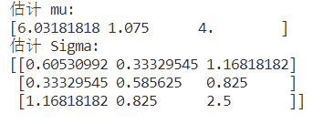
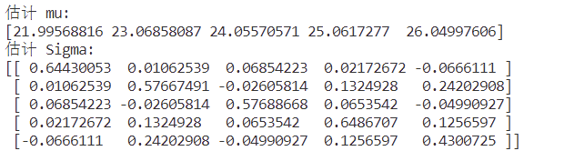
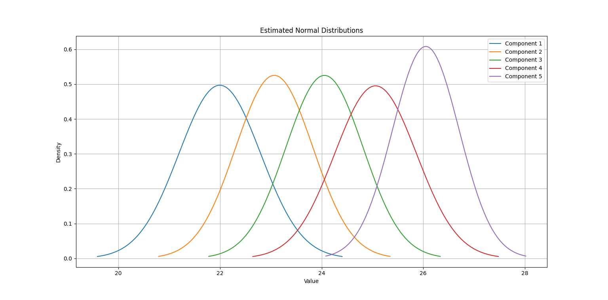

# EM算法

## 理论推导

观测值$$x_{1},x_{2},\ldots,x_{n}\sim N_{p}(\mu,\Sigma)$$，另外$$(n-1)S=\sum_{i=1}^n(x_i-\hat{x})(x_i-\hat{x})^\top $$
$$
\begin{aligned}
&T_1 =\sum_{i=1}^{n}x_{i}=n\bar{x}  \\
&
\begin{aligned}
T_{2} &=\sum_{i=1}^{n}x_{i}x_{i}^{\top}\\&=\sum_{i=1}^{n}(x_{i}-\bar{x}+\bar{x})(x_{i}-\bar{x}+\bar{x})^{\top}  \\
&=\sum_{i=1}^{n}(x_{i}-\bar{x})(x_{i}-\bar{x})^{\top}+\sum_{i=1}^{n}(x_{i}-\bar{x})\bar{x}^{\top}+\sum_{i=1}^{n}\bar{x}(x_{i}-\bar{x})^{\top}+\sum_{i=1}^{n}\bar{x}\bar{x}^{\top} \\
&=\sum_{i=1}^{n}(x_{i}-\bar{x})(x_{i}-\bar{x})^{\top}+0+0+n\bar{x}\bar{x}^{\top} \\
&=(n-1)S+n\bar{x}\bar{x}^{\top}
\end{aligned}
\end{aligned}
$$
对每一具有缺损值得向量$x_j$，记$x_j^{(1)}$为其缺损向量，$x_j^{(2)}$为其可获得分量，于是

$$
x_{j}=\begin{bmatrix}x_{j}^{(1)}\\\ldots\\x_{j}^{(2)}\end{bmatrix},\mu=\begin{bmatrix}\mu^{(1)}\\\ldots\\\mu^{(2)}\end{bmatrix},\Sigma=\begin{bmatrix}\Sigma_{11}&\Sigma_{12}\\\\\Sigma_{21}&\Sigma_{22}\end{bmatrix}
$$

- 证明分块矩阵求行列式
  $$
  \begin{gathered}
      \begin{bmatrix}
          I & 0\\
          -A_{21}A_{11}^{-1} & I
      \end{bmatrix}
      \begin{bmatrix}
          A_{11} & A_{12}\\
          A_{21} & A_{22}
      \end{bmatrix}=
      \begin{bmatrix}
          A_{11} & A_{12}\\
          0 & A_{22}-A_{21}A_{11}^{-1}A_{12}
      \end{bmatrix}\\  
  \end{gathered}
  $$
  两边取行列式：
  $$
  |A|= |A_{11}||A_{22}-A_{21}A_{11}^{-1}A_{12}|\\
  $$

  $$
  \begin{bmatrix}
          I & -\Sigma_{12}\Sigma_{22}^{-1}\\
          0 & I
      \end{bmatrix}
      \begin{bmatrix}
          \Sigma_{11} & \Sigma_{12}\\
          \Sigma_{21} & \Sigma_{22}
      \end{bmatrix}=
      \begin{bmatrix}
          \Sigma_{11}-\Sigma_{12}\Sigma_{22}^{-1}\Sigma_{21} & 0\\
          \Sigma_{21} & \Sigma_{22}
      \end{bmatrix}\\
  $$
  两边取行列式
  $$
  |A|= |A_{22}||A_{11}-A_{12}A_{22}^{-1}A_{21}|\\
  $$
  
- 证明分块矩阵求逆
  $$
  \begin{gathered}
  \Sigma=\begin{bmatrix}\Sigma_{11}&\Sigma_{12}\\\\\Sigma_{21}&\Sigma_{22}\end{bmatrix} \\
  \begin{bmatrix}E&-\Sigma_{12}\Sigma_{22}^{-1}\\0&E\end{bmatrix}\begin{bmatrix}\Sigma_{11}&\Sigma_{12}\\\\\Sigma_{21}&\Sigma_{22}\end{bmatrix}=\begin{bmatrix}\Sigma_{11}-\Sigma_{12}\Sigma_{22}^{-1}\Sigma_{21}&0\\\\\Sigma_{21}&\Sigma_{22}\end{bmatrix} \\
  \begin{bmatrix}\Sigma_{11}-\Sigma_{12}\Sigma_{22}^{-1}\Sigma_{21}&0\\\\\Sigma_{21}&\Sigma_{22}\end{bmatrix}\begin{bmatrix}E&0\\\\-\Sigma_{22}^{-1}\Sigma_{21}&E\end{bmatrix}=\begin{bmatrix}\Sigma_{11}-\Sigma_{12}\Sigma_{22}^{-1}\Sigma_{21}&0\\\\0&\Sigma_{22}\end{bmatrix} 
  \end{gathered}
  $$
  即，
  $$
  \begin{bmatrix}E&-\Sigma_{12}\Sigma_{22}^{-1}\\0&E\end{bmatrix}\begin{bmatrix}\Sigma_{11}&\Sigma_{12}\\\\\Sigma_{21}&\Sigma_{22}\end{bmatrix}\begin{bmatrix}E&0\\\\-\Sigma_{22}^{-1}\Sigma_{21}&E\end{bmatrix}=\begin{bmatrix}\Sigma_{11}-\Sigma_{12}\Sigma_{22}^{-1}\Sigma_{21}&0\\\\0&\Sigma_{22}\end{bmatrix}
  $$
  两边求逆：
  $$
  \begin{gathered}
  \begin{bmatrix}E&0\\-\Sigma_{22}^{-1}\Sigma_{21}&E\end{bmatrix}^{-1}\begin{bmatrix}\Sigma_{11}&\Sigma_{12}\\\\\Sigma_{21}&\Sigma_{22}\end{bmatrix}^{-1}\begin{bmatrix}E&-\Sigma_{12}\Sigma_{22}^{-1}\\0&E\end{bmatrix}=\begin{bmatrix}\left(\Sigma_{11}-\Sigma_{12}\Sigma_{22}^{-1}\Sigma_{21}\right)^{-1}&0\\0&\Sigma_{22}^{-1}\end{bmatrix} \\
  \Rightarrow\begin{bmatrix}\Sigma_{11}&\Sigma_{12}\\\\\Sigma_{21}&\Sigma_{22}\end{bmatrix} ^{-1}=\begin{bmatrix}E&0\\-\Sigma_{22}^{-1}\Sigma_{21}&E\end{bmatrix}\begin{bmatrix}\left(\Sigma_{11}-\Sigma_{12}\Sigma_{22}^{-1}\Sigma_{21}\right)^{-1}&0\\0&\Sigma_{22}^{-1}\end{bmatrix}\begin{bmatrix}E&-\Sigma_{12}\Sigma_{22}^{-1}\\0&E\end{bmatrix} \\
  =\begin{bmatrix}\Sigma_{11\cdot2}&-\Sigma_{11\cdot2}^{-1}\Sigma_{12}\Sigma_{22}^{-1}\\\\-\Sigma_{22}^{-1}\Sigma_{21}\Sigma_{11\cdot2}^{-1}&\Sigma_{22}^{-1}+\Sigma_{22}^{-1}\Sigma_{21}\Sigma_{11\cdot2}^{-1}\Sigma_{12}\Sigma_{22}^{-1}\end{bmatrix} 
  \end{gathered}
  $$
  其中，
  $$
  \Sigma_{11\cdot2}=\Sigma_{11}-\Sigma_{12}\Sigma_{22}^{-1}\Sigma_{21}
  $$
  

下面正式开始推导：
$$
\begin{aligned}
f\left(x_{j}^{(1)}|x_{j}^{(2)}\right)
&\ =\frac{f(x_{j})}{f(x_{j}^{(2)})} &\\
&\ =\frac{(2\pi)^{-\frac{p}{2}}|\Sigma|^{-\frac{1}{2}}e^{{-\frac{1}{2}(x_{j}-\mu)^{\top}\Sigma^{-1}(x_{j}-\mu)}}}{(2\pi)^{-\frac{p_2}{2}}|\Sigma_{22}|^{-\frac{1}{2}}e^{-\frac{1}{2}(x_{j}^{(2)}-\mu^{(2)})^{\top}\Sigma_{22}^{-1}(x_{j}^{(2)}-\mu^{(2)})}} &\\
&\ =(2\pi)^{-\frac{p_1}{2}}{(\frac{|\Sigma|}{|\Sigma_{22}|})}^{-\frac{1}{2}}
e^{-\frac{1}{2}\left\{ \left[ (x_j-\mu)^\top \Sigma^{-1} (x_j-\mu) \right] - \left[ (x_j^{(2)}-\mu^{(2)})^\top \Sigma_{22}^{-1} (x_j^{(2)}-\mu^{(2)})  \right] \right\}} &\\
&\ =(2\pi)^{-\frac{p_1}{2}}
\left|\Sigma_{11}-\Sigma_{12}\Sigma_{22}^{-1}\Sigma_{21}\right|^{-\frac{1}{2}}e^{-\frac{1}{2}\left[(x_{j}^{(1)}-\mu^{(1)})-\Sigma_{11}\Sigma_{22}^{-1}(x_{j}^{(2)}-\mu^{(2)})\right]^{\top}
(\Sigma_{11}-\Sigma_{12}\Sigma_{22}^{-1}\Sigma_{21})^{-1}\left[(x_{j}^{(1)}-\mu^{(1)})-\Sigma_{11}\Sigma_{22}^{-1}(x_{j}^{(2)}-\mu^{(2)}) \right]} &\\ 
\end{aligned}
$$

其中，指数部分化简如下：$$e^{-\frac{1}{2}\times E}$$


$$
\begin{aligned}
E
    &=\begin{bmatrix} 
    	x_j^{(1)}-\mu^{(1)} \\ 
    	x_j^{(2)}-\mu^{(2)} 
    \end{bmatrix}^\top
    
    \begin{bmatrix}
        \Sigma_{11\cdot 2} & -\Sigma_{11\cdot 2}^{-1}\Sigma_{12}\Sigma_{22}^{-1}\\
        -\Sigma_{22}^{-1}\Sigma_{21}\Sigma_{11\cdot 2}^{-1} & \Sigma_{22}^{-1}+\Sigma_{22}^{-1}\Sigma_{21}\Sigma_{11\cdot 2}^{-1}\Sigma_{12}\Sigma_{22}^{-1}
    \end{bmatrix}
    
    \begin{bmatrix} 
    	x_j^{(1)}-\mu^{(1)} \\ 
    	x_j^{(2)}-\mu^{(2)} 
    \end{bmatrix}
    -\left[ (x_j^{(2)}-\mu^{(2)}) \Sigma_{22}^{-1} (x_j^{(2)}-\mu^{(2)})^\top \right]\\
    &= \begin{bmatrix}
    (x_j^{(1)}-\mu^{(1)}) \Sigma_{11\cdot 2}^{-1} - (x_j^{(2)}-\mu^{(2)}) \Sigma_{22}^{-1}\Sigma_{21} \Sigma_{11\cdot 2}\\
    -(x_j^{(1)}-\mu^{(1)}) \Sigma_{11\cdot 2}^{-1} \Sigma_{12} \Sigma_{22}^{-1} + (x_j^{(2)}-\mu^{(2)}) \left( \Sigma_{22}^{-1} + \Sigma_{22}^{-1}\Sigma_{21}\Sigma_{11\cdot 2}^{-1}\Sigma_{12}\Sigma_{22}^{-1} \right)
    \end{bmatrix}^\top
    \begin{bmatrix} x_j^{(1)}-\mu^{(1)} \\ x_j^{(2)}-\mu^{(2)} \end{bmatrix}-\left[ (x_j^{(2)}-\mu^{(2)}) \Sigma_{22}^{-1} (x_j^{(2)}-\mu^{(2)})^\top \right]\\
    &= \left[ (x_j^{(1)}-\mu^{(1)}) \Sigma_{11\cdot 2}^{-1} - (x_j^{(2)}-\mu^{(2)}) \Sigma_{22}^{-1}\Sigma_{21} \Sigma_{11\cdot 2} \right] (x_j^{(1)}-\mu^{(1)})^\top \, \\
    &+\left[- (x_j^{(1)}-\mu^{(1)}) \Sigma_{11\cdot 2}^{-1} \Sigma_{12} \Sigma_{22}^{-1} - (x_j^{(2)}-\mu^{(2)}) \left( \Sigma_{22}^{-1} + \Sigma_{22}^{-1}\Sigma_{21}\Sigma_{11\cdot 2}^{-1}\Sigma_{12}\Sigma_{22}^{-1} \right) \right] (x_j^{(2)}-\mu^{(2)})^\top-\left[ (x_j^{(2)}-\mu^{(2)}) \Sigma_{22}^{-1} (x_j^{(2)}-\mu^{(2)})^\top \right]\\
    &= (x_j^{(1)}-\mu^{(1)}) \Sigma_{11\cdot 2}^{-1} (x_j^{(1)}-\mu^{(1)})^\top - (x_j^{(2)}-\mu^{(2)}) \Sigma_{22}^{-1}\Sigma_{21} \Sigma_{11\cdot 2} (x_j^{(1)}-\mu^{(1)})^\top
    - (x_j^{(1)}-\mu^{(1)}) \Sigma_{11\cdot 2}^{-1} \Sigma_{12} \Sigma_{22}^{-1} (x_j^{(2)}-\mu^{(2)})^\top\\ 
    &+ (x_j^{(2)}-\mu^{(2)}) \left( \Sigma_{22}^{-1} + \Sigma_{22}^{-1}\Sigma_{21}\Sigma_{11\cdot 2}^{-1}\Sigma_{12}\Sigma_{22}^{-1} \right) (x_j^{(2)}-\mu^{(2)})^\top-\left[ (x_j^{(2)}-\mu^{(2)}) \Sigma_{22}^{-1} (x_j^{(2)}-\mu^{(2)})^\top \right]\\
    
\end{aligned}
$$
令 ：
$$
\begin{cases} 
    y &=\Sigma_{12} \Sigma_{22}^{-1} (x_j^{(2)}-\mu^{(2)})\\
    y^\top&=(x_j^{(2)}-\mu^{(2)})^\top \Sigma_{22}^{-1} \Sigma_{12}^\top\\
    \end{cases}
$$
那么，
$$
\begin{aligned}
    E &= (x_j^{(1)}-\mu^{(1)}) \Sigma_{11\cdot 2}^{-1} (x_j^{(1)}-\mu^{(1)})^\top -  y^\top \Sigma_{11\cdot 2}^{-1} \, y\\
      &= (x_j^{(1)}-\mu^{(1)}-y)^{\top} \Sigma_{11\cdot 2}^{-1} (x_j^{(1)}-\mu^{(1)}-y)\\
\end{aligned}
$$
所以，
$$
f\left(x_{j}^{(1)}|x_{j}^{(2)}\right)=(2\pi)^{-\frac{p}{2}}
\left|\Sigma_{11}-\Sigma_{12}\Sigma_{22}^{-1}\Sigma_{21}\right|^{-\frac{1}{2}}e^{-\frac{1}{2}\left[(x_{j}^{(1)}-\mu^{(1)})-\Sigma_{11}\Sigma_{22}^{-1}(x_{j}^{(2)}-\mu^{(2)})\right]^{\top}
(\Sigma_{11}-\Sigma_{12}\Sigma_{22}^{-1}\Sigma_{21})^{-1}\left[(x_{j}^{(1)}-\mu^{(1)})-\Sigma_{11}\Sigma_{22}^{-1}(x_{j}^{(2)}-\mu^{(2)}) \right]}
$$

$$
\Rightarrow \begin{cases}
                \widetilde{x_j^{(1)}} &= \widetilde{\mu^{(1)}}+\Sigma_{12} \Sigma_{22}^{-1} (x_j^{(2)}-\mu^{(2)}) \quad \rightarrow T_1\\
                \widetilde{x_j^{(1)}(x_j^{(1)})^\top} &=\widetilde{x_j^{(1)}(x_j^{(1)})^\top}+ (\Sigma_{11} - \Sigma_{12} \Sigma_{22}^{-1} \Sigma_{21}) \quad \rightarrow T_2 \\
                \widetilde{x_j^{(2)}(x_j^{(2)})^\top}&=\widetilde{x_j^{(2)}} \, \widetilde{(x_j^{(1)})^\top} \quad \rightarrow T_2
\end{cases}
$$

修正后的极大似然估计：
$$
\begin{cases}
    \widetilde{\mu} &= \frac{1}{n}\widetilde{T_1} \\
    \widetilde{\Sigma} &= \frac{1}{n} \widetilde{T_2} - \widetilde{\mu}\widetilde{\mu}^\top
\end{cases}
$$

## 代码

EM算法代码如下。

```python
def em(xdata, mu0, Sigma0, times = 0):
    time = 0
    n, p = xdata.shape
    mu1 = mu0 + 1
    Sigma1 = Sigma0 + 1

    # 计算均方误差，前后两次迭代的均值和协方差元素逐个比较
    def err(mu0, Sigma0, mu1, Sigma1):
        th0 = np.concatenate((mu0, Sigma0.flatten()))
        th1 = np.concatenate((mu1, Sigma1.flatten()))
        return np.sqrt(np.sum((th0 - th1) ** 2))

    if times:
        # 循环迭代
        while time < times:
            time += 1
            mu1 = mu0.copy()
            Sigma1 = Sigma0.copy()

            # T_1
            T_1 = np.copy(xdata)
            # T_2的增量
            delta = np.zeros((p, p))

            # 迭代每一组数据
            for i in range(n):
                # 如果这一行数据有缺失值，才继续循环
                if np.any(np.isnan(xdata[i])):
                    # 拿到这一行数据
                    zi = xdata[i]
                    # 找到缺失值的索引
                    na_idx = np.where(np.isnan(zi))[0]
                    # 找到非缺失值的索引
                    cs_idx = np.where(~np.isnan(zi))[0]

                    # 分块
                    Sigma011 = Sigma0[np.ix_(na_idx, na_idx)]
                    Sigma012 = Sigma0[np.ix_(na_idx, cs_idx)]
                    Sigma022_iv = np.linalg.inv(Sigma0[np.ix_(cs_idx, cs_idx)])

                    T_1[i, na_idx] = mu0[na_idx] + np.dot(Sigma012, Sigma022_iv).dot(zi[cs_idx] - mu0[cs_idx])
                    delta[np.ix_(na_idx, na_idx)] += Sigma011 - np.dot(Sigma012, Sigma022_iv).dot(Sigma012.T)

            mu0 = np.mean(T_1, axis=0)
            # T_2 = (n - 1) * np.cov(T_1, rowvar=False) + delta +  n * np.dot(mu0, mu0.T)
            # Sigma0 = T_2 / n - np.dot(mu0, mu0.T)
            # 上面两步合并为下面一步
            Sigma0 = (n - 1) * np.cov(T_1, rowvar=False) / n + delta / n
    else:
        # 循环迭代
        while err(mu0, Sigma0, mu1, Sigma1) > 1e-12:
            mu1 = mu0.copy()
            Sigma1 = Sigma0.copy()

            # T_1
            T_1 = np.copy(xdata)
            # T_2的增量
            delta = np.zeros((p, p))

            # 迭代每一组数据
            for i in range(n):
                # 如果这一行数据有缺失值，才继续循环
                if np.any(np.isnan(xdata[i])):
                    # 拿到这一行数据
                    zi = xdata[i]
                    # 找到缺失值的索引
                    na_idx = np.where(np.isnan(zi))[0]
                    # 找到非缺失值的索引
                    cs_idx = np.where(~np.isnan(zi))[0]

                    # 分块
                    Sigma011 = Sigma0[np.ix_(na_idx, na_idx)]
                    Sigma012 = Sigma0[np.ix_(na_idx, cs_idx)]
                    Sigma022_iv = np.linalg.inv(Sigma0[np.ix_(cs_idx, cs_idx)])

                    T_1[i, na_idx] = mu0[na_idx] + np.dot(Sigma012, Sigma022_iv).dot(zi[cs_idx] - mu0[cs_idx])
                    delta[np.ix_(na_idx, na_idx)] += Sigma011 - np.dot(Sigma012, Sigma022_iv).dot(Sigma012.T)

            mu0 = np.mean(T_1, axis=0)
            # T_2 = (n - 1) * np.cov(T_1, rowvar=False) + delta +  n * np.dot(mu0, mu0.T)
            # Sigma0 = T_2 / n - np.dot(mu0, mu0.T)
            # 上面两步合并为下面一步
            Sigma0 = (n - 1) * np.cov(T_1, rowvar=False) / n + delta / n

    return {'mu': mu0, 'Sigma': Sigma0}
```

## 结果

### 验证算法的正确性

为了验证代码的正确性，我用例5.13的数据，设置EM算法只迭代一次观察结果。

```python
jun = np.array([6, 1, 4])
matrix = np.array([
    [np.nan, 0, 3],
    [7, 2, 6],
    [5, 1, 2],
    [np.nan, np.nan, 5]
])

S = np.array([
    [0.5, 0.25, 1], 
    [0.25, 0.5, 0.75],
    [1, 0.75, 2.5]
])

result2 = em(matrix, jun, S, 10)
print(result2['mu'])
print(result2['Sigma'])
```



如图所示，代码运行出来的结果与例教材5.13迭代一次的结果相符。

### 生成正态分布的数据运行EM算法

```python
# 设置超参数
np.random.seed(1422)
mu0 = np.array([22, 23, 24, 25, 26])
p = 5
n = 1000
Sig0 = np.array([
    [ 0.64422976,  0.02235931,  0.00341657,  0.03159973, -0.11107787],
    [ 0.02235931,  0.55234995, -0.07244604,  0.12820811,  0.23877859],
    [ 0.00341657, -0.07244604,  0.64107747,  0.02788362, -0.06677286],
    [ 0.03159973,  0.12820811,  0.02788362,  0.67289534,  0.06010743],
    [-0.11107787,  0.23877859, -0.06677286,  0.06010743,  0.44281487],
])
# 生成指定均值和协方差的数据
triv = np.random.multivariate_normal(mu0, Sig0, n)

# 随机缺失
misp = 0.2
misidx = np.random.binomial(1, misp, size=(n, p)).astype(bool)
triv[misidx] = np.nan

com_cases = triv[~np.isnan(triv).any(axis=1)]

# 初始化EM算法参数
mu_ini = np.zeros(p)
Sigma_ini = np.eye(p)

# EM 估计
result = em(com_cases, mu_ini, Sigma_ini)
print("估计 mu:")
print(result['mu'])
print("估计 Sigma:")
print(result['Sigma'])

# 画出正态分布图
plt.figure(figsize=(12, 8))
for i in range(p):
    mean = result['mu'][i]
    cov = result['Sigma'][i, i]  # 取对角元素作为方差
    
    x = np.linspace(mean - 3*np.sqrt(cov), mean + 3*np.sqrt(cov), 100)
    plt.plot(x, multivariate_normal.pdf(x, mean=mean, cov=cov), label=f'Component {i+1}')

plt.title('Estimated Normal Distributions')
plt.xlabel('Value')
plt.ylabel('Density')
plt.legend()
plt.grid(True)
plt.show()
```



画出的正态分布图如下：


