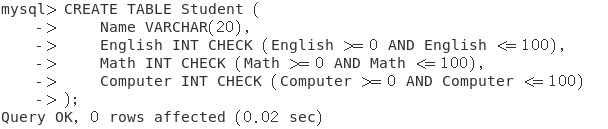
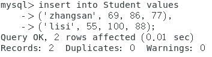
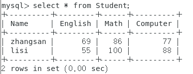
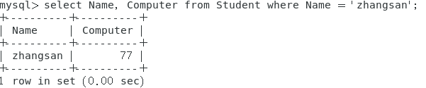
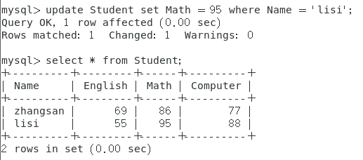
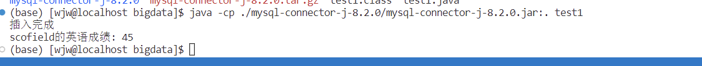

## 学生表Student

|  **Name**  | **English** | **Math** | Computer |
| :--------: | :---------: | :-------: | :------: |
| `zhangsan` |     69      |    86     |    77    |
|  `lisi`   |     55      |    100    |    88    |

### 根据上面给出的Student表，在MySQL数据库中完成如下操作：

1. 在`MySQL`中创建`Student`表，并录入数据；

   

   

2. 用`SQL`语句输出`Student`表中的所有记录；

   

3. 查询 `zhangsan`的`Computer`成绩

   

4. 修改`lisi`的`Math`成绩为95

   

### 根据上面已经设计出的Student表，使用MySQL的Java客户端编程实现以下操作：

1. 向`Student`表中添加如下所示的一条记录：

   | scofield |  45  |  89  | 100  |
   | :------: | :--: | :--: | :--: |

2. 获取`scofield`的`English`成绩

   
   
   ```java
   import java.sql.*;
   
   public class test1 {
       public static void main(String[] args) {
           String dbUrl = "jdbc:mysql://localhost:3306/bigdata_test";
           String dbUser = "root";
           String dbPassword = "123456";
           try {
               // 1. 获取数据库连接
               Connection conn = DriverManager.getConnection(dbUrl, dbUser, dbPassword);
               // 2. 创建Statement对象
               Statement stmt = conn.createStatement();
               // 3. 执行SQL插入语句
               String insertSql = "INSERT INTO Student (Name, English, Math, Computer) VALUES ('scofield', 45, 89, 100)";
               stmt.executeUpdate(insertSql);
               System.out.println("插入完成");
               // 4. 执行SQL查询
               String selectSql = "SELECT English FROM Student WHERE Name = 'scofield'";
               ResultSet rs = stmt.executeQuery(selectSql);
               // 5. 处理结果集
               while (rs.next()) {
                   System.out.println("scofield的英语成绩: " + rs.getInt("English"));
               }
               // 6. 关闭连接和声明
               rs.close();
               stmt.close();
               conn.close();
           } catch (Exception e) {
               // 打印异常信息
               e.printStackTrace();
           }
       }
   }
   ```
   
   

