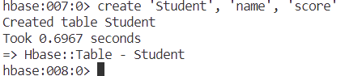
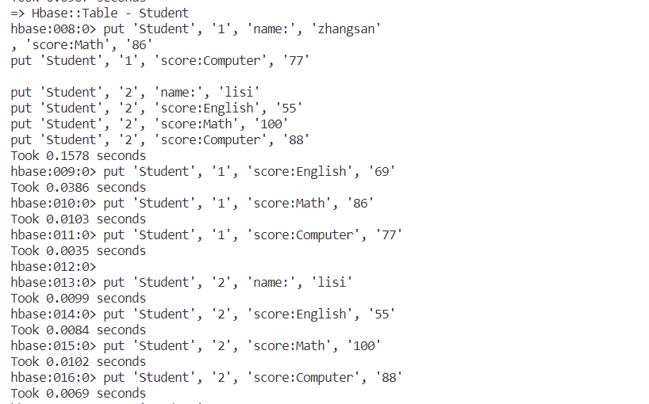
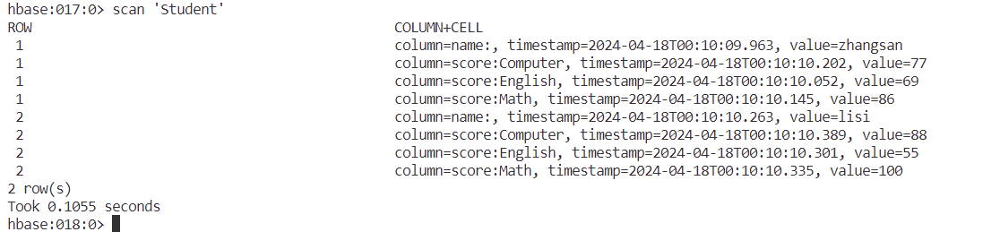
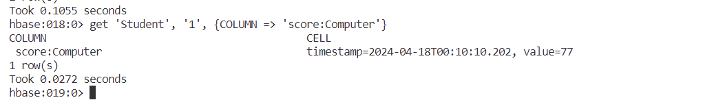
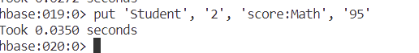
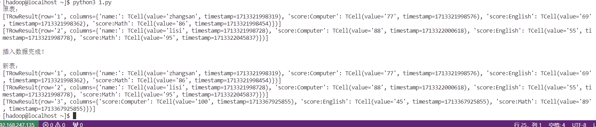

# 第二次作业：HBase 数据库操作

**学生表Student**

| Name     | English | Math | Computer |
| -------- | ------- | ---- | -------- |
| zhangsan | 69      | 86   | 77       |
| lisi     | 55      | 100  | 88       |

表中English、Math和Computer都属于score属性，Student表是有name和score两个属性的

## 1．根据第一次作业给出的学生表Student的信息，执行如下操作：

1. 用Hbase Shell命令创建学生表Student；

   

   

2. 用scan命令浏览Student表的相关信息；

   

3. 查询zhangsan的Computer成绩；

   

4. 修改lisi的Math成绩，改为95。

   

```bash
create 'Student', 'name', 'score'

put 'Student', '1', 'name:', 'zhangsan'
put 'Student', '1', 'score:English', '69'
put 'Student', '1', 'score:Math', '86'
put 'Student', '1', 'score:Computer', '77'

put 'Student', '2', 'name:', 'lisi'
put 'Student', '2', 'score:English', '55'
put 'Student', '2', 'score:Math', '100'
put 'Student', '2', 'score:Computer', '88'

scan 'Student'

get 'Student', '1', {COLUMN => 'score:Computer'}

put 'Student', '2', 'score:Math', '95'
```

## 2.根据上面已经设计出的Student表，用HBaseAPI编程实现以下操作：

添加数据：

   | scofield | 45 | 89 |  100|
   | -------- | ---- | ---- | -- |


```java
from hbase import Hbase
from hbase.ttypes import Mutation
from thrift.transport import TSocket,TTransport
from thrift.protocol import TBinaryProtocol

socket = TSocket.TSocket('127.0.0.1',9090)
socket.setTimeout(5000)

transport = TTransport.TBufferedTransport(socket)
protocol = TBinaryProtocol.TBinaryProtocol(transport)

client = Hbase.Client(protocol)
socket.open()

# 扫描Student表
print("原表：")
scannerId = client.scannerOpen('Student','',["name", "score:English", "score:Math", "score:Computer"]) 
while True:
    result = client.scannerGet(scannerId)   # 根据ScannerID来获取结果
    if not result:
        break
    print(result)

# 插入数据
mutations = [Mutation(column="name", value="scofield"), Mutation(column="score:English", value="45"), Mutation(column="score:Math", value="89"), Mutation(column="score:Computer", value="100")]
client.mutateRow("Student","3",mutations)
print("\n插入数据完成！\n")

# 再次扫描Student表
print("新表：")
scannerId = client.scannerOpen('Student','',["name", "score:English", "score:Math", "score:Computer"]) 
while True:
    result = client.scannerGet(scannerId)   # 根据ScannerID来获取结果
    if not result:
        break
    print(result)
```


