将下列`JSON`格式数据复制到`Linux`系统中，并保存命名为`employee.json`。（我命名成了`wjw.json`）

```json
{"id": 1, "name": "Ella", "age": 36}
{"id": 2, "name": "Bob", "age": 29}
{"id": 3, "name": "Jack", "age": 29}
{"id": 4, "name": "Jim", "age": 28}
{"id": 4, "name": "Jim", "age": 28}
{"id": 5, "name": "Damon"}
{"id": 5, "name": "Damon"}
```

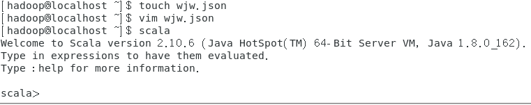

为`employee.json`创建`DataFrame`，并写出`Scala`语句完成下列操作：

1. 查询所有数据；

   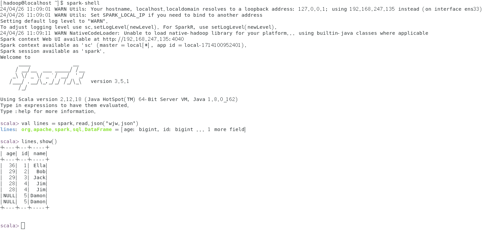

2. 查询所有数据，并去除重复的数据；

   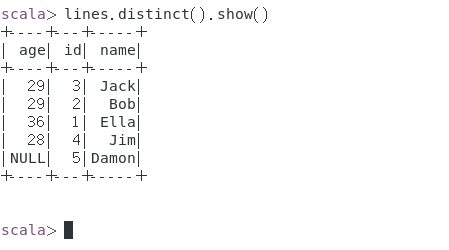

3. 查询所有数据，打印时去除id字段；

   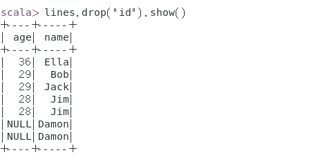

4. 筛选出age>30的记录；

   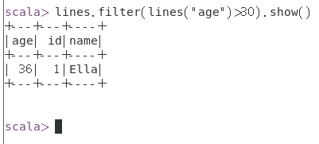

5. 将数据按age分组；

   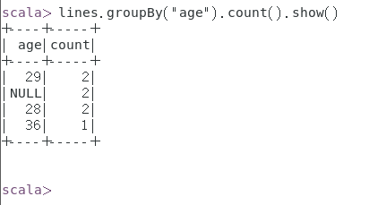

6. 将数据按name升序排列；

   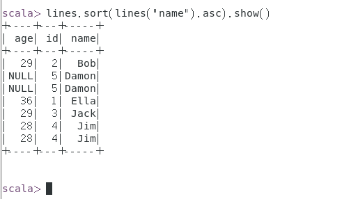

7. 取出前3行数据；

   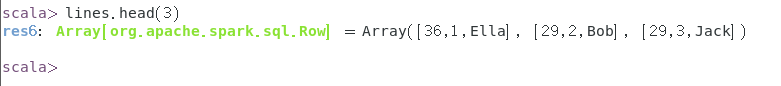

8. 查询所有记录的name列，并为其取别名为`username`；

   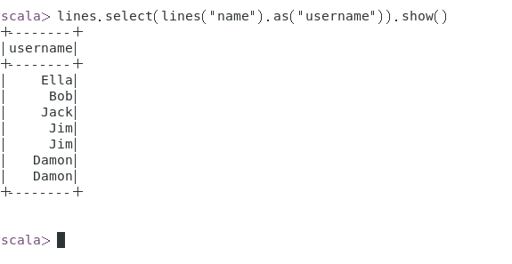

9. 查询年龄age的平均值；

   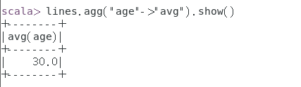

10. 查询年龄age的最小值。

    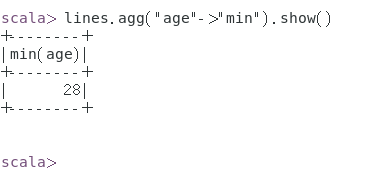

