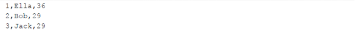
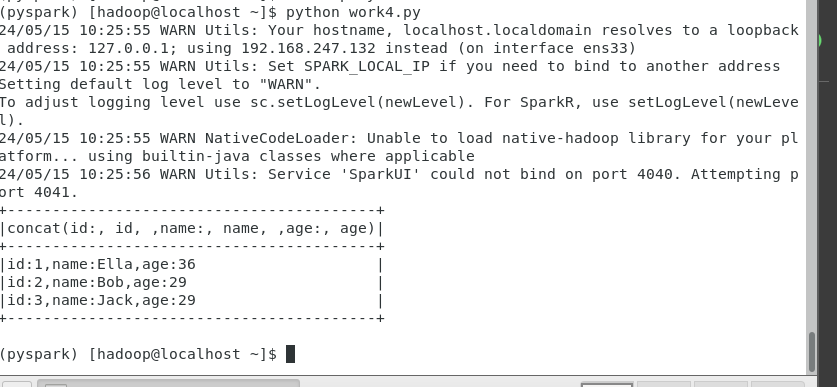

# 编程实现将`RDD`转换为`DataFrame`

源文件内容如下（包含`id,name,age`）：



请将数据复制保存到`Linux`系统中，命名为`employee.txt`，实现从`RDD`转换得到`DataFrame`，并按`“id:1,name:Ella,age:36”`的格式打印出`DataFrame`的所有数据。请写出程序代码。

## 实验结果



## 实验代码

```python
# -*- coding: utf-8 -*-


from pyspark.sql import SparkSession
from pyspark.sql.types import StructType, StructField, IntegerType, StringType
 
# 创建SparkSession
spark = SparkSession.builder.appName("RDD to DataFrame").getOrCreate()
 
# 定义schema
schema = StructType([
    StructField("id",StringType(), True),
    StructField("name", StringType(), True),
    StructField("age",StringType(), True)])
 
# 读取数据并创建RDD
rdd = spark.sparkContext.textFile("/home/hadoop/employee.txt") \
    .map(lambda line: line.split(",")) \
    .map(lambda x: (int(x[0]), x[1], int(x[2])))
 
# 将RDD转换为DataFrame
df = spark.createDataFrame(rdd, schema)
 
# 按照指定格式打印DataFrame的所有数据
df.selectExpr("concat('id:', id, ',name:', name, ',age:', age)").show(truncate=False)
 
# 关闭SparkSession
spark.stop()
```

