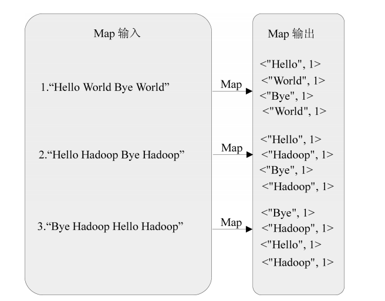
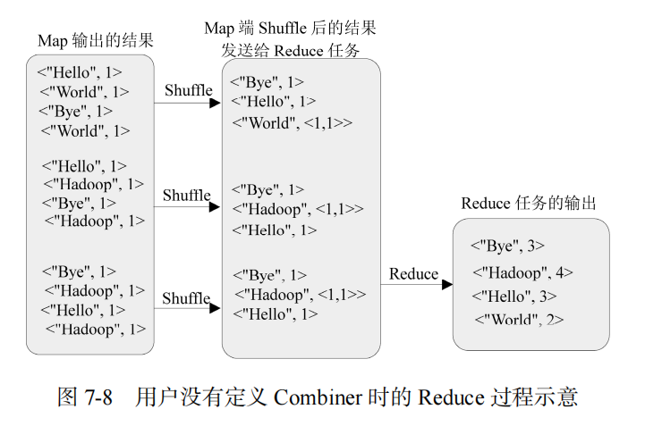
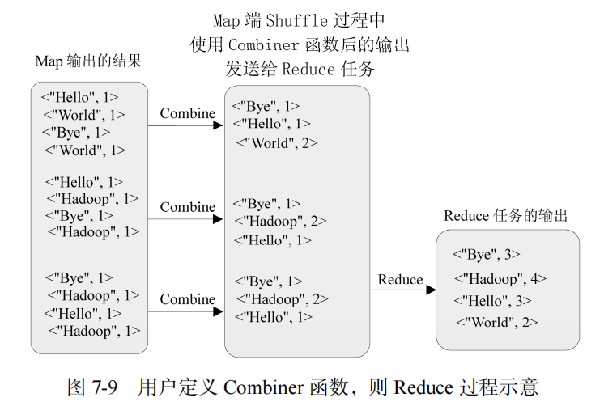
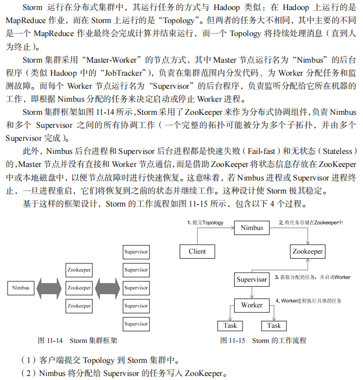

# 大数据复习

## 第一章 大数据概述

### 1.大数据决策与传统的基于数据仓库的决策

- 数据仓库：批量和周期性的数据加载；数据变化实时探测、传播和加载；能结合历史数据和实时数据实现查询分析和自动规则触发，从而提供对战略决策和战术决策。
- 大数据决策：面向类型繁多的、非结构化的海量数据进行决策分析。

### 2.大数据的四大特征

- 数据量大
- 数据类型繁多
- 处理速度快
- 价值密度低（商业价值高）

### 3.大数据、云计算和物联网（概念、区别与联系等）

2010年前后大数据、云计算和物联网的快速发展，拉开了第三次信息化浪潮的大幕。

- **概念**：
  - **大数据**不仅仅是数据的“大量化”,而是包含“快速化”、“多样化”和“价值化”等多重属性。
  - **云计算**实现了通过网络提供可伸缩的、廉价的分布式计算能力，用户只需要在具备网络接入条件的地方，就可以随时随地获得所需的客种资源
  - **物联网**是物物相连的互联网，是互联网的延伸，它利用局部网络或互联网等通信技术把传感器、控制器、机器、人员和物等通过新的方式联在一起，形成人与物、物与物相联，实现信息化和远程管理控制

- **区别**：大数据侧重于海量数据的存储、处理与分析，海量数据中发现价值，服务于生产和生活；云计算本质上皆在整合和优化各种 `IT` 资源并通过网络已服务的方法，廉价地提供给用户；物联网的发展目标是实现呜呜向量，应用创新是物联网的核心
- **联系**从整体来看，大数据、云计算和物联网这三者是相辅相成的。大数据根植于云计算，大数据分析的很多技术都来自于云计算，云计算的分布式存储和管理系统提供了海量数据的存储和管理能力，没有这些云计算技术作为支撑，大数据分析就无从谈起。物联网的传感器源源不断的产生大量数据，构成了大数据的重要数据来源，物联网需要借助于云计算和大数据技术，实现物联网大数据的存储、分析和处理。

### 4.数据产生方式经历的阶段

运营式系统阶段、用户原创内容阶段、感知式系统阶段

## 第二章&第八章 `Hadoop`

### 1.`Hadoop`生态系统中的核心组件

`MapReduce`和`HDFS`

### 2.`Hadoop`特性、作用以及应用场景

#### 2.1 特性

高可靠性、高效性、高可扩展性、高容错性、成本低、运行在`Linux`平台、支持多种编程语言

#### 2.2 作用

存储和处理大规模数据

#### 2.3 应用场景

1. 大数据存储：`Hadoop`可以存储海量数据，具有高可靠性和容错性。
2. 大数据处理：`Hadoop`可以并行处理大规模数据，提供高性能的数据处理能力。
3. 数据分析：`Hadoop`可以用于大规模数据的分布式计算和数据分析，如数据挖掘、机器学习等。
4. 日志处理：`Hadoop`可以处理大量日志数据，支持实时分析和监控。
5. 数据仓库：`Hadoop`可作为大数据仓库，存储结构化和非结构化数据，并支持复杂的查询和分析。
6. 数据备份和恢复：`Hadoop`可用于数据备份和恢复，确保数据安全和可靠性。

## 第三章 分布式文件系统`HDFS`

**解决海量数据高效存储的问题**

分布式文件系统是一种通过网络实现文件在多台主机上进行分布式存储的文件系统。分布式文件系统的设计一般采用“客户/服务器”模式，客户端以特定的通信协议通过网络与服务器建立连接，提出文件访问请求。

### 1.`HDFS HA`架构构成组件及其具体功能

`HA` 架构中，一般设置了两个名称节点。一个为活跃的名称节点，负责对外处理所有客户端的请求；一个为待命的名称节点，作为备用节点，保存了足够多的系统元数据，当名称节点出现故障时提供快速恢复能力。

### 2.`HDFS`和`MapReduce`的功能

分布式存储、分布式计算

### 3.`HDFS`中的名称节点和数据结点（包括功能）

- 名称节点负责管理分布式文件系统系统的命名空间，记录分布式文件系统中的每个文件中各个块所在的数据节点的位置信息；
- 数据节点是分布式文件系统 `HDFS` 的工作节点，负责数据的存储和读取，会根据客户端或者是名称节点的调度来进行数据的存储和检索，并向名称节点定期发送自己所存储的块的列表。

### 4.`HDFS`的冗余数据保存策略

采用了多副本方式多数据进行存储。即先在集群内挑选一台磁盘不太满、`CPU` 不太忙的数据节点作为第一个副本存放点；选取不同的机架的数据节点作为第二副本存放点；选择与第一副本存放点同机架的不同节点作为第三副本存放点；第四副本存放点从集群中随机挑选节点。

### 5.`HDFS`是探测错误发生以及恢复

- 名称节点出错：将名称节点上的元数据信息同步存储到其他文件系统中；并运行一个第二名称节点，当名称节点宕机之后，利用第二名称节点进行系统恢复。
- 数据节点出错：将无法接收到 “心跳” 信号的数据节点标记为不可读，如果数据块的副本数量小于冗余因子，就会启动数据冗余复制，为它生成新副本。
- **数据出错**：客户端收到数据后会使用 `md5` 和 `sha1` 对数据块进行校验；如果校验出错，客户端就会请求到另外一个数据节点读取该文件块，并向名称节点报告这个文件块有错误，名称节点会定期检查并且重新复制这个块。

### 6.`HDFS`的容错机制

`HDFS` 文件系统的容错可以通过 `NameNode` 高可用、`SecondaryNameNode` 机制、数据块副本机制和心跳机制来实现。

### 7.`HDFS`在正常情况下读\写文件过程

见`Xmind`导图

### 8.`HDFS 1.0`的缺陷

`NameNode`单点故障；表达能力有限；磁盘`IO`开销大；延迟高。

### 9.`HDFS`中“块池”的概念，`HDFS`联邦中的一个名称节点失效会否影响为其他名称节点提供服务？

- `HDFS` 联邦拥有多个独立的命名空间，其中，每一个命名空间管理属于自己的一组块，这些属于同一个命名空间的块构成一个 “块池”。
- 每个数据节点会为多个块池提供块的存储。数据节点是物理逻辑，而块池则属于逻辑概念，一个块池是一组块的逻辑集合，块池中的各个块实际上是存储在各个不同的数据节点中的。因此 `HDFS` 联邦中的一个名称节点失效，也不会影响到与它相关的数据节点继续为其他名称节点提供服务。

### 10.常用命令

```shell
hadoop fs <args>     # 使用面最广，可以操作任何文件系统
hdfs dfs <args>      # 只能针对HDFS文件系统

# 将hadoop上某个文件down至本地已有目录下
hadoop dfs -get [文件目录] [本地目录]
hadoop dfs –get /user/t/ok.txt /home/t

# 将本地文件存储至hadoop
hdfs dfs –put [本地地址] [hadoop目录]
hdfs dfs –put /home/t/file.txt /user/t  
# 将本地文件夹存储至hadoop
hdfs dfs –put [本地目录] [hadoop目录] 
hdfs dfs –put /home/t/dir_name /user/t
(dir_name是文件夹名)

# 在hadoop指定目录下新建一个空文件
# 使用touchz命令：
hdfs dfs  -touchz  /user/new.txt
```

## 第四章 `HBase`

### 1.`HBase`和`BigTable`：

`HBase` 是 `BigTable` 的开源实现。 请阐述 `HBase` 和 `BigTable` 的底层技术的对应关系

1. 文件存储系统：`BigTable` 基于 `GFS`，`HBase` 基于 `HDFS`；
2. 海量数据处理：`BigTable` 基于 `MapReduce`，`HBase` 基于 `Hadoop MapReduce`；
3. 协同服务管理：`BigTable` 基于 `Chubby`，`HBase` 基于 `Zookeeper`；

### 2.`HBase`和传统关系数据库：

|   特性   |                  传统关系数据库                  |                           `HBase`                            |
| :------: | :----------------------------------------------: | :----------------------------------------------------------: |
| 数据类型 |                     关系模型                     |                           数据模型                           |
| 数据操作 |         插入、删除、更新、查询、多表连接         |        插入、查询、删除、清空，无法实现表与表之间关联        |
| 存储模式 | 基于行模式存储，元组或行会被连续地存储在磁盘也中 | 基于列存储，每个列族都由几个文件保存，不同列族的文件是分离的 |
| 数据索引 |           针对不同列构建复杂的多个索引           |                       只有一个行键索引                       |
| 数据维护 |       用最新的当前值去替换记录中原来的旧值       |      更新操作不会删除数据旧的版本，而是生成一个新的版本      |
| 可伸缩性 |    很难实现横向扩展，纵向扩展的空间也比较有限    |    轻易地通过在集群中增加或者减少硬件数量来实现性能的伸缩    |

### 3.`HBase`中行键、列族和时间戳

- 行键是唯一的，在一个表里只出现一次，否则就是在更新同一行，行键可以是任意的字节数组。
- 列族需要在创建表的时候就定义好，数量也不宜过多。列族名必须由可打印字符组成，创建表的时候不需要定义好列。
- 时间戳，默认由系统指定，用户也可以显示设置。使用不同的时间戳来区分不同的版本。

### 4.`HBase`的概念视图和物理视图

- 在 `HBase` 的概念视图中，一个表可以视为一个稀疏、多维的映射关系。
- 在物理视图中，一个表会按照属于同一列族的数据保存在一起

### 5.`HBase`的数据分区机制

`HBase` 采用分区存储，一个大的表会被分拆许多个 `Region`，这些 `Region` 会被分发到不同的服务器上实现分布式存储。

### 6.在`HBase`的三层结构下，`Region`的大小、客户端访问数据

阐述 `HBase` 的三层结构下，客户端是如何访问到数据的。 首先访问 `Zookeeper`，获取 `-ROOT-` 表的位置信息，然后访问 `-Root-` 表，获得`.MATA.` 表的信息，接着访问`.MATA.` 表，找到所需的 `Region` 具体位于哪个 `Region` 服务器，最后才会到该 `Region` 服务器读取数据。

### 7.`Region`服务器向`HDFS`文件系统中读写数据的基本原理

`Region` 服务器内部管理了一系列 `Region` 对象和一个 `HLog` 文件，其中，`HLog` 是磁盘上面的记录文件，它记录着所有的更新操作。每个 `Region` 对象又是由多个 `Store` 组成的，每个 `Store` 对应了表中的一个列族的存储。每个 `Store` 又包含了 `MemStore` 和若干个 `StoreFile`，其中，`MemStore` 是在内存中的缓存，保存最近更新的数据。`StoreFile` 是磁盘中的文件，这些文件都是树结构，方便读取。 用户读写数据的过程：当用户写入数据时，会被分配到相应的 `Region` 服务器去执行操作，用户数据首先被写入到 `MemStore` 和 `HLog` 中，当操作写入 `HLog` 之后，`commit()` 调用才会将其返回给客户端。当用户读取数据时，`Region` 服务器会首先访问 `MemStore` 缓存，如果数据不在缓存中，才会到磁盘上面的 `StoreFile` 中去寻找。

### 8.`HLog`的工作原理

`HBase` 系统为每个 `Region` 服务器配置了一个 `HLog` 文件，它是一种预写式日志（`Write Ahead Log`），用户更新数据必须首先写入日志后，才能写入 `MemStore` 缓存，并且，直到 `MemStore` 缓存内容对应的日志已经写入磁盘，该缓存内容才能被刷写到磁盘。

### 9.在`HBase`中，每个`region`服务器维护一个`HLog`的优缺点

- 优点：当有多个 `Region` 对象的更新操作发生的日志修改时，只需要不断把日志记录追加到单个日志文件中，而不需要同时打开、写入到多个日志文件中，可以减少磁盘寻址次数，提高对表的写操作性能。
- 缺点：如果一个 `Region` 服务器发生故障，为了恢复其上的 `Region` 对象，需要将 `Region` 服务器上的 `HLog` 文件按照所属的 `Region` 对象进行拆分，然后分发到其他的 `Region` 服务器上执行恢复操作。

### 10.`Region`服务器意外终止情况的处理

1. `Zookeeper` 会实时监测每个 `Region` 服务器的状态，当某个 `Region` 服务器发生故障时，`Zookeeper` 会通知 `Master`。
2. `Master` 首先会处理该故障 `Region` 服务器上面遗留的 `HLog` 文件，这个遗留的 `HLog` 文件中包含了来自多个 `Region` 对象的日志记录。
3. 系统会根据每条日志记录所属的 `Region` 对象对 `HLog` 数据进行拆分，分别放到相应 `Region` 对象的目录下，然后，再将失效的 `Region` 重新分配到可用的 `Region` 服务器中，并把与该 `Region` 对象相关的 `HLog` 日志记录也发送给相应的 `Region` 服务器
4. `Region` 服务器领取到分配给自己的 `Region` 对象以及与之相关的 `HLog` 日志记录以后，会重新做一遍日志记录中的各种操作，把日志记录中的数据写入到 `MemStore` 缓存中，然后，刷新到磁盘的 `StoreFile` 文件中，完成数据恢复；

## 第五章 `Nosql`数据库

### 1.`CAP`

- C（`Consistency`）：一致性，所有节点在同一时间具有相同的数据。
- A:（`Availability`）：可用性，是指快速获取数据，可以在确定的时间内返回操作结果，保证每个请求不管成功或者失败都有响应；
- P（`Tolerance of Network Partition`）：分区容忍性，是指当出现网络分区的情况时（即系统中的一部分节点无法和其他节点进行通信），分离的系统也能够正常运行，也就是说，系统中任意信息的丢失或失败不会影响系统的继续运作。

### 2.关系数据库和`NoSQL`数据库

|  对比指标  |             `NoSQL`              | 关系数据库 |                             备注                             |
| :--------: | :------------------------------: | :--------: | :----------------------------------------------------------: |
| 数据库原理 |             部分支持             |  完全支持  | 关系数据库有关系代数理论作为基础。 `NoSQL`没有统一的理论基础 |
|  数据规模  |               超大               |     大     | 关系数据库很难实现横向扩展，纵向扩展空间有限，性能随数据规模增大而降低。 `NoSQL`可通过添加设备支持更大规模数据 |
| 数据库模式 |               灵活               |    固定    | 关系数据库需定义模式，遵守数据定义和约束。 `NoSQL`自由、灵活定义存储不同类型数据 |
|  查询效率  | 可高效简单查询，复杂查询性能不佳 |     快     | 关系数据库通过索引实现快速查询。 `NoSQL`复杂查询性能不如关系数据库 |
|   一致性   |             弱一致性             |  强一致性  | 关系数据库遵守`ACID`模型。 `NoSQL`遵守`BASE`模型，保证最终一致性 |
| 数据完整性 |             很难实现             |  容易实现  |     关系数据库容易实现数据完整性，`NoSQL`数据库无法实现      |
|   扩展性   |                好                |    一般    |           关系数据库扩展困难。 `NoSQL`易于横向扩展           |
|   可用性   |               很好               |     好     |     关系数据库优先保证数据一致性，`NoSQL`提供较高可用性      |
|   标准化   |                否                |     是     | 关系数据库已标准化（`SQL`）。 `NoSQL`无行业标准，查询语言各异 |
|  技术支持  |                低                |     高     | 关系数据库成熟，大型厂商提供技术支持。 `NoSQL`技术支持起步阶段 |
|  可维护性  |               复杂               |    复杂    |  关系数据库需`DBA`维护。 `NoSQL`虽不如此复杂，但仍难以维护   |

### 3.数据存储时的软状态、无状态和硬状态

- 软状态：与硬状态相对，状态可以有一段时间不同步，具有一定的滞后性；
- 无状态：没有记忆，即进行了任何操作都不会保存修改；
- 硬状态：保持数据一致性，即保证数据一直是正确的。

### 4.键值数据库、列族数据库、文档数据库和图数据库的适用场合和优缺点

| 项目     |                 键值数据库                 |                      列族数据库                      |                       文档数据库                       |                           图数据库                           |
| -------- | :----------------------------------------: | :--------------------------------------------------: | :----------------------------------------------------: | :----------------------------------------------------------: |
| 适用场合 | 内容缓存，如会话、配置文件、参数、购物车等 |                 分布式数据存储与管理                 | 存储、索引并管理面向文档的数据或者类似的半结构化的数据 | 大量复杂、互连接、低结构化的图结构场合，如社交网络、推荐系统等 |
| 优点     |   扩展性好、灵活性好、大量写操作时性能高   | 查找速度快、可扩展性强、容易进行分布式扩展、复杂性低 |        性能好、灵活性高、复杂性低、数据结构灵活        |     灵活性高、支持复杂的图算法、可用于构建复杂的关系图谱     |
| 缺点     |    无法存储结构化信息、条件查询效率较低    |            功能较少、大都不支持事务一致性            |                 缺乏统一的数据查询语法                 |              复杂性高，且只能支持一定的数据规模              |

### 5.`NewSQL`数据库与传统的关系数据库以及`NoSQL`数据库的区别、常见的`NoSQL`数据库

`NewSQL`数据库不仅具有`NoSQL`对海量数据的存储管理能力，还保持了传统数据库支持`ACID`和`SQL`特性。

### 6.`BASE`

- 基本可用（`Basically available`）：一个分布式系统的一部分发生问题变得不可用时，其他部分仍然可以正常使用，也就是允许分区失败的情形出现。
- 软状态（`Soft-state`）：状态可以有一段时间不同步，具有一定的滞后性。
- 最终一致性（`Eventual consistency`）：允许后续的访问操作可以暂时读不到更新后的数据，但是经过一段时间后，必须读到更新后的数据。

## 第七章 `MapReduce`

### 1.`MapReduce1.0`体系结构的优缺点

**优点**

1. `MapReduce` 易于编程
2. 良好的扩展性
3. 高容错性。
4. 适合 `PB` 级以上海量数据的离线处理

**缺点**

1. 存在单点故障：系统中只有一个 `JobTracker` 来负责所有 `MapReduce` 作业的调度
2. `JobTracker` 负责的任务过重：`JobTracker` 不仅要负责作业的调度和失败恢复，同时要负责资源管理与分配；
3. 容易出现内存溢出：`TaskTracker` 资源分配时不考虑内存的实际情况；
4. 资源划分不合理：资源槽之间彼此不能共通使用；

### 2.`Map`函数和`Reduce`函数的输入、输出以及处理过程

- `Map` 函数的输入是来自于分布式文件系统的文件块，这些文件块的格式是任意的，可以是文档，也可以是二进制格式。文件块是一系列元素的集合，这些元素是任意类型的，同一个元素不能跨文件块存储。`Map` 函数将输入的元素转换成 `<key,value>` 形式的键值对，键和值的类型也是任意的，其中，键不同于一般的标志属性，即键没有唯一性，不能作为输出的身份标识，即使是同一输入元素，也可通过一个 `Map` 任务生成具有相同键的多个 `< key,value>`。
- `Reduce` 函数的任务就是将输入的一系列具有相同键的键值对以某种方式组合起来, 输出处理后的键值对，输出结果会合并成一个文件。用户可以指定 Reduce 任务的个数 (如 `n` 个)，并通知实现系统，然后主控进程通常会选择一个 `Hash` 函数，`Map` 任务输出的每个键都会经过 Hash 函数计算，并根据哈希结果将该键值对输入相应的 `Reduce` 任务来处理。对于处理键为 `k` 的 `Reduce` 任务的输入形式为 `<K, <v1,v2,…,vn>>`, 输出为 `<k,V>`。

### 3.`MapReduce`的工作流程（需包括提交任务、`Map`、`Shuffle`、`Reduce`的过程）

1. `MapReduce` 框架使用 `InputFormat` 模块做 `Map` 前的预处理，然后将输入文件切分为逻辑上的多个 `InputSplit`。
2. 通过 `RecordReader` 根据 `InputSplit` 中的信息来处理 `InputSplit` 中的具体记录，加载数据并转换为适合 `Map` 任务读取的键值对，输入给 `Map` 任务。
3. `Map` 任务会根据用户自定义的映射规则，输出一系列的 `<key, value>` 作为中间结果。
4. `Shuffle`：对 `Map` 的输出进行一定的分区、排序、合并、归并等操作，得到 `<key,value-list>` 形式的中间结果，再交给对应的 `Reduce` 进行处理。
5. `Reduce` 以一系列 `<key, value-list>` 中间结果作为输入，执行用户定义的逻辑，输出结果给 `OutputFormat` 模块。
6. `OutputFormat` 模块会验证输出目录是否存在以及输出结果类型是否符合配置文件中的配置类型，如果都满足，就输出 `Reduce` 的结果到分布式文件系统。

### 4.`Map`端和`Reduce`端的`Shuffle`过程（包括`Spilt`、`Sort`、`Merge`、`Fetch`的过程）

#### 4.1 `Map`端的`Shuffle`过程

- 输入数据和执行Map任务
- 写入缓存
- 溢写（分区、排序、合并）
- 文件归并

#### 4.2 `Reduce`端的`Shuffle`过程

- ”领取“数据
- 归并数据
- 把数据输入`Reduce`任务

### 5.`Reduce`的三阶段

1. “领取”数据
2. 归并数据
3. 把数据输入给 Reduce 任务

### 6.`Combiner`的灵活使用

分析为何采用 `Combiner` 可以减少数据传输量? 对于每个分区内的所有键值对，后台线程会根据 `key` 对它们进行内存排序 (`Sort`), 排序是 `MapReduce` 的默认操作。排序结束后，还包含一个可选的合并 (`Combine` ) 操作。如果用户事先没有定义 `Combiner` 函数，就不用进行合并操作。如果用户事先定义了 `Combiner` 函数，则这个时候会执行合并操作，从而**减少需要溢写到磁盘的数据量**。所谓 “合并”，是指将那些具有相同 `key` 的 `< key,value >` 的 `value` 加起来，比如，有两个键值对 `<"xmu",1 >` 和 `<"xmu",1>`, 经过合并操作以后就可以得到一个键值对 `<"xmu",2>`, 减少了键值对的数量。不过，并非所有场合都可以使用 `Combiner`, 因为，`Combiner` 的输出是 `Reduce` 任务的输入，`Combiner` 绝不能改变 `Reduce` 任务最终的计算结果，一般而言，累加、最大值等场景可以使用合并操作。

### 7.`MapReduce`程序的中间结果存储在本地磁盘而不是`HDFS`上有何优缺点

- 优点：更符合移动计算比移动数据经济原则，且 `Map` 输出结果仅仅是中间结果。
- 缺点：在 `Reduce` 任务完成后，中间结果会被删除， `HDFS` 还会对该部分数据做复制备份，造成资源浪费。

### 8.在`YARN`框架中执行一个`MapReduce`程序时，从提交到完成需要经历的具体步骤

1. 用户编写客户端应用程序，向 YARN 提交应用程序，提交的内容包括 `ApplicationMaster` 程序、启动 `ApplicationMaster` 的命令、用户程序等。
2. `YARN` 中的 `ResourceManager` 负责接收和处理来自客户端的请求。接到客户端应用程序请求后，`ResourceManager` 里面的调度器会为应用程序分配一个容器。同时，`ResourceManager` 的应用程序管理器会与该容器所在的 `NodeManager` 通信，为该应用程序在该容器中启动一个 `ApplicationMaster`。
3. `ApplicationMaster` 被创建后会首先向 `ResourceManager` 注册，从而使得用户可以通过 `ResourceManager` 来直接查看应用程序的运行状态。
4. `ApplicationMaster` 采用轮询的方式通过 `RPC` 协议向 `ResourceManager` 申请资源。
5. `ResourceManager` 以 “容器” 的形式向提出申请的 `ApplicationMaster` 分配资源，一旦 `ApplicationMaster` 申请到资源后，就会与该容器所在的 `NodeManager` 进行通信，要求它启动任务。
6. 当 `ApplicationMaster` 要求容器启动任务时，它会为任务设置好运行环境（包括环境变量、`JAR` 包、二进制程序等），然后将任务启动命令写到一个脚本中，最后通过在容器中运行该脚本来启动任务。
7. 各个任务通过某个 `RPC` 协议向 `ApplicationMaster` 汇报自己的状态和进度，让 `ApplicationMaster` 可以随时掌握各个任务的运行状态，从而可以在任务失败时重启任务。
8. 应用程序运行完成后，`ApplicationMaster` 向 `ResourceManager` 的应用程序管理器注销并关闭自己。若 `ApplicationMaster` 因故失败，`ResourceManager` 中的应用程序管理器会监测到失败的情形，然后将其重新启动，直到所有任务执行完毕。

### 9.单词统计实例

<center class="half">    
	<center class="half">
    
    
    
</center>
<h2>单词统计实例</h2>

### 10.`Hadoop MapReduce`的缺陷，并说明`Spark`具有哪些优点？

`Hadoop` 存在以下缺点：

1. 表达能力有限；
2. 磁盘 `IO` 开销大；
3. 延迟高。

`Spark` 主要有如下优点： 

4. 除了 `Map` 和 `Reduce` 操作，提供了多种数据集操作类型，编程模型比 `Reduce` 更加灵活。 
5. 提供了内存计算，中间结果直接存放在内存中，带来了更高的迭代运算效率。 
6. 基于 `DAG` 的任务调度执行机制，优于 `MapReduce` 的迭代执行机制。

### 11.`MapReduce`的框架、小批量处理、以及流数据处理

- 试述 `MapReduce` 框架为何不适合用于处理流数据。 `Hadoop` 设计的初衷是面向大规模数据的批量处理，这种批量任务处理方式在时间延迟方面是无法满足流计算的实时响应需求的。
- 将基于 `MapReduce` 的批量处理转为小批量处理，每隔一个周期就启动一次 `MapReduce` 作业，通过这样的方式来处理流数据是否可行？为什么？ 不可行。

1. 切分成小的片段，虽然可以降低延迟，但是也增加了任务处理的附加开销，而且还要处理片段之间的依赖关系。
2. 需要对 `MapReduce` 进行改造以支持流式处理，会大大增加 `MapReduce` 框架的复杂度，难以维护和扩展。
3. 降低了用户程序的可伸缩性，因为用户必须要使用 `MapReduce` 接口来定义流式作业。

### 12.单词统计：采用`MapReduce`框架与采用`Storm`框架区别？

- `MapReduce` 框架使用了 `Map` 和 `Reduce` 的过程，将文本进行分割后，由 `Map` 进行各文本段的单词计数再传输到 `Reduce` 中计数；
- 而 `Storm` 框架使用了 `Spout` 和 `Bolt` 的抽象，由一个 `Bolt` 进行单词分割，另一个 `Bolt` 进行计数。

### 13.`JobTracker`和`TaskTracker`的功能

- `JobTracker` 负责作业和任务的调度，监控它们的执行，并重新调度已经失败的任务。
- `TaskTracker` 负责执行由 `JobTracker` 指派的任务。

### 14.为何说`MapReduce`移动计算比移动数据更经济？

`MapReduce` 设计的一个理念就是 “计算向数据靠拢”，而不是 “数据向计算靠拢”，因为移动数据需要大量的网络传输开销，尤其是在大规模数据环境下，这种开销尤为惊人，所以，移动计算要比移动数据更加经济。本地计算：在一个集群中，只要有可能，`MapReduce` 框架就会将 `Map` 程序就近地在 `HDFS` 数据所在的节点运行，即将计算节点和存储节点放在一起运行，从而减少了节点间的数据移动开销。

## 第九章 `Hive`

### 1.`ETL`过程概念及步骤

数据提取、转换和加载（`Extraction`、`Transformation`、`Loading`，`ETL`）：即来自各个不同数据源的数据被收集过来以后，使用 `Pig` 进行统一加工处理，然后加载到数据仓库 `Hive` 中。

## 第十章 `Spark`

### 1.`Spark`的几个主要概念：`RDD`、`DAG`、阶段、分区、窄依赖、宽依赖

- `RDD`：是弹性分布式数据集（`Resilient Distributed Datase`t）的英文缩写，是分布式内存的一个抽象概念，提供了一种高度受限的共享内存模型。
- `DAG`：是 `Directed Acyclic Graph`（有向无环图）的英文缩写，反映 `RDD` 之间的依赖关系。
- 阶段：是作业的基本调度单位，一个作业会分为多组任务，每组任务被称为 “阶段”，或者也被称为 “任务集”。
- 分区：一个 RDD 就是一个分布式对象集合，本质上是一个只读的分区记录集合，每个 RDD 可以分成多个分区，每个分区就是一个数据集片段。
- 窄依赖：父 `RDD` 的一个分区只被一个子 `RDD` 的一个分区所使用就是窄依赖
- 宽依赖：父 `RDD` 的一个分区被一个子 `RDD` 的多个分区所使用就是宽依赖

### 2.`Spark`对`RDD`的操作主要分为：行动和转换

- 行动：计算并输出计算值，接受 `RDD` 但是返回非 `RDD`；
- 转换：基于现有的数据集创建新数据集，指定 `RDD` 之间的相互依赖关系，接受 `RDD` 并返回 `RDD`。

## 第十一章 流计算

### 1.流计算流程与传统的数据处理流程

- 传统的数据处理需要先采集数据并存储在关系数据库等数据管理系统中，且需要主动发起查询；
- 流计算是使用实时数据流，经过计算和分析后，实时查询服务可以不断更新结果，并将用户所需要的结果实时推送给用户。

### 2.常用的流计算框架

- 商业：`IBM InfoSphere Streams`、`IBM StreamBase`
- 开源：`Twitter Storm`、`Yahoo! S4(Simple Scalable Streaming System)`、`Spark Streaming`、`Flink`
- 自身业务：百度`DStream`、淘宝银河流

### 3.批处理、实时处理概念，批处理与流处理区别

- 批量计算以“静态数据”为对象，可以在很充裕的时间内对海量数据进行批量处理，计算得到有价值的信息。`Hadoop` 就是典型的批处理模型，由 `HDFS` 和 `HBase`存放大量的静态数据，由 `MapReduce` 负责对海量数据执行批量计算。流数据则不适合采用批量计算，因为流数据不适合用传统的关系模型建模，不能把源源不断的流数据保存到数据库中。
- 流数据必须采用实时计算，实时计算最重要的一个需求是能够实时得到计算结果，一般要求响应时间为秒级。

### 4.`Nimbus`进程和`Supervisor`进程




### 5.`Storm`集群中的`Master`和`Worker`节点各自运行什么后台进程，这些进程又分别负责什么工作？

- `Storm` 集群采用 `Master—Worker` 的节点方式：
- `Master` 节点运行名为 “`Nimbus`” 的后台程序（类似 `Hadoop` 中的“`JobTracker`”），负责在集群范围内分发代码、为 `Worker` 分配任务和监测故障
- `Worker` 节点运行名为 “`Supervisor`” 的后台程序，负责监听分配给它所在机器的工作，即根据 `Nimbus` 分配的任务来决定启动或停止 `Worker` 进程，一个 `Worker` 节点上同时运行若干个 `Worker` 进程。

### 6.`Nimbus`进程和`Supervisor`进程意外终止后，重启时是否能恢复到终止之前的状态，为什么？

可以。

`Storm` 使用 `Zookeeper` 来作为分布式协调组件，负责 `Nimbus` 和多个 `Supervisor` 之间的所有协调工作。借助于 `Zookeeper`，若 `Nimbus` 进程或 `Supervisor` 进程意外终止，重启时也能读取、恢复之前的状态并继续工作，使得 `Storm` 极其稳定

## 第十三章 图计算

### 1.图计算框架`Pregel`的应用

图遍历、最短路径、`PageRank`计算等等

## Others

### 数据清洗概念及常见操作（步骤）以及数据清洗的必要性

数据清洗是数据预处理的关键一步。包括：缺失值处理、异常值检测与处理、去重、类型转换、格式统一。可以提高数据质量、减少偏差、提升分析结果。

