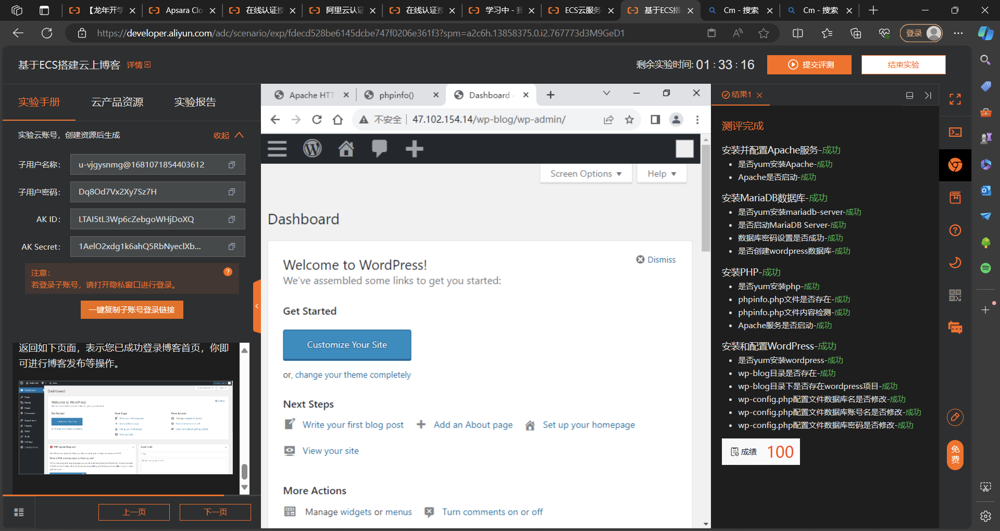

# 阿里云自学实践课程

## 一、云中学堂课程

## 二、飞天加速计划

**《基于ECS搭建云上博客》**

## 三、高校训练营

### 玩法一

### 玩法三

## 四、《云服务器ECS》入门认证考试证书

## 五、`Clouder`认证

### `ECS`云服务器新手上路

### 云服务器`ECS`入门

## 六、自学心得

### 学习Apache Flink的心得体会

随着大数据时代的到来，实时数据处理成为了企业决策和业务创新的关键驱动力。在这场数据洪流中，Apache Flink作为一款功能强大的分布式流处理和批处理框架，以其高效、灵活和强大的容错能力脱颖而出，成为众多企业和开发者关注的焦点。在我深入学习Flink的过程中，不仅对其技术架构有了全面的理解，也深刻体会到了其在实时数据分析领域的巨大潜力和价值。以下是我学习Flink的一些心得体会。

### Flink的技术魅力

Flink的核心设计理念是“统一”，它将流处理和批处理统一在一套框架之下，使得开发者可以使用相同的API处理有界和无界数据。这种统一性极大地简化了开发复杂度，提高了代码的复用性。Flink的架构设计高度模块化，从JobManager到TaskManager，再到StateBackend，每个组件各司其职，协同工作，共同构建了一个既强大又灵活的处理引擎。

**JobManager**和**TaskManager**的分工明确，JobManager作为集群的大脑，负责作业调度和资源管理，而TaskManager则是执行者，专注于数据处理任务。这样的设计保证了系统的高可用性和扩展性。尤其是StateBackend的设计，让我印象深刻，它支持多种状态存储方式，如内存、文件系统和RocksDB，这些多样化的选择让开发者可以根据业务需求灵活地选择最适合的状态持久化策略，确保数据处理的准确性和可靠性。

### DataStream API与DataSet API

Flink提供的DataStream API和DataSet API分别针对流处理和批处理，两者的易用性和强大功能给我留下了深刻印象。DataStream API特别适合实时数据流处理，其内置的窗口函数、时间处理逻辑和丰富的转换操作符，如map、filter、window和join，极大地简化了实时计算逻辑的编写。相比之下，DataSet API则更加专注于有界数据集的处理，它所提供的功能与Hadoop的MapReduce相似，但提供了更高级别的抽象，使得批处理任务的开发更加高效。

### 窗口函数与流式计算

Flink的窗口函数是其处理无界数据流的核心特性之一。通过滚动窗口、滑动窗口、会话窗口和全局窗口，Flink能够灵活地对连续不断的数据流进行分片和聚合，满足不同场景下的实时分析需求。我被其对时间窗口的精准控制所吸引，这在诸如实时监控、交易分析、用户行为分析等领域有着广泛的应用。特别是自定义窗口函数的能力，使得Flink在处理复杂时间序列分析时展现出极高的灵活性和定制性。

### 集成与扩展性

Flink与多种资源管理器（如YARN、Kubernetes）的无缝集成，以及丰富的Connectors，体现了其出色的生态兼容性和扩展性。这种开放性使得Flink能够轻松接入各类数据源和数据存储系统，比如Kafka、HDFS、Elasticsearch等，大大拓宽了其应用领域。此外，Flink的容错机制和状态管理设计，确保了在分布式环境中即使出现故障也能保证数据处理的精确一次语义，这是实时处理系统不可或缺的特性。

### 学习挑战与收获

学习Flink的过程中，最大的挑战在于理解和掌握其复杂的架构设计与丰富的API。流处理本身就是一个相对复杂的领域，涉及到事件时间、水印、窗口策略等多个概念，需要投入大量的时间和精力去实践和理解。但正是这种深入的学习，让我对实时数据处理有了更深层次的认识，也锻炼了我解决实际问题的能力。

### 结语

总的来说，Flink的学习之旅是一段充满挑战但收获颇丰的旅程。它不仅让我掌握了实时数据处理的核心技术和方法论，更激发了我对大数据处理技术的浓厚兴趣。随着大数据和人工智能技术的不断发展，我相信Flink在未来将会扮演更加重要的角色。对于希望踏入这一领域的开发者而言，深入学习Flink无疑是一项值得投资的技能，它将为我开启一扇通往大数据实时处理世界的大门。