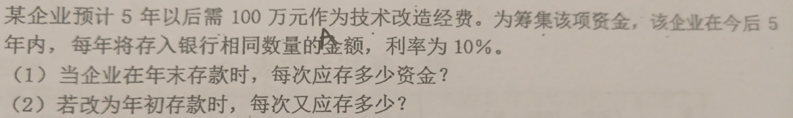

# 工程经济期末预习

## 第一章 导论

### 一、技术与经济的关系

1. 技术与经济呈现相互促进、相互制约的关系；
2. 发展经济必须依靠技术创新与技术进步，科学技术是第一生产力，技术突破会对经济产生巨大推动作用；
3. 技术开发是一项高投入、高风险和周期长的活动，其产生与应用都需要经济的支持，受到经济的制约；
4. 任何技术的产生与应用不仅是技术问题，也是经济问题，技术与经济要协调发展。

### 二、技术经济学定义

技术经济学是研究技术与经济的相互关系的学科。它通过技术比较、经济分析和效果评价，寻求技术与经济的最佳结合，确定技术先进与经济合理的最优状态

### 三、技术经济分析的一般过程

1. 明确目标功能，即明确解决的问题；
2. 研究和提出备选方案；
3. 方案评价（净现值法、内部收益率法、盈亏平衡法等）；
4. 选择最优方案。

### 四、工程人员肩负的责任（三大使命）

1. 技术使命（技术创新）
2. 经济使命（技术方案产生良好经济效益）
3. 社会使命（环境保护、节能减排）

## 第二章 技术创新

### 1.技术创新是什么？

指企业家对生产要素的重新组合，或者说是建立一种新的生产函数，将生产要素的“新组合”引入生产体系。

### 2.熊比特提出的创新分类：

- 生产新的产品；
- 引入新的生产方法、新的工艺过程；
- 开辟新的市场；
- 开辟并利用新的原料或半制成品的供应来源；
- 采用新的生产组织方法。

### 3.技术创新的特征

1) 技术创新与发明不同，发明是一种技术活动，而技术创新是一种经济活动；

2) 技术创新活动是一个过程，包括研究开发、设计、制造、营销等方面；

3) 严格意义上的技术创新是指新技术的首次商业化应用，而在此之后的应用称为模仿。

### 4.技术创新过程的主要模式

技术推动模式、需求拉动模式、耦合模式、整合模式、系统集成及网络化模式

### 5.技术创新战略模式有哪些？

自主创新战略模式、模仿创新战略模式、合作创新战略模式

### 6.企业内部技术创新组织形式

内企业与内企业家、技术创新小组、新事业发展部、技术中心

### 四、技术创新组织形式

技术创新常用的组织形式包括:

- 在产品事业部内组成新产品或新技术开发小组
- 技术中心(风险事业部
- “产、学、研”结合
- 内企业与内企业家
- 创新小组

### 五、商业模式创新

#### 1.概念

描述企业如何通过运作来实现其生存与发展

#### 2.要素

价值主张、消费者目标群体、分销渠道、客户关系、价值匹配、核心能力、合作伙伴网络、成本结构、收入模型

#### 3.商业模式创新的动力

1. 商业环境的变化
2. 新技术的发展需要
3. 市场机会的拉动
4. 竞争的巨大压力

#### 4.商业模式的创新途径

1. 商业模式系统的创新
2. 商业模式组成要素的创新
3. 基于创新程度视角的创新途径
4. 价值链视角的商业模式创新

## 第三章 经济性评价基本要素

### 1. 经济效果与经济效益

1. 经济效果指人们为了达到一定目的所从事的实践活动的成果与劳动消耗的比较。而将经济活动中所取得的有效劳动成果与劳动耗费的**比较**称为经济效益。

   经济效果=成果/消耗=产出/投入

   经济效益=有效成果/消耗=有效产出/投入

2. 差额表示法、比值表示法、差额比值表示法

3. 经济效果分类：宏观与微观（企业经济效果与国民经济效果）；直接与间接；有形与无形

### 2. 现金流量

1) 现金流入
2) 现金流出
3) 净现金流量

### 3. 投资

1. 固定资产投资

   使用期限在一年以上，单位价值在一定额度以内，在使用过程中保持原来形态的资产。

2. 流动资产投资

   项目在投产前预先垫付在投产后生产经营过程中周转使用的资金

3. 无形资产投资

   用于购置无形资产所投入的资金

4. 递延资产投资

   不能全部计入当年损益，应当在以后的年度内分期摊销的各项费用

### 4.固定资产折旧

- 含义：

  在固定资产的使用过程中，随着资产损耗而逐渐转移到产品成本费用中的那部分价值

- 平均年限法（直线法）
  $$
  \text{年折旧费}=\dfrac{\text{原定资产原值-预计净残值}}{\text{折旧年限}}\\
  \text{年折旧率}=\dfrac{\text{年折旧费}}{\text{固定资产原值}}\times 100\%
  $$
  

- 工作量法

  

- 加速折旧法

  - 双倍余额递减法
    $$
    \text{年折旧费}=\dfrac{2}{\text{折旧年限}}\times 100\%\\
    \text{年折旧费}=\text{年初固定资产账面净值}\times \text{年折旧率}
    $$
    **最后两年要改用平均年限法**

    

  - 年数总和法

    **每年都要确定一个不同的折旧率**
    $$
    \text{年折旧费}=\dfrac{\text{折旧年限-已使用年数}}{\text{折旧年限}\times \dfrac{\text{折旧年限}+1}{2}}\times 100\%\\
    \text{年折旧费}=(\text{固定资产原值}-\text{预计净残值})\times 年折旧率
    $$
    

### 5.成本

- 机会成本

  机会成本指将有限资源用于某种特定用途而放弃的其他最好用途中的最高收益）

- 沉没成本

  沉没成本指过去已经支出而现在已无法得到补偿的成本，其对企业决策不起作用。

- 固定成本

  一定产量范围内不随产量变动而变动的费用

- 变动成本

  总成本中随产量变动而变动的费用

- 经营成本

  为了分析的需要从总成本费用中分离出来的一部分费用（期间通常为一年）

  $\text{经营成本}=\text{总成本费用}-\text{折旧费}-\text{摊销费}-\text{财务费用}$

### 6.税金与税收

- 增值税

  商品生产、流通和加工、修理、修配等各种环节的增值额征收的一种流转税

  $\text{纳税人应纳税额}=\text{当前销项税额}-\text{档期进项税额}$

- 企业税后利润

  $\text{税后利润}=\text{利润总额}-\text{应交所得税}$

### 7.资金时间价值及其等值计算

- 单利与复利
  $$
  \text{单利}F=P(1+ni)\\
  \text{复利}F=P(1+i)^n
  $$

- 名义利率与实际利率
  $$
  \text{实际利率}i=(1+\frac{\text{名义利率}r}{m})^m-1
  $$
  $m$表示一年内的计息周期数

- [计算题](https://www.bilibili.com/video/BV1MB4y1j71E/?spm_id_from=333.337.search-card.all.click&vd_source=b39ccc08927e4cd0ba5044fb9fb47c25)

  

  

  - F/P、P/F、F/A、A/F、P/A、A/P，求解什么，哪个字母就在上面

  - 画现金流量图

    

  例题：

  

  

## 第四章 经济性评价基本方法

### 1.投资回收期法

**投资回收期，越小越好！**

- 净现金流量
  $$
  CI:现金流入量\\
  CO:现金流出量\\
  (CI-CO):第 t 年净现金流量
  $$

- 静态投资回收期

  - 投资一次完成
    $$
    T_p=\dfrac{I}{B-C}
    $$
    I：项目投入的资金

    B：每年的投入

    C：每年的成本费用

  - 投资分几次完成

    直接看题，那么长的公式谁`tm`想看

    

    投资回收期，就是把项目初期的投资的钱赚回来，要花的时间。

    所以先看净现金流量，第三年<0，第四年>0，说明这个回收期是3.几年。

    第三年初还亏着3500，然后第三年一年赚了5000，那么赚到3500的时候，就是投资回收期的那个点，需要花$$(3+\dfrac{3500}{5000})$$年。

- 动态投资回收期

  

  动态投资回收期同理，就是加入了时间的考量，所以要看折现值。

### 2.净值法

- 净现值

  折算到初期

  

- 净现值率

  单位投资现值所取得的净现值额
  $$
  NPVR+\dfrac{NPV(i_0)}{K_p}
  $$
  $NPVR$：净现值率

  $K_p$：项目总投资现值

- 净终值

  换算到期末

- 净年值
  $$
  NAV=NPV(A/P,i_0,n)
  $$

### 3.内部收益率法

内部收益率$IRR$​：项目在计算期内，净现值等于0时的折现率。

**内部收益率越高越好**
$$
\sum_{i=0}^{n}(CI-CO)_t(P/F,IRR,t)=0
$$
线性插值法求解：

- 在满足以下两个条件的基础上预先估计两个适当的折现率$i_1$​和$i_2$​
  $i_1<i_2$​，且$(i_2-i_1)\le5\%$​
  $NPV(i_1)>0$​，$NPV(i_2)<0$​
  
- $\dfrac{IRR-i_低}{i_高-i_低}=\dfrac{NPV_{(正)}}{NPV_{(正)}+|NPV_{(负)}|}$​
  
### 4.其他效率型指标

#### 4.1 投资收益率

#### 4.2 效益费用比值

### 5.多方案经济评价方法

#### 5.1 备选方案类型


#### 5.2 互斥型方案经济评价方法

##### 5.2.1 寿命期相等的互斥方案比较选择

- 净现值法

  分别计算各个方案的净现值，剔除不合理（$NPV<0$）的方案，选择净现值最大的方案

- 增量净现值法

  投资额大的方案减去投资额小的方案构成新的现金流量

  $\Delta NPV\ge 0$        选择投资大的方案

  $\Delta NPV< 0$​​        选择投资小的方案

  

- 增量内部收益率法

  $\Delta IRR\ge i_0$​        选择投资大的方案

  $\Delta IRR<i_0$​​        选择投资小的方案

  

- 增量投资回收期
  $$
  \Delta T=\dfrac{I_1-I_2}{C_2-C_1}
  $$
  若$\Delta T\le T_b$，选择$I_1$那个方案

  

- 多个互斥方案的比较方法

  

##### 5.2.2 寿命期不相等的互斥方案比较选择

- 方案重复法

  - 最小公倍数法

    

  - 净年值法

    

- 研究期法

  一般选寿命最短的为研究期

  

#### 5.3 独立方案的经济评价方法

**资源限制条件下**

##### 5.3.1 方案组合法

##### 5.3.2 效率指标排序法

- 净现值指数排序法

  求`NPVR`，排序

- 内部收益率排序法

  求内部收益率，排序

## 第五章 不确定性与风险分析

### 1.技术方案产生的风险、不确定性的原因

- 通货膨胀和物价的变动
- 技术装备及生产工艺的变革和项目经济寿命期的变动
- 生产能力和销售量的变动
- 建设资金和工期的变化
- 国家经济政策和法规的变化

### 2.不确定性分析的程序

- 鉴别主要不确定因素
- 估计不确定因素的变化范围，进行初步分析
- 进行敏感性分析

### 3.盈亏平衡分析

盈亏平衡点和额定量相差越远，说明方案盈利的可能性越大，亏损的可能性越小，因而方案有较大的抗经营风险的能力。

- 销售收入与产量的关系
  $$
  TR=PQ
  $$
  TR：销售收入

  P：单位产品价格（不含税）

  Q：产品销售量

- 成本与产量的关系
  $$
  TC=F+C_v+Q
  $$
  TC：总成本

  F：固定成本

  $C_v$：单位可变成本

  Q：产品销售量

- 盈亏平衡点的确定

  - 图解法

    

    当产量在$0<Q<Q_E$，$TC$曲线位于$TR$之上，此时项目处于亏损状态；

    当产量$Q>Q_E$，$TC$曲线位于$TR$之下，项目处于盈利状态；

    $TC$与$TR$的交点对应的产量$Q_E$​，就是盈亏平衡点产量。

  - 代数法

    当项目达到盈亏平衡状态时，总成本费用等于总销售收入
    $$
    TR=TC
    $$
    若以$Q_E$表示盈亏平衡点产量
    $$
    Q_E=\dfrac{F}{P-C_v}
    $$
    如果产品是含税的，$r$为产品销售税率，$p$为产品含税价格，则
    $$
    P=(1-r)\times p\\
    Q_E=\dfrac{F}{(1-r)\times p-C_v}
    $$

- 盈亏平衡点参数

  **盈亏平衡点产量（保本销售量）**
  $$
  Q_E=\dfrac{F}{P-C_v}
  $$
  **盈亏平衡时生产能力利用率$\phi$**

  若已知项目设计生产能力为$Q_g$，平衡点产量为$Q_E$，则
  $$
  \phi=\dfrac{Q_E}{Q_g}\times 100\%
  $$
  $\phi$​越小，项目的风险越小

  **盈亏平衡销售单价$P_E$**

  $$
  P_E=\dfrac{F}{Q_E}+C_v
  $$
  **变动成本率**
  $$
  K=\dfrac{C_v}{P}
  $$

### 4.敏感性分析

不确定性分析的常用方法有哪些？这些方法各有何作用？

1. 常用方法有：盈亏平衡分析、敏感性分析和概率分析。
2. 盈亏平衡分析的作用是通过分析各种不确定因素的变化对投资方案的经济效果的影响，找出临界值，判断投资方案对不确定因素变化承受能力。
3. 敏感性分析是通过测定一个或多个不确定因素的变化所导致的决策评价指标的变化幅度，了解各种因素的变化对实现预期目标的影响程度，从而对外部条件发生不利变化时投资方案的承受能力作出判断。
4. 概率分析是通过研究各种不确定因素发生不同幅度变动的概率分布及对方案经济效果的影响，对方案的净现金流量及经济效果指标作出某种概率描述，从而对方案的风险情况作出比较准确的判断。

## 第六章 设备更新与租赁的经济分析

### 1.[设备磨损及其寿命](https://www.bilibili.com/video/BV19N411T7VX/?spm_id_from=333.788&vd_source=b39ccc08927e4cd0ba5044fb9fb47c25)

- 设备磨损的分类

  ```mermaid
  graph LR
  root[设备磨损]
  a[有形磨损]
  b[无形磨损]
  root-->a
  root-->b
  a1["第Ⅰ种有形磨损"]
  a2["第Ⅱ种有形磨损"]
  a-->a1
  a-->a2
  suba1["设备在使用（运转）过程中发生的磨损"]
  suba2[设备在闲置过程中发生的磨损]
  a1-->suba1
  a2-->suba2
  b1["第Ⅰ种无形磨损"]
  b2["第Ⅱ种无形磨损"]
  b-->b1
  b-->b2
  subb1["生产相同结构的原设备时间减少，原设备发送贬值"]
  subb2["出现更先进的新设备，原设备不仅贬值，而且局部或全部地失去使用价值"]
  b1-->subb1
  b2-->subb2
  ```

- 设备磨损的补偿

  ```mermaid
  graph LR
  root[设备磨损的补偿]
  a[修理]
  b[改装]
  c[更新]
  root-->a
  root-->b
  root-->c
  a1["日常维护、小修、中修、大修"]
  a-->a1
  b1["利用现在的科技成果，对设备的结构做局部的改进和技术上的更新"]
  b-->b1
  c1["使用相同设备去更换磨损严重、不能继续使用的旧设备"]
  c2["使用技术更先进、效率更高、原材料消耗更少的新设备去更换旧设备"]
  c-->c1
  c-->c2
  ```

- 设备寿命的分类

  ```mermaid
  graph LR
  root[设备寿命]
  a[自然寿命]
  b[技术寿命]
  c[折旧寿命]
  d[经济寿命]
  root-->a
  root-->b
  root-->c
  root-->d
  suba[物理寿命]
  a-->suba
  subb[设备从开始使用到因技术落后而被淘汰的时间]
  b-->subb
  subc["根据财会制度，按规定的设备耐用年数，将设备的原值通过折旧的方式转入产品成本，直到使设备净值接近于0的全部时间"]
  c-->subc
  subd["从投入使用开始，到设备因继续使用不经济而被更新的时间"]
  d-->subd
  ```

- [经济寿命](https://www.bilibili.com/video/BV1YC4y117hN/?spm_id_from=333.788&vd_source=b39ccc08927e4cd0ba5044fb9fb47c25)

  

  **求年平均总成本**

  - 经济寿命的静态计算

    

  - 经济寿命的动态计算

    终值$\rightarrow$现值$\rightarrow$年值
  
    

### 2.设备更新的经济分析

#### 2.1 设备更新经济分析特点

- 分析时仅考虑设备方案的费用
- 常采用**年度费用（年值）**进行比较
- 立足现实，不考虑沉没成本
- 从客观立场出发，考虑机会成本

### 3.设备租赁的经济分析

- 提供及时而灵活的资金融通方式，减少设备陈旧过时的风险，还可以使承租人享受设备试用以及使企业获得税收的减免等优惠

- 取决于税后的净收益

  **影响因素**

  - 租赁设备的租金允许计入成本
  - 购买设备每年计提的折旧费也允许计入成本，借款利息可以计入成本

- 税收的节约可以作为一种收益（影响决策的主要因素)

## 第七章 价值工程

### 1.什么是价值工程

价值工程是指以产品或作业的功能分析为核心，以提高产品或作业的价值为目的，力求以最低寿命周期成本实现产品或作业所要求的必要功能的一项有组织的创造性工作。

### 2.提高价值途径


提高价值的途径有：①成本不变，功能提高；②功能不变，成本下降；③成本略有增加，功能大幅度提高；④功能略有下降，成本大幅度下降；⑤成本降低，功能提高。

### 3.为什么说在设计环节开展价值工程更能发挥作用

因为不仅能降低材料成本，劳务成本和工厂制造费用，而且能提高一个公司的产品的质量和价格，使其更具有竞争力。

### 4.功能定义的作用是什么

- 透过产品的形式实体准确抓住用户的本质要求，对价值工程的创新活动具有导向型作用
- 是今后提出改进方案的依据，可以大大开拓设计思路，按照价值工程的要求抛开原方案，紧紧抓住功能这个关键进行重新设计

### 5.[计算题](https://www.bilibili.com/video/BV1b44y1e7i7/?spm_id_from=333.337.search-card.all.click&vd_source=b39ccc08927e4cd0ba5044fb9fb47c25)

**原理：**
$$
value=\dfrac{Function}{Cost}=\dfrac{F}{C}
$$
对象的功能$F$，成本$C$，价值$V$。


功能评价系数：重要程度得分的一个占比

成本系数：每个部件的成本占到总成本的百分比

价值系数：可以简单的理解为性价比，$\text{价值系数}=\dfrac{\text{功能系数}}{\text{成本系数}}$​，一般情况下，价值系数不趋近于1的都需要改进


## 第八章 建设项目可行性研究

### 1.项目可行性研究的概念

寻求使投资项目达到最好经济效益的综合研究方法。它的任务是以市场为前提，以技术为手段，以经济效益为最终目标，对拟建项目在投资前期全面、系统地论证其必要性、可能性、有效性和合理性，做出对项目可行或不可行的评价。

### 2.项目可行性研究的重要性

从技术与经济多方面为投资决策提供科学依据，以提高项目决策成功率，提高投资效益。

### 3.项目可行性研究的主要内容（必要性、可行性、合理性）

1. 总论
2. 市场需求预测和拟建规模
3. 原材料、能源及公用设施情况
4. 建厂条件和厂址方案
5. 工艺技术和设备的选择
6. 环境保护与劳动安全
7. 企业组织、劳动定员和人员培训
8. 项目实施进度的建议
9. 投资估算与资金筹措
10. 财务分析（财务评价）
11. 经济分析（国民经济评价）
12. 敏感性分析与盈亏平衡分析
13. 风险分析
14. 结论与建议

### 4.项目规模确定时要考虑哪些因素

**衡量规模的指标：**生产能力（主要指标）、投资额、所需人数等

1. 国民经济发展规划（国家、地区、行业）
2. 市场需求（市场分析研究结果）
3. 各工厂部门的技术经济特点（各工业部门的特殊性）
4. 资源、设备制造能力、资金等供应的可能性
5. 规模经济的要求（亏损规模、起始规模（最小经济规模）、合理经济规模（适宜经济规模）、最佳经济规模）
6. 投资主体风险承载能力（规模越大风险越大）

### 5.起始经济规模与最佳经济规模

- 起始经济规模

  销售输入等于总成本费用的保本最小规模，每个行业都有最低生产规模界限，高于界限就盈利，低于就亏损

- 最佳经济规模

  项目生产的成本最低，而经济效益最高的生产规模，最理想的规模，一般很难达到

### 6.项目资金来源上可以分为哪几类

- 财政预算投资
- 自筹资金投资
- 银行贷款投资

### 7.什么是财务评价

财务评价是根据国家县行财税制度和价格体系，分析计算项目的财务效益和费用，编制财务报表，计算财务指标，考察项目盈利能力、清偿能力等财务状况。以判别财务可行性。

### 8.什么是全投资现金流量表

- 全部投资现金流量表没有银行借款流入只有销售收入，流出是开发建设总投资+运营费用。
- 与资本金流量表区别在于借贷及利息不计入投资现金流量表

### 9.财务评价与国民经济评价的区别

1. 概念

   - 建设项目财务评价（财务分析）

     在国家现行财税制度和体系价格的前提下，从项目的角度出发，计算项目范围内财务效益和费用，分析项目的盈利能力和清偿能力，评价项目在财务上的可能性

   - 国民经济评价（经济分析）

     在合理配置社会资源的前提下，从国民经济总体利益的角度出发，计算项目对国民经济的贡献，分析项目的经济效率、效果和对社会的影响，评价项目在宏观经济上的合理性。

2. 评价角度不同

   企业角度评价盈利能力及借款偿还能力；

   国家整体角度评价对国民经济的贡献

3. 效益和费用的构成范围不同

4. 采用参数不同

5. 评估方法不同

6. 决策依据不同

## 第九章 建设项目可持续发展评价

## 第十章 创业计划书编制

### 1.编制规范的创业计划书的基本框架内容

- 执行概要
- 项目、产品或服务介绍
- 管理团队与组织计划
- 市场与竞争分析
- 营销推广策略和计划
- 生产运营管理计划
- 财务融资计划、资金退出及回报机制
- 风险分析与防范对策
- 实施日程计划
- 附录附件资料

### 2.好的专业的创业计划书的共通特点

- 基于创业前期的充分准备用心策划
- 书面计划体现扎实的专业知识素养
- 思路清晰，结构合理，语言精炼
- 产品或服务独特，差异化优势明显
- 商业模式和盈利模式创新打动人
- 书面制作精美，佐证资料完备

