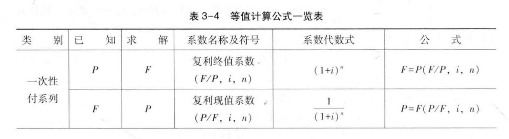
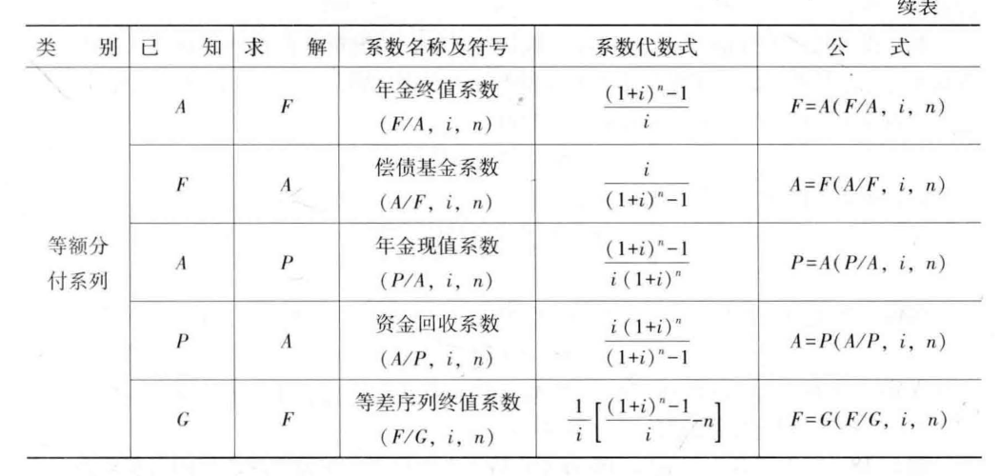
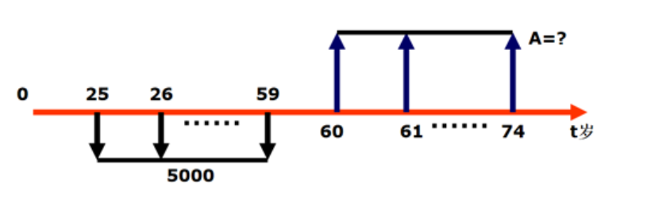
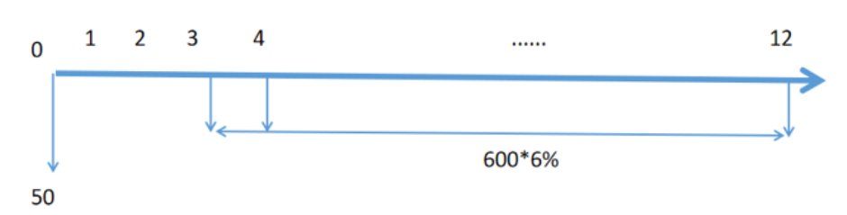
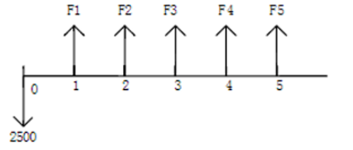

[TOC]
## 简答题练习
### 简述技术与经济的关系。
技术与经济相互依赖、相互促进、又相互制约
- 发展经济必须紧紧依靠技术创新与技术进步，科学技术是第一生产力； 
- 技术的进步要受到经济条件的制约。
- 技术与经济这种相互促进、相互制约的关系，使任何技术的发展和应用都不仅是一个技术问题，同时又是一个经济问题。
### 1. 简述技术经济分析的一般过程。
（1）确定目标功能（2）提出备选技术方案（3）方案评价 （4）选择最优技术方案（5）技术方案后评价。
### 2. 简述技术创新与技术发明的区别与联系。
### 3. 什么是机会成本和沉没成本?为什么要在工程经济分析中引入经营成本的概念?
- 机会成本指将资源用于特定用途而放弃的其他最好用途中的最高收益；
- 沉没成本指已经支出而无法得到补偿的成本，其对决策无用。

1. 价值工程经济分析是一种评价投资项目的方法，主要是为了确定一个项目是否值得投资。在这个过程中，经营成本在评价项目经济效益时占有重要的地位。经营成本是指项目从总成本中扣除折旧费、摊销费和利息支出以后的成本，即：经营成本＝总成本费用－折旧费－摊销费－利息支出。
2. 折旧费和摊销费不是经常性实际支出，而是以前一次性投资支出的分摊。由于投资已按其发生的时间作为一次性支出被计入现金流出，所以不能再以折旧费和摊销费的方式计为现金流出，否则会发生重复计算。因此，作为经常性支出的经营成本中不包括折旧费和摊销费。
3. 在考察全部投资时，因为全部投资现金流量表以全部投资作为计算基础，不分投资资金来源，利息支出不作为现金流出，而自有资金现金流量表中已将利息支出单列，因此经营成本中也不包括利息支出。
### 4. 简述寿命期不相等互斥方案选择的方法有哪几种?
### 5. 为什么不能用内部收益率IRR指标来评选寿命期相等的互斥方案，而只能用增量内部收益率?（可以借助图形示例来解释）
增量净现值法和增量内部收益率法基于边际原理，即额外投入带来的收益等于其成本时，利润最大化。当边际收益等于或超过标准，表明追加投资仍可获得预期回报；反之，则说明追加投资的回报低于标准。
使用净现值(NPV)和增量净现值(∆NPV)作为评价指标比单纯依赖内部收益率(IRR)更可靠。这是因为IRR可能产生误导，导致与NPV/∆NPV法不同的结果。
### 6. 简述内部收益率指标的优缺点。
### 7. 针对同一个投资项目，如何选择不同的指标进行评价?
- 根据项目评价的需要和目的，采取不同的评价指标或者评价指标组合。
- 例如，简单评估项目投资回收情况可采用投资回收期法；
- 如需具体细致评估项目收益情况，可采用净现值指标、内部收益率指标等。
- 也可根据项目处于不同的评估阶段采取不同的指标；
- 还可从市场前景、市场竞争及投资回报等选择具体的评价指标。
### 8. 什么是敏感性分析?敏感性分析的主要步骤有哪些?
### 9. 什么是价值工程？提高价值的途径有哪些？【性价比】
价值工程，以产品或作业的功能分析为核心，以提高产品或作业的价值为目的，力求以最低寿命周期成本实现产品或作业所要求的必要功能的一项有组织的创造性工作。

提高价值的途径有：
1. 成本不变/降低/小幅增加，功能大幅提高；
2. 功能不变/降低，成本大幅下降；
### 10. 简述价值工程分析的三大基本要素及提高价值的主要途径。
### 11. 简述价值工程的概念，并从消费者价值和产品价值两个方面来解释价值工程的内涵。
### 12. 简述供决策用的成本概念。
### 13. 不确定性分析的常用方法有哪些?这些方法各有何作用?
1. 常用方法有：盈亏平衡分析、敏感性分析和概率分析。
2. 盈亏平衡分析的作用是通过分析各种不确定因素的变化对投资方案的经济效果的影响，找出临界值，判断投资方案对不确定因素变化承受能力。
3. 敏感性分析是通过测定一个或多个不确定因素的变化所导致的决策评价指标的变化幅度，了解各种因素的变化对实现预期目标的影响程度，从而对外部条件发生不利变化时投资方案的承受能力作出判断。
4. 概率分析是通过研究各种不确定因素发生不同幅度变动的概率分布及对方案经济效果的影响，对方案的净现金流量及经济效果指标作出某种概率描述，从而对方案的风险情况作出比较准确的判断。
### 14. 简述可行性研究的主要内容。
### 15. 简述编制规范的创业计划书的基本框架内容及好的专业的创业计划书的共通特点。
规范的创业计划书的框架内容包括10个模块的核心内容：
执行概要；项目、产品或服务介绍；管理团队与组织计划；市场与竞争分析；营销推广策略和计划；生产运营管理计划；财务融资计划；资金退出及回报机制；风险分析与防范对策；实施日程计划；附录附件资料。
好的专业的创业计划书通常有以下6大共通特点：
- 基于创业前期的充分准备用心策划；
- 书面计划体现扎实的专业知识素养；
- 思路清晰，结构合理，语言精炼；
- 产品或服务独特，差异化优势明显；
- 商业模式和盈利模式创新打动人；
- 书面制作精美，佐证资料完备。
### 16. 为什么国家相关部门鼓励有关企业加速折旧？加速折旧对企业有何利好？
加速折旧是指在固定资产使用年限的初期提列较多的折旧。加速折旧可促进技术进步，符合收入成本配比原则，使企业成本费用在整个使用期内较为平衡。前期成本提高，利润降低，抵扣了企业应缴税款，等于国家提供了变相无息贷款，具有节税功能。是一种国家税收优惠的鼓励支持政策措施。
对企业的利好：使企业成本费用在整个使用期内较为平衡。前期成本提高，利润降低，抵扣了企业应缴税款，等于国家提供了变相无息贷款，具有节税功能；加快传统制造业企业固定设备的更新升级，加速折旧可以缓解企业短期资金链压力，推动企业加快技术设备的更新，加快设备更新，进一步提高生产能力与经营状况，进一步提高企业利润，使产业升级加速；有利于中小企业提高创新能力， 加快折旧提取，减轻了企业税负，企业现金流更加充裕，也更有利于中小企业购买更新设备，科技研发创新，不断推出附加值更高、市场竞争能力更强的产品，加速折旧可以使企业加快更新设备。


# 计算题练习

### 浙江东方机器设备公司【贷款利息，单利法、等额还本】
浙江东方机器设备公司拟向华夏银行借款9000 万元，并计划分4 年等额还本，年利率10%，求：该公司每年的还款额以及其中的利息和本金各是多少？
<mark>答案</mark>
已知条件：
- 借款总额：\( 9000 \)万元
- 还款期数：\( 4 \)年
- 年利率：\( 10\% \)

首先，我们计算年度等额还本数值：
\[ \text{年度等额还本数值} = \frac{9000}{4} = 2250 \text{万元} \]

接下来，我们逐年计算每年的还款情况：

**第1年**
- 利息：\( 9000 \times 10\% = 900 \text{万元} \)
- 年度还款：\( 900 + 2250 = 3150 \text{万元} \)

**第2年**
- 利息：\( (9000 - 2250) \times 10\% = 675 \text{万元} \)
- 年度还款：\( 675 + 2250 = 2925 \text{万元} \)

**第3年**
- 利息：\( (9000 - 2250 - 2250) \times 10\% = 450 \text{万元} \)
- 年度还款：\( 450 + 2250 = 2700 \text{万元} \)

**第4年**
- 利息：\( (9000 - 2250 - 2250 - 2250) \times 10\% = 225 \text{万元} \)
- 年度还款：\( 225 + 2250 = 2475 \text{万元} \)

### 某人用1000元进行投资【复利法】
某人用1000元进行投资，时间为10年，年利率为6%，每季计息一次，求年实际利率和10年末的本利和。

<mark>答案</mark>

#### 复利投资计算

- **初始投资** (\( P \)): 1000 元
- **投资期限** (\( t \)): 10 年
- **名义年利率** (\( r \)): 6%
- **计息周期** (\( n \)): 每季计息一次，一年计息 4 次

#### 实际年利率计算

- **计算公式**:
    \[
    \text{实际年利率} = \left(1 + \frac{r}{n}\right)^n - 1= \left(1 + \frac{6\%}{4}\right)^4 - 1 = 6.14\%
    \]

#### 10年末的本利和计算

- **计算公式**:
    \[
    A = P \left(1 + \frac{r}{n}\right)^{nt}= 1000 \left(1 + \frac{6\%}{4}\right)^{4 \times 10} = 1814.02 元
    \]


### 浙工大的李教授【资金等值、一次支付现值公式】
浙工大的李教授拟向xxx公司出售一项碳储存设备的发明专利，双方已就该技术的市场价值谈妥，预计该专利10年期使用费总计为300万元。但李教授对该公司提供的两个支付方案犹豫不决，请帮他进行选择。该公司的报价方案1：一次性支付清，但只能支付总价的95%（另外5%作为优惠）。方案2：签订合同后的三年内付清，其中，首付总价的40%，第1年末付30％，第2年末付20％，第3年末支付余下的10%。（资金利率为10%）
<mark>答案</mark>
从李老师角度考虑来画现金流量图或从企业角度考虑来画现金流量图(如图)都可以,关键是要说明,并画对箭头.

求现值：
- **给定条件**:
    - 年数 \( n \): 分别为第1年、第2年、第3年
    - 每年支付款 \( F \):
        - 第1年: 90万
        - 第2年: 60万
        - 第3年: 30万
    - 折现率 \( r \): 10%
    - 折现系数 \[ P(F/r,n) = \frac{1}{(1+r)^n} \]
        - 第1年: 0.9091
        - 第2年: 0.8264
        - 第3年: \( P(F/0.10,3) = \frac{1}{(1+0.10)^3} = \frac{1}{1.331} = 0.7513 \)

- **计算步骤**:

\[ P = F_1 \times P(F/r,1) + F_2 \times P(F/r,2) + F_3 \times P(F/r,3) \]

\[ P = 90 \times 0.9091 + 60 \times 0.8264 + 30 \times 0.7513= 273.942 \approx 274<285=300\times 95\% \]

李老师应该选企业支付多的一次性支付。


### 根据表内的已知数据求出空格数据【净现值】
根据表内的已知数据求出空格数据，并填入空格中。已知所得税率为25％，i0＝10%,并求净现值。
| 年份 | 销售收入 | 经营成本 | 折旧 | 投资 | 残值回收 | 流动资金回收 | 应交所得税 | 现金流入 | 现金流出 | 净现金流量 |
| --- | --- | --- | --- | --- | --- | --- | --- | --- | --- | --- |
| 0   |       |       |     | 500 |       |             |           |        | 500 |          |
| 1   | 340   | 300   | 40  |     |       |             |           | 380    | 300 | 80       |
| 2   | 600   | 400   | 40  |     |       |             |           | 640    | 400 | 240      |
| 3   | 600   | 400   | 40  |     | 20    | 100         |           | 740    | 400 | 340      |

<mark>答案</mark>

| 年份/项目 | 应交所得税 | 现金流入 | 现金流出 | 净现金流量 |
| --- | --- | --- | --- | --- |
| 0   | 0   |     | 500 | -500 |
| 1   | 40  | 340 | 300 | 40   |
| 2~9 | 40  | 600 | 440 | 160  |
| 10  |     | 720 | 440 | 280  |
| 净现值 |     |     |     | 420.3 |

这个问题主要考察了资本预算中的净现值（Net Present Value, NPV）分析，以及如何在考虑折旧、残值、流动资金回收和所得税等因素的情况下计算项目的现金流量。以下是具体步骤：

1. **确定现金流入和流出**：现金流入通常包括销售收入和回收的资产价值；现金流出则包括投资、经营成本和应交所得税。

2. **计算应交所得税**：所得税基于利润计算，而利润是销售收入减去经营成本和折旧后的差额。折旧虽然是一种非现金支出，但它会减少应税利润，从而影响所得税。

   - 第一年的应交所得税计算如下：\[ (340 - 300 - 40) \times (1-0.25) = 0 \] 实际上，由于第一年的利润为零，所得税也为零。
   - 第二年的应交所得税计算如下：\[ (600 - 400 - 40) \times 0.25 = 40 \]
   - 第三年的应交所得税计算如下：\[ (600 - 400 - 40) \times 0.25 = 40 \] （假设每年的经营情况相同）

3. **计算净现金流量**：净现金流量等于现金流入减去现金流出。例如，在第一年，净现金流量为\[ 340 - 300 = 40 \]，但考虑到所得税的影响，实际净现金流量应为\[ 40 - 0 = 40 \]。

4. **计算净现值（NPV）**：净现值是对所有未来现金流量按预定折现率（i0）进行折现后与初始投资的差额。公式为\[ NPV = \sum_{t=0}^{n} \frac{C_t}{(1+i)^t} - I_0 \] 其中\(C_t\)是第t期的净现金流量，\(I_0\)是初始投资，\(i\)是折现率，\(n\)是项目持续的期数。

   - 初始投资为500，即第一行的现金流出。
   - 使用10%的折现率，计算每期净现金流量的现值，然后求和。

对于第三年的净现金流量计算，它包含了残值回收（20）和流动资金回收（100），因此现金流入为\[ 600 + 20 + 100 = 720 \]，而现金流出仍然为400加上所得税40，总计440。因此，第三年的净现金流量为\[ 720 - 440 = 280 \]。

最终，将所有年度的净现金流量按10%的折现率折现后相加，得出的总和即为项目的净现值（NPV）。这个过程需要使用现值公式对每个现金流量进行单独计算，然后加总。





### 湖州华兴公司拟推进一项员工福利计划【等额分付终值公式】
湖州华兴公司拟推进一项员工福利计划：该公司拟为核心员工向平安商业保险公司购买一款保险产品，保障员工的退休生活。该产品是公司每年为核心员工的保险账户存入保险金5000元；员工可以在60-74岁间每年从保险公司等额领取养老金。如果一位核心员工从25岁开始在该公司参加工作起至59岁退休。那么，若利率为10％，该员工退休后每年可以从保险公司等额领到多少钱? （要求画出现金流量图）
<mark>答案</mark>


\[
\text{F}_{59岁末} = 5000 \times (F/A, 10\%, 35) = 5000 \times 271.024 = 1355120.00\ 元
\]

\[
A_{60-74岁} = P(\text{F}_{59岁末}) \times (A/P, 10\%, 15) = 1355120 \times 0.1315 = 178198.28\ 元
\]

在上述公式中：

- \( \text{F}_{59岁末} \) 表示59岁年末的未来值；
- \( (F/A, 10\%, 35) \) 是未来值因子，意味着每年投入5000元，连续35年，年利率为10%时的终值；
- \( A_{60-74岁} \) 表示60至74岁期间每年的等额支付金额；
- \( (A/P, 10\%, 15) \) 是偿债基金因子，意味着为了在15年内偿还一笔现值为\( \text{F}_{59岁末} \)的债务，每年需要支付的金额。


### 嘉兴新能源公司【年金现值系数，复利现值系数】
嘉兴新能源公司欲引进浙工大陶教授的一项新能源电池技术专利，它为陶教授提出了两种支付方式。一种是：一次支付250万元，；另一种是：收入与产品销售提成相结合，其具体条件是，签约时付费50万元，2年建成投产后，按产品每年销售收入600万元的6％提成（从第3年末至第12年末）。若资金利率为10%，问陶教授应选择哪种付款方式？（要求画出现金流量图）

<mark>答案</mark>


第二种方式：将付款额折成现值   
\[
\begin{aligned}
P &= 50+36(P/A,10\%,10)(P/F,10\%,2) \\
    &= 50+36 \times 6.145 \times 0.8264 \\
    &= 232.8 \quad (\text{小于} 250 \text{万元})
\end{aligned}
\]
故陶教授应该选择第一种付款方式，收益较高。

### 某项目有两个贷款方案【复利】
某项目有两个贷款方案：第一方案年利率16%，每年计息一次；第二方案年利率15%，每月计息一次。应选择哪个贷款方案为优？

<mark>答案</mark>
对于方案1（年利率16%，每年计息一次）：
\[ i_1 = 16\% \]

对于方案2（年利率15%，每月计息一次），实际年利率通过复利公式计算得到：
\[ i_2 = \left(1+\frac{15\%}{12}\right)^{12} - 1 = 16.075\% \]

由于\( i_1 < i_2 \)，即方案1的实际利率低于方案2，因此选择方案1（年利率16%，每年计息一次）更为优惠，因为归还的本利和会少于方案2。

### 某企业目前在使用的生产线在5年前以200万元购置的【净年值、资金回收系数】
某企业目前在使用的生产线在5年前以200万元购置的，使用年限为10年，期末残值为10万元，每年生产产品的净收益为45万元，目前该机器的市场售价为60万元。市场目前出现新机器，购置费用为240万元，使用年限同样为10年，期末残值15万元，每年生产产品的净收益为65万元。若基准收益率为10%，请判断应选择继续使用旧机器还是使用新机器？
<mark>答案</mark>

对于A方案（使用旧机器）：
\[
\begin{aligned}
\text{年金A} &= 45 + [-60 \times (A/P, 10\%, 5)] + 10 \times (A/F, 10\%, 5) \\
&= 45 + (-60 \times 0.2638) + 10 \times 0.1638 \\
&= 45 - 15.828 + 1.638 \\
&= 30.81 \text{（万元）}
\end{aligned}
\]

对于B方案（使用新机器）：
\[
\begin{aligned}
\text{年金B} &= 65 + [-240 \times (A/P, 10\%, 10)] + 15 \times (A/F, 10\%, 10) \\
&= 65 + (-240 \times 0.16275) + 15 \times 0.06275 \\
&= 65 - 39.06 + 0.94125 \\
&= 26.88125 \text{（万元）}
\end{aligned}
\]

所以应该使用旧机器。

### 某企业有一台设备的原始价位20万元【直线折旧法、双倍余额递减法和年数总和法】
某企业有一台设备的原始价位20万元，净残值为2万元，折旧年限是8年，请按照直线折旧法、双倍余额递减法和年数总和法三种方式计算折旧费和折旧率? 并绘制汇总比较表。
<mark>答案</mark>
- 直线折旧法：
    - 年折旧费 = (固定资产原值P - 净残值S) / 折旧年限Nd = (20 - 2) / 8 = 2.25万元
    - 年折旧率 = (年折旧费 / 固定资产原值) * 100% = (1 - S/P) / Nd * 100% = 2.25 / 20 * 100% = 11.25%

- 双倍余额递减法：
    - 年折旧率 = 2 * (年折旧费 / 固定资产原值) * 100% = 2 * ((1 - S/P) / Nd) = 22.5%
    - 年折旧费 = 年初固定资产账面净值 * 年折旧率，逐年计算不等额折旧费，最后第7和第8年的每年折旧额和折旧率按照直线折旧法计算。

- 年数总和法：
    - 年折旧率 = (折旧年限 - 已使用年数) / [折旧年限 * (折旧年限 + 1) / 2] * 100%
    - 年折旧费 = (P - S) * 年折旧率


### 宁波一家智能化工厂
宁波一家智能化工厂可用分期付款来购买一台标价22 000美元的专用机器，定金为2 500美元，余额在以后五年末均匀地分期支付，并加上余额8％的利息。但现在也可用一次支付现金19 000美元来购买这台机器。如果这家公司的基准收益率为10％，用净现值法应该选择哪个方案？（要求画出现金流量表）
<mark>答案</mark>

| 年度 | 偿还本金 | 偿还利息 | 未偿还本金 | 净现金流出额 |
| --- | --- | --- | --- | --- |
| 0   | 2500    | 0       | 19500      | 2500        |
| 1   | 3900    | 1560    | 15600      | 5460        |
| 2   | 3900    | 1248    | 11700      | 5148        |
| 3   | 3900    | 935     | 7800       | 4836        |
| 4   | 3900    | 624     | 3900       | 4524        |
| 5   | 3900    | 312     | 0          | 4212        |



\[
\begin{aligned}
\text{年金} &= \frac{(22000 - 2500)}{5} = 3900 \\
\text{PC} &= 2500 + 5460 \times (P/F, 10\%, 1) + 5148 \times (P/F, 10\%, 2) + \\
&\quad 4836 \times (P/F, 10\%, 3) + 4524 \times (P/F, 10\%, 4) + \\
&\quad 4212 \times (P/F, 10\%, 5) \\
&= 21057 > 19000
\end{aligned}
\]

其中 \( (P/F, r, n) \) 是复利现值因子，表示未来n期的金额在利率r下的现值。

最终计算得到分期付款的总现值比一次性支付的金额（19000元）要高。一次性支付方案更为经济。

### 余杭一家小微加工企业【又出现过一次】
余杭一家小微加工企业根据疫情结束后订单大增的情况，考虑了A、B、C三个扩大投资计划。在5年计划期中，这三个投资方案的现金流量情况如下表所示，该企业的最低希望收益率为10%，请参看方案费用数据表计算回答：

（1）假设这三个计划是独立的，且资金没有限制，应选择哪个方案或哪些方案？

（2）在（1）中假定资金限制在160000元，试选出最好方案。

（3）假设计划A、B、C互斥，试用增量内部收益率法来选出最合适的投资计划。

| 方案 | 最初成本（元） | 年净收入（1-5年末，元） | 残值（元） |
|------|-------------|---------------------|---------|
| A    | 65000       | 18000               | 12000   |
| B    | 58000       | 15000               | 10000   |
| C    | 93000       | 23000               | 15000   |

<mark>答案</mark>

(1)
$$
NPV_A = -65000 + 18000 \times (P/A, 10\%, 5) + 12000 \times (P/F, 10\%, 5) = 10685.2 > 0
\\
NPV_B = -58000 + 15000 \times (P/A, 10\%, 5) + 10000 \times (P/F, 10\%, 5) = 5071 > 0
\\
NPV_C = -93000 + 23000 \times (P/A, 10\%, 5) + 15000 \times (P/F, 10\%, 5) = 3501.9 > 0
$$

这里的$(P/A, r, n)$代表年金现值系数，而$(P/F, r, n)$代表复利现值系数，其中$r$是折现率，$n$是期数。由于所有方案的净现值都大于零，在没有资金限制的情况下，理论上可以选择任意一个或多个方案进行投资。

(2)
| 方案     | 成本       | 年净收入   | 残值     | NPV         | NPVR        |
|----------|------------|------------|----------|-------------|-------------|
| A        | 65000      | 18000      | 12000    | 10685.2     | 16.44%      |
| B        | 58000      | 15000      | 10000    | 5071        | 8.74%       |
| C        | 93000      | 23000      | 15000    | 3502.9      | 3.77%       |
| A+B      | 123000     | 33000      | 22000    | 15756.2     | 12.81%      |
| A+C      | 158000     | 41000      | 27000    | 14187.1     | 8.98%       |
| B+C      | 151000     | 38000      | 25000    | 8573.9      | 5.68%       |
| A-B+C    | 254000     |       |     |  |

(3)
给定方案B为基准方案，并且已知B方案可行。我们首先比较方案A与B，计算增量内部收益率\(\Delta IRR(A-B)\)，通过解方程找到使得等式成立的\(\Delta IRR(A-B)\)值：

\[-(65000 - 58000) - (18000 - 15000) \times (P/A, \Delta IRR(A-B), 5) + (12000 - 10000) \times (P/F, \Delta IRR(A-B), 5) = 0\]

求解上述方程得到\(\Delta IRR(A-B) = 15.85\%\)

由于\(15.85\% > 10\%\)，我们选择方案A。

接下来，比较方案A与C，计算增量内部收益率\(\Delta IRR(C-A)\)，同样地，我们解方程找到使得等式成立的\(\Delta IRR(C-A)\)值：

\[-(93000 - 65000) - (23000 - 18000) \times (P/A, \Delta IRR(C-A), 5) + (15000 - 12000) \times (P/F, \Delta IRR(C-A), 5) = 0\]

求解上述方程得到\(\Delta IRR(C-A) = 0.01\%\)

由于\(0.01\% < 10\%\)，我们仍应选择方案A。

### 萧山一家纺织企业
萧山一家纺织企业现在需要扩充数字化设备产能，如果新购设备需10万元，每年能产生5万元营业收入，需3万元经营成本，寿命期为10年。如果采用经营租赁，需交纳租金1.8万元/年，如果采用融资租赁，首付4万元，余款10年内每年交纳0.8万元。若基准收益率10%，所得税率25%，采用直线折旧法，残值为0，问哪一种更为合适？
<mark>答案</mark>

对于方案一（自有资金购买）：

\[ \text{净现金流量（自有资金）} = \text{销售收入} - \text{经营成本} - (\text{销售收入} - \text{经营成本} - \text{折旧费}) \times \text{所得税税率} \\= 5 - 3 - (5 - 3 - \frac{10}{10}) \times 25\% = 1.75 \]

对于方案二（经营租赁）：

\[ \text{净现金流量（经营租赁）} = \text{销售收入} - \text{经营成本} - \text{租金} - (\text{销售收入} - \text{经营成本} - \text{租金}) \times \text{所得税税率} \\ = 5 - 3 - 1.8 - (5 - 3 - 1.8) \times 25\% = 0.15 \]

对于方案三（融资租赁）：

\[ \text{净现金流量（融资租赁）} = \text{销售收入} - \text{经营成本} - \text{租金} - (\text{销售收入} - \text{经营成本} - \text{折旧费}) \times \text{所得税税率}\\ = 5 - 3 - 0.8 - (5 - 3 - 0.8 - \frac{10}{10}) \times 25\% = 0.95 \]

接着是净现值(NPV)的计算：

\[ NPV1 = -10 + 1.75 \times (P/A, 10\%, 10) = 0.75\\
NPV2 = 0.15 \times (P/A, 10\%, 10) = 0.92\\
NPV3 = -4 + 0.95 \times (P/A, 10\%, 10) = 1.84 \]

基于以上计算，方案三（融资租赁）的净现值最高，因此选择方案三。

## 不确定性与风险分析

### 某工程项目寿命期为20年【盈亏平衡分析】
某工程项目寿命期为20年，正常年份的设计生产能力为500万t，投产当年达产率为70%，其余各年达产率均为100%。固定成本为4050万元，每吨产品的可变成本为45元，产品市场价为160元/t，不计销售税金及附加。

（1）计算正常生产年份每年总成本和每年最大可盈利额。
（2）用产量和单价分别表示项目的盈亏平衡点。
（3）从盈亏平衡分析的角度，判断该项目的可行性。

<mark>答案</mark>
#### 步骤1: 计算正常生产年份的总成本和最大可盈利额

- 总成本 $= \text{固定成本} + \text{单位可变成本} \times \text{产量}= 4050\text{万元} + 45\text{元/t} \times 500\text{万t} = 26550\text{万元}$
- 最大可盈利额 $=\text{销售收入} - \text{总成本}= 160\text{元/t} \times 500\text{万t} - 26550\text{万元} = 53450\text{万元}$

#### 步骤2: 计算产量和单价的盈亏平衡点

- 用产量表示的盈亏平衡点 $\text{BEP(Q)} =\frac{\text{年固定总成本}}{\text{单位产品销售价格} - \text{单位产品可变成本}}= \frac{4050\text{万元}}{160\text{元/t} - 45\text{元/t}} \approx 352173.91 \text{t}$
- $\text{BEP(P)} = \frac{\text{年固定总成本}}{\text{设计生产能力}} + \text{单位产品可变成本} = \frac{4050\text{万元}}{500\text{万t}} + 45\text{元/t} = 53.1 \text{元/t}$

#### 步骤3: 判断项目可行性

- 用生产能力利用率表示的盈亏平衡点 $\text{BEP(\%)} = \frac{\text{BEP(Q)}}{\text{设计生产能力}} \times 100\%= \frac{352173.91 \text{t}}{500\text{万t}} \times 100\% \approx 7.04\%$


#### 结论:

- 盈亏平衡点产量仅占设计生产能力的$7.04\%$，表明项目抗风险能力强。
- 盈亏平衡点单价比市场价低约$\frac{(160-53.1)}{160}\times100\% = 66.81\%$，显示项目盈利潜力大。

### 为给儿子备好出国留学费用
为给儿子备好出国留学费用，陈杨夫妇计划从小孩8岁开始每年定期支出一部分资本金，投入到一个基金产品中（假设该基金产品无风险，年化收益率为10%），连续投资10年，然后10年到期后设定为每个月以固定收益分红的形式打款到小孩在国外开设的银行账户，国外留学月费用（含学费、生活杂费）为3万元，连续均衡打款4年，以资助小孩顺利完成学业。请查询相关复利系数表，测算该夫妇每年定期要支出多少资金投入到购买该基金项目产品中？
<mark>答案</mark>

每个月支付到小孩账户的资金月收益率为 $\frac{10\%}{10} = 1\%$。

我们有公式 $x(F/A,10\%,10) = 3(F/A,1\%,10)(P/A,10\%,4) = 120.6068$。

因此，求得 $x = 7.5677$ 万元。


### 某企业欲购买一项软件著作权【年金现值】
某企业欲购买一项软件著作权，预计该软件开发使用后可产生年净收益50万元，有效使用期为6年，若投资收益率为10%，问该企业应出价多少购买？（复利系数 P/A，10%，6）=4.355）

<mark>答案</mark>

\[50×（P/A，10\%，6）=217.75万\]

### 根据下表，计算各功能的功能评价系数【价值系数、功能评价】

根据下表，计算各功能的功能评价系数，成本系数和价值系数，并确定改进对象。

| 功能单元 | 功能得分 | 功能评价系数 | 目前成本（元） | 成本系数 | 价值系数 |
| --- | --- | --- | --- | --- | --- |
| A | 47 |  | 405 |  |  |
| B | 32 |  | 645 |  |  |
| C | 16 |  | 240 |  |  |
| D | 5 |  | 210 |  |  |

<mark>答案</mark>

\[ 功能评价系数 = \frac{功能得分单项}{功能得分总和} \]

\[ 成本系数 = \frac{目前成本}{成本总和} \]

\[ V价值系数 = \frac{F功能评价系数}{C成本系数} \]

| 功能单元 | 功能得分 | 目前成本（元） | 功能评价系数 | 成本系数 | 价值系数 |
| --- | --- | --- | --- | --- | --- |
| A | 47 | 405 | 0.47 | 0.27 | 1.740741 |
| B | 32 | 645 | 0.32 | 0.43 | 0.744186 |
| C | 16 | 240 | 0.16 | 0.16 | 1.000000 |
| D | 5 | 210 | 0.05 | 0.14 | 0.357143 |

**价值系数** 越高，表示该功能单元的性价比越高。价值系数离1远的需要改进，即ABD。

### 如果大学生校园交通出行工具选择有三种可选方案【净现值NAV计算】
如果大学生校园交通出行工具选择有三种可选方案：（1）自购电动自行车；（2）自购自行车；（3）租用共享单车。经市场调研和评估，数据汇总如下表所示：

| 选项 | 自购电瓶车 | 自购自行车 | 共享单车 |
| --- | --- | --- | --- |
| 投入成本（元） | 2000 | 200 | 200（押金或时长会员制的资金等价投入成本） |
| 使用成本（元/年） | 144 | 0 | 130 |
| 维修成本（元/年） | 75 | 10 | 0 |
| 净残值（元） | 500 | 20 | 0 |
| 时间节约效益（元/年） | 405 | 270 | 270 |

假设大学4年后交通工具以净残值交易卖出，基准收益率i0为3%，请选出最佳交通出行方案。

[参考复利系数：(A/F,3%,4)=0.3235]

<mark>答案</mark>


**公式**:
- 净现值 $= \text{现金流入} - \text{现金流出}$

**计算**:

1. 自购电瓶车的净现值:

    $$
    \begin{align*}
    NAV_{\text{电瓶车}} &= \text{投入成本的等额偿还}+(\text{时间节约效益}-\text{使用成本}-\text{维修成本})+\text{净残值折算现值}\\
     &= -2000(A/P,3\%,4) + 186 + 500(A/F,3\%,4) \\
    &= -2000 \times 0.3535 + 186 + 500 \times 0.3235 \\
    &= -359.25
    \end{align*}
    $$

2. 自购自行车的净现值:

    $$
    \begin{align*}
    NAV_{\text{自行车}} &= -200(A/P,3\%,4) + 260 + 20(A/F,3\%,4) \\
    &= -200 \times 0.3535 + 260 + 20 \times 0.3235 \\
    &= 195.77
    \end{align*}
    $$

3. 租用共享单车的净现值:

    $$
    \begin{align*}
    NAV_{\text{共享单车}} &= -200(A/P,3\%,4) + 140 \\
    &= -200 \times 0.3535 + 140 \\
    &= 69.3
    \end{align*}
    $$

**结论**:

选择自购自行车交通出行最佳。

### 某项目为期10年，其主要设备A【净现值】

某项目为期10年，其主要设备A从项目开始到现在已使用6年，现市场价格为50万元，每年能够带来净收益15万元，余下寿命内每年的残值如表所示。现有一台新设备B，市场价格为100万元，每年能够带来净收益20万元，经济寿命为8年，每年残值如表所示，项目结束后所有设备都将处理贩卖。问项目结束前是否应该更换新设备B？如应更换新设备B，何时更换效益最佳？（基准收益率为10%）。

| 使用年数 | 1 | 2 | 3 | 4 | 5 | 6 | 7 | 8 |
| --- | --- | --- | --- | --- | --- | --- | --- | --- |
| 设备A残值 | 35 | 20 | 10 | 5 | - | - | - | - |
| 设备B残值 | 78 | 62 | 48 | 36 | 26 | 18 | 12 | 8 |

<mark>答案</mark>

**方案一：马上更新，接下来使用B，用4年**:
- NPV0 $= -100 + 20(P/A,10\%,4) + 36(P/F,10\%,4)\\= -100 + 20 \times 3.1699 + 36 \times 0.6830 = -12.01$

**方案二：A使用1年，B使用3年**:
- NPV1 $= -50 + 15(P/A,10\%,1) + 35(P/F,10\%,1) + (-100 + 20(P/A,10\%,3) + 48(P/F,10\%,3))(P/F,10\%,1)\\= -50 + 15 \times 0.9091 + 35 \times 0.9091 + (-100 + 20 \times 2.4869 + 48 \times 0.7513) \times 0.9091 = -17.45$

**方案三：A使用2年，B使用2年**:
- NPV2 $= -50 + 15(P/A,10\%,2) + 20(P/F,10\%,2) + (-100 + 20(P/A,10\%,2) + 62(P/F,10\%,2))(P/F,10\%,2)\\= -50 + 15 \times 1.7355 + 20 \times 0.8264 + (-100 + 20 \times 1.7355 + 62 \times 0.8264) \times 0.8264 = -19.05$

**方案四：A使用3年，B使用1年**:
- NPV3 $= -50 + 15(P/A,10\%,3) + 10(P/F,10\%,3) + (-100 + 20(P/A,10\%,1) + 78(P/F,10\%,1))(P/F,10\%,3)\\= -50 + 15 \times 2.4869 + 10 \times 0.7513 + (-100 + 20 \times 0.9091 + 78 \times 0.9091) \times 0.7513 = -13.37$


**方案五：A使用4年**:
- NPV4 $= -50 + 15(P/A,10\%,4) + 5(P/F,10\%,4)\\= -50 + 15 \times 3.1699 + 5 \times 0.6830 = 0.96$

**结论**:
- NPV0较大，应立即卖A换B最合算。

### 某人要装修新房【净现值和净年值】
某人要装修新房，可以选择单价为3000元的分体空调4台，每台的年均电费大约为1000元，残值为500元/台，也可以选择价格为1.5万的中央空调，电费约为3000元/年，残值为500元，预计此房需要住15年，利率为10％。请选择安装哪种空调合算。

<mark>答案</mark>

**公式**:
- NPV（分） $= -12000 - 4000 \times (P/A,10\%,15) + 2000 \times (P/F,10\%,15)=-41945.6$
- NAV（分） $= -12000 \times (A/P,10\%,15) - 4000 + 2000 \times (A/F,10\%,15)=-5514.7$
- NPV（中） $= -15000 - 3000 \times (P/A,10\%,15) + 500 \times (P/F,10\%,15)=-37698.6$
- NAV（中） $= -15000 \times (A/P,10\%,15) - 3000 + 500 \times (A/F,10\%,15)= -4956.3$
- NPV（中） < NPV（分），NAV（中）< NAV（分），可见安装中央空调合算。

### 湖州华兴公司拟上马一项新能源电池项目
湖州华兴公司拟上马一项新能源电池项目，预计售价为180元／台。已知生产该产品单位可变成本为55元，年固定成本为65000元。试计算：

（１）该产品的盈亏平衡产量；　　

（２）如果企业今年的目标利润为100万元，为获得目标利润，该产品的最低年产销量为多少？

（３）又根据市场预测，该产品预计年销售量只能达到8000台。在这种条件下，为获得目标利润，该产品的单位可变成本应该降低到多少？

<mark>答案</mark>

#### （1）盈亏平衡产量

\[ Q^* = \frac{FC}{P - VC} = \frac{65000}{180 - 55} = \frac{65000}{125} = 520 \]

#### （2）目标利润下的最低产销量

\[ Q = \frac{TP + FC}{P - VC} = \frac{1000000 + 65000}{180 - 55} = \frac{1065000}{125} = 8520 \]

#### （3）单位可变成本降低到多少以实现目标利润

\[ CV' = \frac{TP + FC - Q \cdot P}{-Q} = \frac{1000000 + 65000 - 8000 \cdot 180}{-8000} = 46.875 \]

### KY公司拟购置一处房产【资金回收】
KY公司拟购置一处房产，房主提出三种付款方案：

1. 一次性支付100万元；
2. 每年年初支付20万元，连续支付10次，共200万元；
3. 从第五年年初起每年年初支付25万元，连续支付10次，共250万元。

假设该公司有资金成本率（即最低报酬率）为10％，你认为该公司应选择哪个方案？

<mark>答案</mark>

1. 方案一的现值 $P1 = 100$

2. 方案二的现值 $P2 = 20 \times [(P/A, 10\%, 9) + 1] = 135.18$ 万元

3. 方案三的现值 $P3 = 25 \times (P/A, 10\%, 10) \times (P/F, 10\%, 3) = 115.42$ 万元

该公司应选择现值最小的第一方案。

### 一家工大校友的电商创业项目【净现值 , 净年值, 净现值比率 和内部回报率】

一家工大校友的电商创业项目初始投资为8万元，在第1年末现金流入为2万元，第2年末现金流入3万元，第3、4年末的现金流入均为4万元，请计算该项目的净现值、净年值、内部收益率、动态投资回收期（i_0＝10%）。

<mark>答案</mark>

#### 计算净现值 (NPV), 净年值 (NAV), 净现值比率 (NPVR) 和内部回报率 (IRR)

**公式**:
- NPV $= -8 + 2(P/F,10\%,1) + 3(P/F,10\%,2) + 4(P/F,10\%,3) + 4(P/F,10\%,4)=2.03$
- NAV $= NPV \times (A/P，10\%，4)=0.64$
- NPVR $= NPV / 8=25.43$

**计算**:

**IRR 计算**:

试i1=15%

- NPV $= -8 + 2(P/F,15\%,1) + 3(P/F,15\%,2) + 4(P/F,15\%,3) + 4(P/F,15\%,4) = 0.92 > 0$

试i2=20%

- NPV $= -8 + 2(P/F,20\%,1) + 3(P/F,20\%,2) + 4(P/F,20\%,3) + 4(P/F,20\%,4) = -0.0062 < 0$

- IRR $= 15\% + [0.92 / (0.92 + 0.0062)] \times 5\% = 19.97\%$

**动态投资回收期**
| 年度 | 净现金流量 | 净现金现值 | 累计净现金现值 |
| --- | --- | --- | --- |
| 0 | -8 | -8 | -8 |
| 1 | 2 | 1.82 | -6.18 |
| 2 | 3 | 2.48 | -3.7 |
| 3 | 4 | 3.01 | -0.69 |
| 4 | 4 | 2.73 | 2.04 |

$T_{动}=4-1+\frac{|-0.69|}{2.73}=3.25$ 年


### 假设某设备价值100000元
假设某设备价值100000元，每年年末使用残值和使用年费如下表所示，若基准收益率为10%，试分别计算静态经济寿命和动态经济寿命。
| 年份 | 年使用费用 | 年末残值 |
| --- | --- | --- |
| 1 | 10000 | 70000 |
| 2 | 12000 | 50000 |
| 3 | 15000 | 35000 |
| 4 | 20000 | 12000 |
| 5 | 30000 | 4000 |

<mark>答案</mark>

1. 1年报废，平均总成本：$C1 = 100000 - 70000 + 10000 = 40000$

2. 2年报废，平均总成本：

    $C2 = S2 + M2 = \frac{(100000 - 50000)}{2} + \frac{(10000 + 12000)}{2} = 36000$

3. 3年报废，平均总成本：

    $C3 = S3 + M3 = \frac{(100000 - 35000)}{3} + \frac{(10000 + 12000 + 15000)}{3} = 34000$

4. 4年报废，平均总成本：

    $C4 = S4 + M4 = \frac{(100000 - 12000)}{4} + \frac{(10000 + 12000 + 15000 + 20000)}{4} = 36250$

5. 5年报废，平均总成本：

    $C5 = S5 + M5 = \frac{(100000 - 4000)}{5} + \frac{(10000 + 12000 + 15000 + 20000 + 30000)}{5} = 36600$

所以第3年的平均使用费用最低，静态经济寿命为3年。

动态经济寿命：

1. $C1 = 100000 \times 1.1 - 70000 \times 1 + 10000 = 50000$

2. $C2 = S2 + M2 = k(A/P,10\%,2) - L(A/F,10\%,2) + (A/P,10\%,2) \times (M1(P/F,10\%,1) + M2(P/F,10\%,2)) = 100000 \times 0.5762 - 50000 \times 0.4762 + 0.5762 \times (10000 \times 0.9091 + 12000 \times 0.8264) = 44762.29$

3. $C3 = S3 + M3 = 100000 \times 0.4021 - 35000 \times 0.3021 + 0.4021 \times (10000 \times 0.9091 + 12000 \times 0.8264 + 15000 \times 0.7513) = 41811.00$

4. $C4 = S4 + M4 = 100000 \times 0.3155 - 12000 \times 0.2155 + 0.3155 \times (10000 \times 0.9091 + 12000 \times 0.8264 + 15000 \times 0.7513 + 20000 \times 0.683) = 42826.22$

5. $C5 = S5 + M5 = 100000 \times 0.2638 - 4000 \times 0.1638 + 0.2638 \times (10000 \times 0.9091 + 12000 \times 0.8264 + 15000 \times 0.7513 + 20000 \times 0.638 + 30000 \times 0.6209) = 42229.26$

所以$C3 = 41811$最小，平均使用费最低，动态经济寿命3年。
<!-- 静态经济寿命：
设设备使用n年报废则年平均成本为\(C_i\)
\[C_1=S_1+M_1=\frac{100-7}{1}+\frac{1}{1}=94（万元）\\
C_2=S_2+M_2=\frac{100-5}{2}+\frac{1+1.2}{2}=48.6（万元）\\
C_3=S_3+M_3=\frac{100-3.5}{3}+\frac{1+1.2+1.5}{3}=33.4（万元）\\
C_4=S_4+M_4=\frac{100-1.2}{4}+\frac{1+1.2+1.5+2}{4}=26.125（万元）\\
C_5=21.66（万元）\]
5年的年平均使用费用最低，故静态经济寿命5年。
动态经济寿命：
\[C_1=S_1+M_1=k_0(A/P,10\%,1)-L_1(A/F,10\%,1)+M_1(A/F,10\%,1)=104（万元）\\
C_2=S_2+M_2=k_0(A/P,10\%,2)-L_2(A/F,10\%,2)+\\(A/P,10\%,1)\times(M_1(P/F,10\%,1)+M_2(P/F,10\%,2))=56.3342（万元）\\
C_3=S_3+M_3=k_0(A/P,10\%,3)-L_3(A/F,10\%,3)+\\(A/P,10\%,3)\times(M_1(P/F,10\%,1)+M_2(P/F,10\%,2)+M_3(P/F,10\%,3))=56.3342（万元）\\
C_4=32.47(万元)，C_5=27.96(万元)
\]
动态经济寿命5年。 -->

### 某投资者准备购买某公司1年前发行的债券
某投资者准备购买某公司1年前发行的债券，已知债券的期限为10年，面值为500元，票面利率为8%，每年计算并支付一次利息，设现在市场的投资报酬率为6%。

要求：（1）求该债券的理论价值。
（2）若该债券现在市场价为580元，是否值得投资？

（P/A 6% 8）=6.2098   (p/F 6% 8) =0.6274   （P/A 6% 10）=7.3601   (p/F 6% 10)=0.5584

（P/A 8% 8）=5.7466   (p/F 8% 8) =0.5403   （P/A 8% 10）=6.7101   (p/F 8% 10)=0.4632

<mark>答案</mark>

债券的理论价值取决于债券预期收益的现值。
债券预期收益包含两部分：
1. 每年的利息 $= 500 \times 8\% = 40$ 元
2. 期末一次性 $500$ 元

债券理论价值：
$\begin{aligned}
P &= 40 \times (P/A,6\%,10) + 500 \times (P/F,6\%,10)\\
&= 40 \times 7.3601 + 500 \times 0.5584\\
&= 573.604 \text{元}
\end{aligned}$ 

因为理论价值 $573.6 < $ 市场价 $580$，所以，不值得投资。

### 某项目初始投资为8万元【重复】
某项目初始投资为8万元，在第1年末现金流入为2万元，第2年末现金流入3万元，第3、4年末的现金流入均为4万元，请计算该项目的净现值、净年值、内部收益率、动态投资回收期（i0＝10%）。


### 某企业下属的A、B、C三个分厂的技术改造方案见表
某企业下属的A、B、C三个分厂的技术改造方案见表。各分厂之间是相互独立的，而各分厂内部的技术改造方案是互斥的。若各方案的寿命期均为8年，基准收益率为12%。
（1）若资金供应没有限制，如何选择方案；
（2）当企业的投资额在600万元以内时，从整个企业角度出发， 最有利的选择是什么？

| 投资方案 | 初始投资 | 年净收益 |
| --- | --- | --- |
| A1 | 100 | 40 |
| A2 | 200 | 70 |
| A3 | 300 | 90 |
| B1 | 100 | 20 |
| B2 | 200 | 55 |
| B3 | 300 | 75 |
| B4 | 400 | 95 |
| C1 | 400 | 95 |
| C2 | 200 | 85 |
| C3 | 300 | 100 |
| C4 | 400 | 138 |

<mark>答案</mark>


1. 对于A部门：

    - 初始投资：$-100 + 40(P/A, \text{IRR}(A1), 8) = 0$
    - 第二阶段：$-(200 - 100) + (70 - 40)(P/A, \Delta \text{IRR}(A2 - A1), 8) = 0$

    解得：$\text{IRR}(A1) = 36.72\% > 12\%$；$\Delta \text{IRR}(A2 - A1) = 24.95\% > 12\%$

    - 第三阶段：$-(300 - 200) + (90 - 70)(P/A, \Delta \text{IRR}(A3 - A2), 8) = 0$

    解得：$\Delta \text{IRR}(A3 - A2) = 11.81\% < 12\%$，所以A2为最佳方案

2. 对于B部门：

    - 初始投资：$\text{IRR}(B1) = 11.81\% < 12\%$；故B1是无资格方案
    - 第二阶段：$-200 + 55(P/A, \text{IRR}(B2), 8) = 0$
    - 第三阶段：$-(300 - 200) + (75 - 55)(P/A, \Delta \text{IRR}(B3 - B2), 8) = 0$

    解得：$\text{IRR}(B2) = 21.84\% > 12\%$；$\Delta \text{IRR}(B3 - B2) = 11.81\% < 12\%$

    - 第四阶段：$-(400 - 200) + (95 - 55)(P/A, \Delta \text{IRR}(B4 - B2), 8) = 0$

    解得：$\Delta \text{IRR}(B4 - B2) = 11.81\% < 12\%$，所以B2为最佳方案

3. 对于C部门：

    - 初始投资：$-200 + 85(P/A, \text{IRR}(C1), 8) = 0$
    - 第二阶段：$-(300 - 200) + (100 - 85)(P/A, \Delta \text{IRR}(C2 - C1), 8) = 0$

    解得：$\text{IRR}(C1) = 39.53\% > 12\%$；$\Delta \text{IRR}(C2 - C1) = 4.24\% > 12\%$

    - 第三阶段：$-(400 - 200) + (138 - 85)(P/A, \Delta \text{IRR}(C3 - C1), 8) = 0$

    解得：$\Delta \text{IRR}(C3 - C1) = 20.56\% > 12\%$，所以C3为最佳方案

所以资金没有限制时，三个部门应选择A2 + B2 + C3。

\[
\begin{align*}
NPV_{A1} &= -100 + 40 \times (P/A, 12\%, 8) = 98.71 \\
NPV_{A2} &= -200 + 70 \times (P/A, 12\%, 8) = 147.73 \\
NPV_{A3} &= -300 + 90 \times (P/A, 12\%, 8) = 147.09 \\
NPV_{B1} &= -100 + 20 \times (P/A, 12\%, 8) = -0.65 \\
NPV_{B2} &= -200 + 55 \times (P/A, 12\%, 8) = 73.22 \\
NPV_{B3} &= -300 + 75 \times (P/A, 12\%, 8) = 72.57 \\
NPV_{B4} &= -400 + 95 \times (P/A, 12\%, 8) = 71.93 \\
NPV_{C1} &= -400 + 95 \times (P/A, 12\%, 8) = 71.93 \\
NPV_{C2} &= -200 + 85 \times (P/A, 12\%, 8) = 222.25 \\
NPV_{C3} &= -300 + 100 \times (P/A, 12\%, 8) = 196.76 \\
NPV_{C4} &= -400 + 138 \times (P/A, 12\%, 8) = 285.53
\end{align*}
\]

当企业的投资额在600万元以内时，从整个企业角度出发，根据下表计算可知，A2+B2+C1三个部门投资最合理
| 投资方案 | 初始投资 | 年净收益 | 净现值       | 内含收益率        |
|----------|----------|----------|--------------|------------------|
| A        | 100      | 40       | 98.70        | 36.72%           |
| A2       | 200      | 70       | 147.73       | 30.95%           |
| A3       | 300      | 90       | 147.08       | 24.95%           |
| B1       | 100      | 20       | -0.65        | 11.81%           |
| B2       | 200      | 55       | 73.22        | 21.84%           |
| B3       | 300      | 75       | 72.57        | 18.62%           |
| B4       | 400      | 95       | 71.92        | 16.77%           |
| C1       | 200      | 85       | 222.25       | 39.54%           |
| C2       | 300      | 100      | 196.76       | 28.98%           |
| C3       | 400      | 138      | 285.53       | 30.36%           |


## 论述题

### 华为和小米
```
     华为和小米是我国有代表性的两家创新型高新技术企业。但两家企业的创新方式和侧重点都有 较大的差异。那么，这两家企业的创新模式孰优孰劣?

      华为的核心竞争力是对技术孜孜不倦的追求，技术创新是华为不断增强自身竞争力的关键。咨询机构Strategy发布的一项全球研发费用报告显示，华为2022年的研发投入为1615亿元人民币，与大众、三星、英特尔等行业巨头相差无几。在坚持自主创新的同时，华为还善于借助外部资源不断完善自己的产品。华为由内向外的转变实际上是由封闭式创新向开放式创新演进。因此，华为不仅自主量化生产手机芯片，而且还积极在竞争对手研发的前沿技术的基础上进行再创新。经过十几年的积累，华为形成了以核心技术和标准专利为核心的竞争资源。

    小米的创新模式并不相同。2022年，小米的研发投入为160亿元人民币，5年研发复合增长率达到38.4%；研发人员占比进一步扩大至占员工总数的近50%。小米起步较晚，但其以“互联网+手机”的模式一举打破了中兴通讯、华为、酷派、联想相对稳定的市场结构。2014年前，小米的专利授权量较少，因此，小米采取了与华为完全不同的创新模式。从“粉丝经济”到“饥饿营销”，小米的创新更多集中在品牌和营销方面，而互联网的宽容和开放又为小米的商业模式创新插上了翅膀。这种全新的商业模式为小米带来了巨大的商业价值，事实证明，相比技术创新的贡献度，小米的商业模式创新对自身发展同样具有巨大贡献。

     2015年以来，小米创造的“硬件+软件+服务”的商业模式让小米赚足了风头。以现在小米的发展势头，小米还将继续领跑国内手机市场。小米模式并非那么容易复制，例如凡客在模仿小米的过程中越走越远，小米互联网电视也没能重复小米手机的成功。

小米在智能手机上的技术创新远不及传统的手机厂商，却分得了国内市场最大的蛋糕，长此以往，小米有可能遭遇知识产权诉讼。目前，小米已经意识到自身发展的困境，为了改变这种尴尬的局面，正积极展开专利布局，其提交专利申请的技术领域涵盖了手机操作、数字传输、图像处理及无线通信网络等方面。

由此可见，小米的知识产权战略是通过市场领先反哺技术创新，在商业模式取得阶段性成功以后，将商业上取得的优势资源用于弥补技术创新的不足，逐渐缩小甚至消除专利壁垒。
```

 请结合上述材料，利用所学的知识，回答以下问题：

（1）华为与小米的创新有何基本区别？

（2）结合背景案例阐述技术创新过程的主要模式；

（3）结合背景案例阐述商业模式创新的途径。

<mark>答案</mark>

（1）华为是技术创新，而小米是商业模式创新。

（2）包括技术推动、需求拉动模式、耦合模式、整合模式及系统集成及网络化模式。

（3）包括商业模式系统创新、组成要素创新、创新程度视角及价值链视角的创新等。

### 电池
```
当前，全球能源和环境系统正面临着巨大的挑战。其中，作为石油消耗和二氧化碳排放大户的汽车产业，也正面临着一场革命性的变革，将包括纯电动、燃料电池技术在内的纯电驱动作为新能源汽车的主要技术方向，已然成为世界各国形成的共识。
      燃料电池汽车是电动汽车汽车电池的另一个重要方向，与锂离子电池相比，可以清楚地看见两者间有着明显的优缺点。
       氢燃料电池是将氢气和氧气的化学能直接转换成电能的发电装置，只会产生水和热。
       在这个优势基础上，如果氢是通过光伏电池板、风能发电等可再生能源产生的，则氢燃料电池整个循环过程将不会产生任何污染，实现零排放。
       现阶段锂电池和氢燃料电池是有望取代石油车的核心技术，两者各有各的优势，均有不可估量的进步空间。若锂电池能提升其能量密度，优化循环使用寿命，会更具有竞争力；氢燃料电池的关键技术、机动车辆和加氢站建设的不可估量成本费用、安全可靠等问题依然是产业发展的不可估量瓶颈。从绿色环保性和生态文明建设的角度来分析，氢燃料电池比锂电池更有发展潜力，但从短期内的社会经济效益来讲，转型锂电池比氢燃料电池更具有市场竞争力（参见下表）。
```
| 电池类型 | 氢燃料电池 | 锂电池 |
| --- | --- | --- |
| 补给/充电时间 | 短，直接加氢3-5分钟 | 长，3-8小时（慢充）；约1小时（快充） |
| 污染程度 | 无污染（金属催化剂除外） | 含重金属等有毒污染物，需回收处理 |
| 续航里程 | 超过500公里 | 大部分500公里以下（非售价高车型） |
| 充电站成本 | 100-200万美元 | 约30万美元或更低 |
| 电池成本 | 电化学所需催化剂成本高，使用稀有贵金属铂的价格比黄金还高 | 锂电池广泛使用在手机、电脑、汽车中，成本低，已商业化 |
```
聚合物锂（钠）电池和氢燃料电池的充放电过程均属于化学反应，本质是正电子（质子）的迁移、实现储能。其中锂（钠）电池充电过程锂（钠）离子在从正极脱出、嵌入负极，放电过程锂（钠）离子从从负极脱出、嵌入正极。

       由于氢气和氧气通常为气态，因此氢燃料电池的充电和放电通常在两套装置中进行，且氢气的压力和温度变化较大、对装备的性能和精度要求较高，短期内可通过甲烷和液氨等过渡产品解决储运难题。

  从国内氢燃料电池发展路径看，政策铺路为先，商用车在前，乘用车在后，产业商业化大方向依然是新能源汽车。

      随着汽车动力能源的转化，从燃油到锂离子电池是一个大步。但是氢燃料电池对于节能减排有着更大的优势，各地政府也纷纷推出支持氢燃料电池的政策，或许不久我们的生活将会因为氢燃料电池技术的突破再次革新。
```

请根据以上资料，简要分析：

（1）不同技术创新方案（路径）选择需要考虑哪些因素？并就某一因素谈谈你对该因素对技术创新方案的影响。

（2）选定技术创新方案（路径）之后任何企业投资该方案前都需要进行可行性研究，请结合新能源电池项目相关背景资料简述可行性研究的内容，并就其中一种技术创新方案（路径）谈谈你对该方案（路径）的优缺点。

<mark>答案</mark>

（1）需要考虑的因素包括：不同技术创新方案选择需要考虑各方案的制造成本、消费者使用成本、功能价值水平、产品使用效率、消费者获得效益、环境治理成本、寿命期长短、安全稳定性和供应链服务成本等。学生任选一个因素谈其对技术创新方案的影响情况（影响程度、影响范围等）

（2）按照教材知识点及课堂讲解的2023年版相关最新框架要点，结合背景资料，分析论述新能源汽车项目可行性研究的框架内容。总体可从必要性、可行性及经济社会合理性三大方面进行分析，具体内容包括：总论、市场规模预测（需求分析与产出方案）、资源能源及发展条件分析（产业布局选址分析）、技术工艺与设备方案选择与经济评价、组织架构与培训、财务与经济分析（项目投融资与财务分析）、社会与环境影响评价（项目影响效果、双碳分析）、敏感性与风险分析、结论与建议等。最后根据背景材料和自己认知，论述相关技术创新方案的优缺点。

### 聊天机器人

```
 随着ChatGPT的爆火，国内科技公司不甘示弱，国产聊天机器人争相亮相。目前，国内许多公司都在进  行聊天机器人的相关研究。一些公司的聊天机器人面世之后，功能与用户体验甚至可以媲美ChatGPT。例如，百度的“文心一言”，阿里巴巴的“通义千问”，腾讯的“混元”以及华为的“盘古”都有非常强大的功能，可以实现流畅的对话，也能理解用户的语义。同时这些聊天机器人也能帮助用户完成一些基本的工作，如写作、绘画、翻译等。但是在数据训练上仍有欠缺，创造力也有待提高。

另外，很多科技公司的聊天机器人仍处于开发阶段或内测阶段，通过发布会和官网率先公布了待上市聊天机器人的名字和功能。一些公司也开发了针对专业领域的专业型聊天机器人，如科大讯飞开发的专注于教育领域的“星火”聊天机器人。经过大致统计，目前主要有22家公司开发的大模型相对成熟。其中比较有代表性的如下：

      文心一言。百度旗下的“文心一言”是基于飞桨深度学习平台和文心知识增强大模型。能够与人对话互动，回答问题，协助创作，支持多语言。文心一言的不足之处是个性化和创造力存在局限性。

通义千问。“通义千问”是阿里云推出的超大规模的语言模型，功能包括多轮对话、文案创作、逻辑推理、多语言支持。能够创作文案，续写小说，编写邮件等。通义千问的缺点是不支持多语言，只支持中文。

      混元。腾讯的“混元”是一种生成型人工智能语言模型，尚在孕育阶段。腾讯发布会声称混元提供答案的能力与英语或中文无关。与传统的聊天机器人相比，将能够生成更逼真的自然语言文本。混元还能讲故事，写剧本。

      盘古。华为盘古大模型可解决传统 AI 作坊式开发模式下不能解决的 AI 规模化、产业化难题，目前该模型已经在金融、气象、工业等多个领域落地应用。盘古大模型支持预训练、实时训练、半监督学习、转移学习等技术,在低精度数值计算、视觉识别、语音识别、自然语言理解以及AI场景融合等多个方面都取得了实际成果。

     MOSS。MOSS是复旦大学自然语言处理实验室发布的对话式大型语言模型。MOSS可执行对话生成、编程、事实问答等一系列任务，打通了让生成式语言模型理解人类意图并具有对话能力的全部技术路径。

星火。科大讯飞也计划将类ChatGPT与教育类产品结合。5月6日发布的科大讯飞AI学习机，会成为该项技术率先落地的产品。模型围绕“知识问答、代码编程、数理推算、创意联想、语言翻译”等实用场景，通过文本、代码和知识学习，可实现基于自然对话方式的用户需求理解与任务执行。

     360智脑。360智脑是360公司开发的一款人工智能产品,它利用了深度学习技术,可以帮助企业更好地理解用户需求,提升用户体验。360智脑的五大核心能力是感知、学习、推理、决策、预测,可以帮助企业实现智能化管理,从而提高工作效率和降低成本。

玉言/子曰。网易伏羲中文预训练大模型“玉言”系列在多项任务上超过人类水平。它的自然语言处理能力可应用于语言助手文本创作、新闻传媒、智能客服等多个领域。
```
请结合上述材料，利用所学的知识，回答以下问题：

   （1）中国科技企业采用了什么技术创新战略？这种技术创新战略的优点是什么？

   （2）中国科技企业在当前情况下如何实现破局？

<mark>答案</mark>

（1）模仿创新，或者跟随创新。模仿创新优势在于可节约大量研发及市场培育方面的费用，降低投资风险，也回避了市场成长初期的不稳定性，降低了市场开发的风险。 

（2）可从颠覆式创新、科技自立自强、发展新质生产力、高水平高质量专利等角度进行阐述。