[TOC]

## 一、时间序列的预处理

### 1.平稳性检验

#### 1.1 概率分布

任意有限维分布给定，时间序列分布给定。

局限性：

- 仅有样本数据
- 有限维分布通常只能近似，且特殊分布才能写出来（高维很难）
- 计算复杂，很难估计

#### 1.2 特征统计量

- 均值函数

  $\mu_t=E(X_t)$，一般地，不同时刻 $\mu_t$​ 可能取不同的值

- 方差函数

  $\sigma_t^2=Var(X_t)$

- 自协方差函数（`Cov`）

  $$\gamma_{t,s}=Cov(X_t,X_s)=E(X_t,X_s)-\mu_t\mu_s$$​

  （`t`时刻和`s`时刻）

  同一时间序列不同时间点，度量过去对现在的影响。

- 自相关函数（`ACF`）

  $$\rho_{t,s}=Corr(X_{t},X_{s})=\dfrac{\gamma_{t,s}}{\sqrt{\gamma_{t,t}\gamma_{s,s}}}$$​

  （`t`时刻和`s`时刻）

  可方便利用样本估计总体，且估计较为精确。
  
- **结论：**

  $\mathrm{Cov}\bigg[\sum_{i=1}^{m}c_{i}Y_{t_{i}} ,\sum_{j=1}^{n}d_{j}Y_{s_{j}}\bigg]=\sum_{i=1}^{m}\sum_{j=1}^{n}c_{i}d_{j}\mathrm{Cov}(Y_{t_{i}},Y_{s_{j}})$

  $\mathrm{Var}\bigg[ \sum_{i=1}^{n}c_{i}Y_{t_{i}}\bigg]= \sum_{i=1}^{n}c_{i}^{2} \mathrm{Var}(Y_{t_{i}})+2\sum_{i=2}^{n}\sum_{j=1}^{i-1}c_{i}\mathrm{c}_{j}\mathrm{Cov}(Y_{t_{i}},Y_{t_{j}})$
#### 1.3 平稳时间序列

**统计特性随时间平移不变（一般指的是宽平稳）**

##### 1.3.1 严平稳

分布函数随时间平移不变，即所有的统计性质均不会随时间变化

**严平稳的性质：**

$\left.\left\{\begin{array}{ll}\gamma_0=Var(Y_t),&\rho_0=1;\\\gamma_k=\gamma_{-k},&\rho_k=\rho_{-k};\\|\gamma_k|\leq\gamma_0,&|\rho_k|\leq1.\end{array}\right.\right.$

##### 1.3.2 宽平稳

1. 一二阶矩存在（保证方差有限，即方差存在）    $D(x)=E(X^2)-(EX)^2$
2. 均值为常数
3. 自协方差为时间间隔为`T`的函数

#### 1.4 平稳时间序列统计性质（弱平稳）

- 均值常数    $\mu=EX_t$

- 自相关和自协方差函数只依赖于时间间隔`T`，与时间起止点无关

  - 延迟`k`自协方差函数

    $\gamma(k)=\gamma_k=\gamma(t,t+k)$

  - 延迟`k`自相关函数
    $$
    \rho_k=\dfrac{\gamma(t,t+k)}{\sqrt{D(X_t)D(X_{t+k})}}=\dfrac{\gamma_k}{\gamma_0}=\dfrac{Cov(X_t,X_{t-k})}{Cov(X_t,X_t)}=\dfrac{E(X_t-\mu)(X_{t-k}-\mu)}{E(X_t-\mu)(X_t-\mu)}
    $$
    

#### 1.5 平稳性检验

##### 1.5.1 时序图检验

$\mu$ 为常数：在一个常数值附近波动

$\sigma$ 为常数：波动范围有界，无明显趋势及周期特征

##### 1.5.2 自相关图检验（只和时间间隔有关）

`k` 充分大时，自相关系数衰减向0，很强的**短期相关性**

自相关系数服从正态分布

##### 1.5.3 单位根检验

`DF`检验、`ADF`检验、`PP`检验

### 2.纯随机性检验（白噪声序列）

一个序列平稳且非纯随机，才有研究价值

#### 2.1 白噪声序列的定义

- $E(X_t)=\mu\quad\forall t\in T$
- $r(t,s)=\begin{cases}t^2&t=s\\0&t\neq s\end{cases}\quad\forall t,s\in T$

二阶矩$E(X^2)$​存在（均值、方差都有时，二阶矩存在），是弱平稳序列。

#### 2.2 统计量

自相关函数：$\rho(t,s)=\begin{cases}1&t=s\\0&t\neq s\end{cases}$

## 二、平稳时间序列分析

### 1.方法工具

#### 1.1 差分运算

##### 1.1.1 一步差分

- 一阶差分

  $\nabla X_t=X_{t}-X_{t-1}$

- 二阶差分

  $\nabla^{2}X_{t}=\nabla X_{t}-\nabla X_{t-1}=(X_{t}-X_{t-1})-(X_{t-1}-X_{t-2})=X_{t}-2X_{t-1}+X_{t-2}$

- `p`阶差分

  $\nabla^pX_t=\nabla^{p-1}X_t-\nabla^{p-1}X_{t-1}$

##### 1.1.2 `k`步差分

$\nabla_kX_t=X_t-X_{t-k}$

#### 1.2 延迟算子`B`

- 类似于一个时间指针，当序列值乘`k`个延迟算子，即把序列值时间向过去拨了`k`个时刻。

  $\begin{aligned}&X_{t-1}=BX_{t}\\&X_{t-2}=B^{2}X_{t}\\&\quad\quad\cdots\\&X_{t-p}=B^{p}X_{t}\end{aligned}$

- 用`B`表示差分

  - `p`阶差分：$\nabla^pX_t=(1-B)^pX_t=\sum_{i=0}^p(-1)^pC_p^iX_{t-i}$

    $\begin{aligned}&\nabla X_{t}=X_{t}-X_{t-1}=(1-B)X_{t}\\&\nabla^{2}X_{t}=\nabla X_{t}-\nabla X_{t-1}=(1-B)X_{t}-(1-B)X_{t-1}=(1-B)(X_{t}-X_{t-1})=(1-B)^{2}X_{t}\\&\quad\quad\quad\quad\quad\quad\quad\quad\quad\quad\quad\quad\quad\quad\quad\quad\quad\quad\cdots\\&\nabla^{P}X_{t}=(1-B)^{P}X_{t}\end{aligned}$

  - `k`步差分：
  
    $\nabla_kX_t=(1-B^k)X_t=X_t-X_{t-k}$
  
- 线性差分方程：

- 时序分析与线性差分方程：

### 2.`ARMA`模型

#### 2.1 `Wold`分解定理

**奠定了`ARMA`模型的理论基础**

对任意的离散平稳序列$\{X_t\}$，可分解为2个不相关的平稳序列之和

$X_t=\phi_1X_{t-1}+\phi_2X_{t-2}+\cdots-\varepsilon_t$，前面与$X_t$有关的是确定性序列，后面$\varepsilon_t$是随机序列。

#### 2.2 AR模型

`AR(p)`：p阶自回归模型

##### 2.2.1 AR(1)

$X_t=\phi_1X_{t-1}+\varepsilon_t$​

- $X_t$：中心化后的平稳序列（$\mu=0$）
- $\phi_1$：$X_{t-1}$对$X_t$的影响
- $\varepsilon_t$：随机扰动

性质：

$Cov(\varepsilon_t,X_s)=0$

##### 2.2.2 AR(p)

###### 2.2.2.1 定义

$X_t=\phi_0+\phi_1X_{t-1}+\phi_2X_{t-2}+\cdots+\phi_pX_{t-p}+\varepsilon_t$，$\phi_p\not=0$(保证核心最高阶数为$p$)

###### 2.2.2.2 性质

- $E(\varepsilon_t)=0$

- $Var(\varepsilon_t)=\sigma_{\varepsilon}^2$

- $Cov(\varepsilon_t,\varepsilon_s)=0\quad s\not =t$

  随机扰动项是均值为0的白噪声

- $Cov(X_s,\varepsilon_t)=0$

- 当$\phi_0=0$时（常数项为0），为中心化的AR(p)模型

###### 2.2.2.3 中心化变换（去掉常数项）

$\phi_0\not =0$时，令$\mu=\dfrac{\phi_0}{1-\phi_1-\phi_2-\cdots-\phi_p}$

去中心化后：

$Y_t=X_t-\mu$

###### 2.2.2.4 自回归系数多项式

$X_t=\phi_0+\phi_1X_{t-1}+\phi_2X_{t-2}+\cdots+\phi_pX_{t-p}+\varepsilon_t$（已去中心化）

$\Rightarrow\quad\quad \begin{aligned}\varepsilon_t&=X_t-\phi_1X_{t-1}-\phi_2X_{t-2}-\cdots-\phi_pX_{t-p}\\&=X_t-\phi_1BX_t-\phi_2B^2X_t-\cdots-\phi_pB^pX_t\\&=(1-\phi_1B-\phi_2B^2-\cdots-\phi_pB^p)X_t\\&=\phi(B)X_t\end{aligned}\quad\quad\Rightarrow \phi(B)X_t=\varepsilon_t$

##### 2.2.3 AR(p)平稳性判别

###### 2.2.3.1 图示判别

直观，准确度不高。

###### 2.2.3.2 特征根判别

1. 写出特征根

   $X_t=\phi_1X_{t-1}+\phi_2X_{t-2}+\cdots+\phi_pX_{t-p}+\varepsilon_t$

   $X_t-\phi_1X_{t-1}-\phi_2X_{t-2}-\cdots-\phi_pX_{t-p}=\varepsilon_t$

   $\Rightarrow \lambda^p-\phi_1\lambda^{p-1}-\phi_2\lambda^{p-2}-\cdots-\phi_p\lambda^0=0$

2. 判断

   - $\lambda(p)$的$p$个特征根都在单位圆内              $|\lambda|<1$
   - $\phi(\mu)=0$（自回归多项式）的根都在单位圆外    $\lambda=\frac{1}{B}\quad |B|>1$​

###### 2.2.3.3 平稳域判别

$\phi_1,\phi_2,\cdots,\phi_p$特征根在圆内，主要考察一阶、二阶

- AR（1）

  $\lambda=\phi_1,|\phi_1|<1$,即$\{\phi_1|-1<\phi_1<1\}$

- AR（2）

  $X_t=\phi_1X_{t-1}+\phi_2X_{t-2}+\varepsilon_t\Rightarrow\lambda^2-\phi_1\lambda_1-\phi_2=0$

  $\lambda=\dfrac{\phi_{1}\pm\sqrt{\phi_{1}^{2}+4\phi_{2}}}{2}\quad |\lambda_{1}|<1,|\lambda_{2}|<1$，即平稳域为$\{\phi_1,\phi_2||\phi_2|<1且\phi_2\pm\phi_1<1\}$

##### 2.2.4 平稳AR模型的统计性质

1. 均值

   非中心化：$\mu=\dfrac{\phi_0}{1-\phi_1-\phi_2-\cdots-\phi_p}$​

   中心化：$\mu = 0$

2. 方差

   **整个的AR模型的方差**

   $AR(1):\dfrac{\sigma_e^2}{1-\phi_1^2}$

   **用作预测**

   `AR(1)`：

   $\begin{aligned}G_0&=1\\G_1&=\phi_1\\G_2&=\phi_1^2\\G_3&=\phi_1^3\\G_4&=\phi_1^4\\ \cdots \end{aligned}$

   `AR(2)`：

   $\begin{aligned}G_0&=1\\G_1&=\phi_1G_0\\G_2&=\phi_1G_1+\phi_2G_0\\G_3&=\phi_1G_2+\phi_2G_1\\G_4&=\phi_1G_3+\phi_2G_2\\ \cdots \end{aligned}$

   $\Rightarrow Var(X_t)=(G_0^2+G_1^2+G_2^2+\cdots)\sigma_e^2$

   所以：

   $\begin{aligned}Var(X_{t-0})&=G_0^2\sigma_e^2\\Var(X_{t-1})&=(G_0^2+G_1^2)\sigma_e^2\\Var(X_{t-2})&=(G_0^2+G_1^2+G_2^2)\sigma_e^2\\\cdots\end{aligned}$

3. 协方差函数

   $AR(1):r_k=\phi_1^k\dfrac{\sigma_e^2}{1-\phi_1^2}$

   $AR(2):\begin{cases}r_{0}=\dfrac{1-\phi_{2}}{(1+\phi_{2})(1-\phi_{1}-\phi_{2})(1+\phi_{1}-\phi_{2})}\sigma_e^2\\r_{1}=\dfrac{\phi_{1}r_{0}}{1-\phi_{2}}\\r_{k}=\phi_{1}r_{k-1}+\phi_{2}r_{k-2},\quad k\geq2\end{cases}$

4. 自相关系数

   **拖尾性、呈指数衰减**

   $\rho_k=\dfrac{r_k}{r_0}$

   $\rho_{k}=\phi_{1}\rho_{k-1}+\phi_{2}\rho_{k-2}+\cdots+\phi_{p}\rho_{k-p}$

   $AR(1):\quad \rho_{k}=\dfrac{r_{k}}{r_{0}}=\phi_{1}^{k}$

   $AR(2):\quad\rho_{k}=\frac{r_{k}}{r_{0}}=\begin{cases}1&k=0\\\dfrac{\phi_{1}}{1-\phi_{2}}&k=1\\{\phi_{1}\rho_{k-1}+\phi_{2}\rho_{k-2}}&k\geq2\end{cases}$

5. 偏自相关系数

   剔除了中间 $k-1$ 个随机变量的干扰，$X_{t-k}$ 对 $X_t$ 影响的相关度量（单纯度量两变量间的相关性，而自相关则有两时刻中间的相关度量）

   $AR(1):\quad\phi_{kk}=\begin{cases}\phi_{1}&k=1\\0&k\geq 2\end{cases}$

   $AR(2):\quad \phi_{kk}=\begin{cases}\dfrac{\phi_{1}}{1-\phi_{2}}&k=1\\\phi_{2}&k=2\\0&k\geq3\end{cases}$

   $p$ 阶截尾：$\phi_{kk}=0,\quad k>p$

   对$AR(1):\phi_{11}\not =0$​，其他均为0

   对 $AR(2):\phi_{11},\phi_{22}\not = 0$，其他均为0

#### 2.3 MA模型

##### 2.3.1 定义

$\begin{cases}X_t=\varepsilon_t-\theta_1\varepsilon_{t-1}-\theta_2\varepsilon_{t-2}-\cdots-\theta_q\varepsilon_{t-q}\\\theta_q\not=0\end{cases}$

$\begin{aligned}X_t&=\varepsilon_t-\theta_1\varepsilon_{t-1}-\cdots-\theta_q\varepsilon_{t-q}\\&=\varepsilon_t-\theta_1B\varepsilon_t-\cdots-\theta_qB^q\varepsilon_t\\&=ⒽB\varepsilon_t\end{aligned}$

$ⒽB=1-\theta_1B-\theta_2B^2-\cdots-\theta_qB^q$（移动平均系数多项式）

##### 2.3.2 统计性质

###### 2.3.2.1 常数均值

$E(X_t)=\mu$

###### 2.3.2.2 常数方差

$var(X_t)=(1+\theta_1^2+\cdots+\theta_q^2)\varepsilon_q^2$

###### 2.3.2.3 自协方差`q`阶截尾

$r_{k}=\begin{cases}(1+\theta_{1}^{2}+\cdots+\theta_{q}^{2})\sigma_e^{2},k=0\\(-\theta_{k}+\sum_{i=1}^{q-k}\theta_{i}\theta_{k+i})\sigma_e^{2},1\leq k\leq q\\0,k>q\end{cases}$

$MA(1):\begin{cases}(1+\theta_1^2)\sigma_e^2&k=0\\-\theta_1\sigma_e^2&k=1\\0&k>1\end{cases}$​

$\begin{aligned}MA(2):\begin{cases}(1+\theta_{1}^{2}+\theta_2^2)\sigma_e^{2}&k=0\\(-\theta_{1}+\theta_{1}\theta_{2})\sigma_e^{2}&k=1\\-\theta_{2}\sigma_e^{2}&k=2\\0&k\geq3\end{cases}\end{aligned}$

###### 2.3.2.4 自相关系数`p`阶截尾

$MA(1):\quad\rho_k=\left\{\begin{array}{ll}1,&\text{if }k=0\\-\dfrac{\theta}{1+\theta^2},&\text{if }k=1\\0,&\text{if }k\ge2\end{array}\right.$

$MA(2):\quad \left.\rho_k=\left\{\begin{array}{ll}1,&\quad\text{if }k=0\\\dfrac{-\theta_1+\theta_1\theta_2}{1+\theta_1^2+\theta_2^2},&\quad\text{if }k=1\\\dfrac{-\theta_2}{1+\theta_1^2+\theta_2^2},&\quad\text{if }k=2\\0,&\quad\text{if }k\geq3\end{array}\right.\right.$

##### 2.3.3 MA的可逆性

有限阶`MA`模型一定平稳

###### 2.3.3.1 `MA(q)`的可逆条件

$MA(1):\quad |\theta_1|<1$

$MA(2):\quad |\theta_2|<1\quad\theta_2\pm\theta_1<1$

##### 2.3.4 MA模型的判别

自相关系数`q`阶截尾$\Rightarrow MA(q)$

偏自相关系数$\infty$阶截尾 （拖尾）

#### 2.4 `ARMA`模型（自回归移动平均）

##### 2.4.1 `ARMA(p,q)`

$\begin{cases}x_{t}=\phi_{0}+\phi_{1}x_{t-1}+\cdots+\phi_{p}x_{t-p}+\varepsilon_{t}-\theta_{1}\varepsilon_{t-1}-\cdots-\theta_{q}\varepsilon_{t-q}\\\phi_{p}\not =0\quad\theta_{q}\neq0\\E(\varepsilon_{t})=0,Var(\varepsilon_{t})=\sigma_{\varepsilon}^{2},E(\varepsilon_t \varepsilon_{s})=0\quad s\neq t\\E(x_{t}\varepsilon_{t})=0,s<t\end{cases}$

$\phi_0=0$时，中心化的`ARMA(p,q)`模型

##### 2.4.2 系数多项式

用滞后算子$B$表示

$\begin{aligned}
\Phi(B)Y_{t}& =\Theta(B)e_t  \\
\Phi(B)& =1-\phi_1B-\phi_2B^2+\cdots-\phi_pB^p,  \\
\Theta(B)& =1-\theta_1B-\theta_2B^2+\cdots-\theta_qB^q
\end{aligned}$

##### 2.4.3 平稳条件和可逆条件

###### 2.4.3.1 平稳

AR部分决定

###### 2.4.3.2 可逆

MA部分决定

##### 2.4.4 传递形式与逆转形式

###### 2.4.4.1 传递形式

###### 2.4.4.2 逆转形式

##### 2.4.5 统计性质

###### 2.4.5.1 均值

$\mu=\dfrac{\phi_0}{1-\phi_1-\phi_2-\cdots-\phi_p}$

###### 2.4.5.2 协方差

$r_k=\sigma_e^2\sum_{i=0}^{\infty}G_iG_{i+k}$

###### 2.4.5.3 自相关系数

$\rho_k=\dfrac{\sum_{i=0}^{\infty}G_iG_{i+k}}{\sum_{i=0}^{\infty}G_i^2}$

###### 2.4.5.4 相关性

|    模型     | 自相关系数 | 偏自相关系数 |
| :---------: | :--------: | :----------: |
|   `AR(p)`   |    拖尾    |  `p`阶截尾   |
|   `MA(q)`   | `q`阶截尾  |     拖尾     |
| `ARMA(p,q)` |    拖尾    |     拖尾     |

## 三、非平稳时间序列的分析

### 1.差分平稳

#### 1.1 差分方式的选择

- 线性——一阶差分
- 曲线——低阶差分
- 固定周期——步长为周期长度的差分运算

#### 1.2 过差分

- 有用的信息浪费，降低估计精度

- 差分会使方差增加

#### 1.3 其他平稳化方式

- 对数变换
- 幂变换

### 2.`ARIMA`模型

$W_t=\phi_1W_{t-1}+\phi_2W_{t-2}+\cdots+\phi_pW_{t-p}+e_t-\theta_1e_{t-1}-\theta_2e_{t-2}-\cdots-\theta_qe_{t-q}$

## 四、模型拟合

### 1. 参数估计

R语言中，参数估计通过调用`arima`函数完成。选择好模型之后，下一步就是估计模型中未知参数的值。对于一个非中心化`ARMA(p,q)`模型，该模型共含有`p+q+2`个未知参数：$$\phi_1,...,\phi_\mathrm{p},\theta_1,...,\theta_\mathrm{q},\mu,\sigma_\epsilon^2$$​。其中参数$\mu$是序列均值，通常采用矩估计方法，用样本均值估计总体均值即可得到它的估计值。对剩下的`p + q + 1` 个未知参数的估计方法有三种：矩估计、极大似然估计和最小二乘估计。

### 2. 残差检验

一个模型是否显著有效主要看它提取的信息是否充分，一个好的拟合模型应该能够提取观察值序列中几乎所有的样本相关信息。换言之，拟合残差项中将不再蕴涵任何相关信息，即残差序列应该为白噪声序列。这样的模型称为显著有效模型。反之，如果残差序列为非自噪声序列，那就意味着残差序列中还残留着相关信息未被提取，这就说明拟合模型不够有效，通常需要选择其他模型，重新拟合。

#### 2.2.1 残差的无关性检验：

利用`Ljung-Box`对一阶差分序列的残差进行白噪声检验。

原假设和备择假设分别为：
$$
H_{0}\colon\rho_{1}=\rho_{2}=\cdots=\rho_{m}=0,\forall m\geq1\\H1{:}\textit{至少存在某个}\rho_{k}\neq0,\forall m\geq1,k\leq m
$$
检验统计量为`LB`检验统计量。如果`p<0.05`，拒绝原假设，说明残差序列中还残留相关信息，拟合模型不显著，原始序列存在相关性；如果`p>=0.05`，接收原假设，说明原始序列独立，纯随机，残差是白噪声。

#### 2.2.2 残差的正态性检验：

画出残差的`QQ`图即可判断，`QQ`图中残差基本完全落在45°线上即为符合正态性假设。否则模型可能出现错误。

### 2.3 参数的显著性检验

参数的显著性检验就是要检验每一个位置参数是否显著非零，这个检验的目的是使模型最精简。如果某个参数不显著，即表示该参数所对应的那个自变量对因变量的影响不明显，该自变量可以从拟合模型中剔除。

系数估计值的显著性检验通过t统计量（`t`检验）来完成。

用估计出的系数除以其的标准差(`s.e.`)得到的商与t统计量5%临界值(1.96)比较，商的绝对值大于1.96，则拒绝原假设,认为系数显著的不为0，系数不显著的可以去掉。此时，应该剔除不显著参数所对应的自变量重新拟合模型，构造出新的、结构更精练的拟合模型。

### 2.4 模型优化

同一个序列可以构造多个拟合模型，且都显著有效。可引入`AIC`和`BIC`信息准则进行模型优化。

### 2.5 模型预测

R语言中，模型预测通过调用`forecast`函数完成。前面这些工作的最终目的就是要利用拟合模型来对随机序列的未来发展进行预测。目前对平稳序列最常用的预测方法是线性最小方差预测。线性是指预测值为观察值序列的线性函数，最小方差是指预测方差达到最小。

对于未来任意l时刻的序列值$x_{t+1}$，最终都可以表示成已知历史信息$x_t,x_{t-1},x_{t-2},\cdots$的线性函数，并用该函数形式估计的$x_{t+1}$值：

`ARIMA`模型做样本外短期预测效果很好。实际中预测期k最好不要大于模型参数 $p+q$​。预测并不能消除未来时期的高度不确定性。预测的最大价值在于向决策者提供了如果按过去和现在的变化规律发展下去或假定了某些变化的前提下时间序列将会导致何种结果。对预测的过低评价或过高期待都是有失偏颇的。

### 3. 时间序列分析建模整体流程

