# 实验一 基于`ResNet`神经网络的图片分类

班级：大数据分析2101                                      学号：202103151422                                      姓名：温家伟

[TOC]

## 一、实验目的     

​	学习和理解`ResNet`神经网络的结构和基本工作原理，重点掌握`ResNet-50`神经网络算法对神经元的训练过程，通过构建`ResNet-50`神经网络实现花卉图片的分类，熟悉前馈网络和反馈网络的原理及结构。

## 二、实验原理

​	2015 年，微软亚洲研究院何凯明等人发表了基于 Skip Connection 的深度残差网络(Residual Neural Network，简称 ResNet)算法，并提出了18层、34 层、50 层、101层、152 层的 ResNet-18、ResNet-34、ResNet-50、ResNet-101 和 ResNet-152等模型，斩获当年ImageNet竞赛中分类任务第一名，目标检测第一名。获得COCO数据集中目标检测第一名，图像分割第一名。该网络的提出是为了解决深层网络中的退化问题，给深层神经网络添加一种回退到浅层神经网络的机制。ResNet 通过在卷积层的输入和输出之间添加 Skip Connection 实现层数回退机制，如下图上所示，输入x通过两个卷积层，得到特征变换后的输出ℱ(x)，与输入x进行对应元素的相加运算，得到最终输出ℋ(x)：ℋ(x) = x + ℱ(x)。

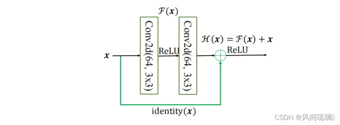

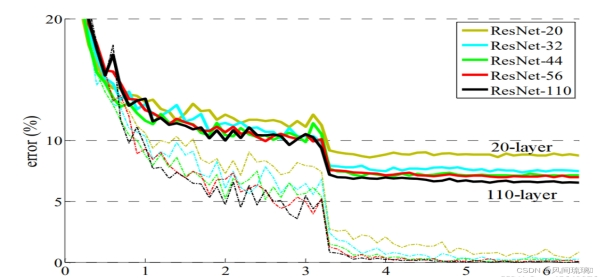

## 三、实验结果

### 1.设计并编程实现一个`ResNet-50`网络结构的图片分类模型

### 2.加载雏菊、蒲公英、玫瑰、太阳花、郁金香等五种花卉的3600图片数集，按8：2划分数据集为训练集和测试集样本数据

### 3.对模型进行训练和测试，分别给出误差变化曲线图、PR曲线、ROC曲线和混淆矩阵

**模型训练：**

```python
python tools/train.py models/resnet/resnet50.py
```

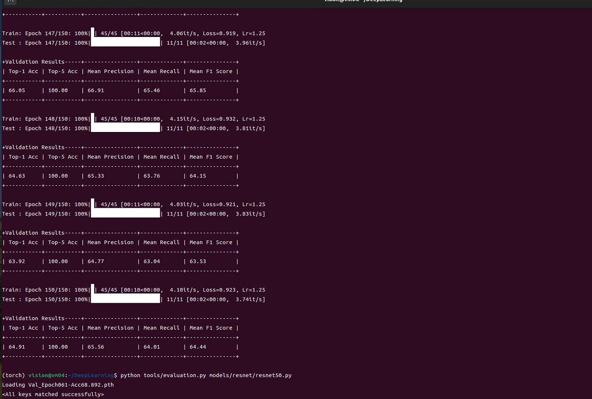

**模型评估：**

```python
python tools/evaluation.py models/resnet/resnet50.py
```

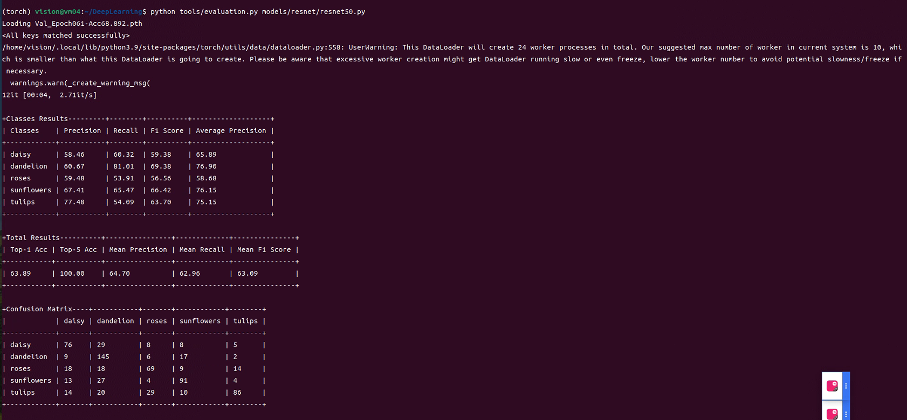

#### 3.1 误差变化曲线图

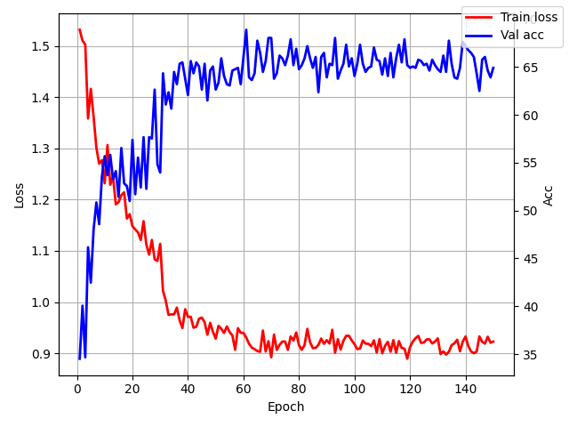

#### 3.2 PR曲线

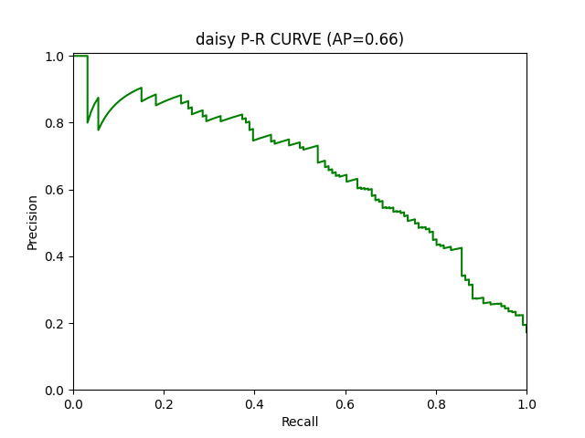

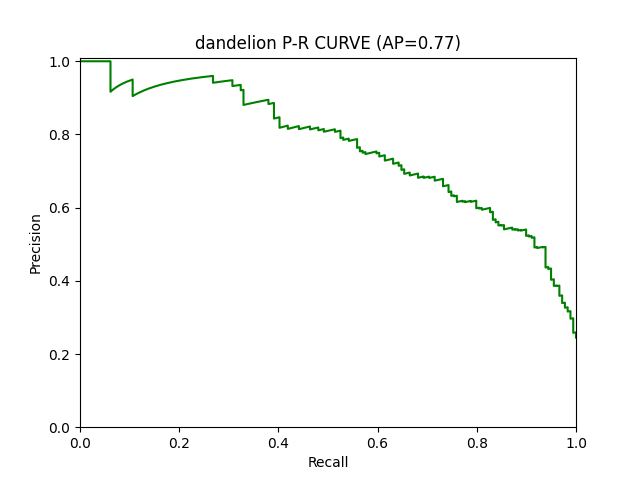

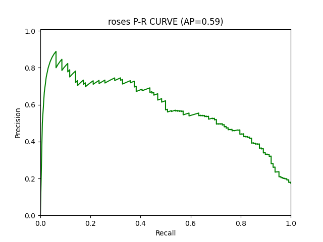

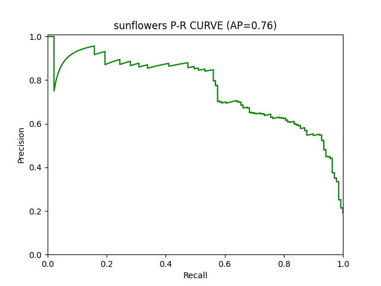

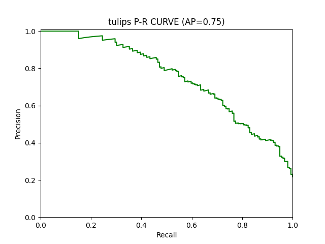

#### 3.3 ROC曲线

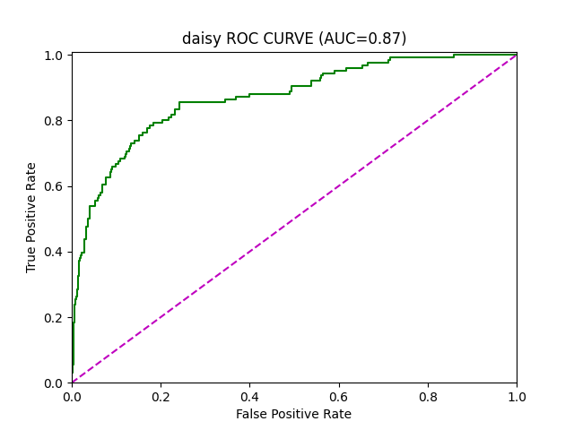

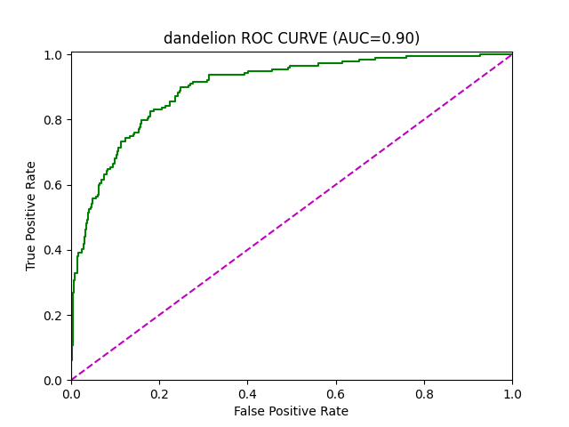

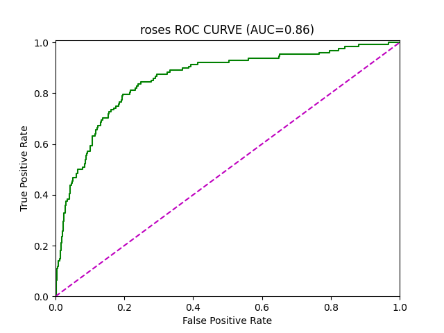

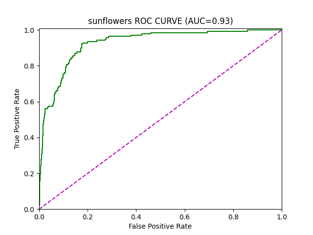

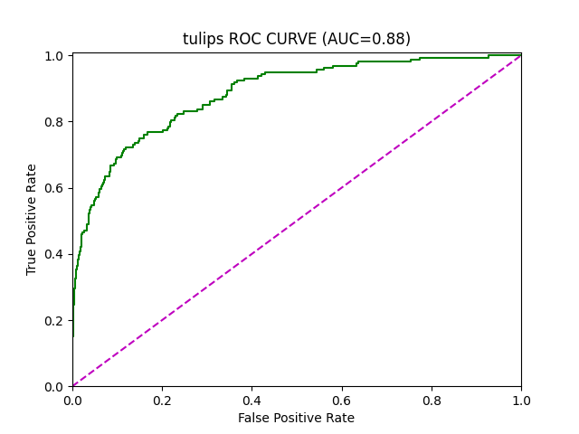

## 四、实验总结

### 1.完成实验报告要求2

#### 1.1 误差变化曲线图：

​	模型在训练过程中的误差变化情况。随着训练的进行，我们看到误差逐渐减小，这表明模型在学习数据特征方面的表现逐渐提高。

#### 1.2 PR曲线

​	PR曲线展示了在不同阈值下模型的精度和召回率之间的关系。`Precision`衡量了模型预测为正例的样本中真正正例的比例，`Recall`衡量了模型成功预测出的正例所占总的正例的比例。`PR`曲线越靠近右上角，说明模型性能越好。

#### 1.3 ROC曲线

​	`ROC`曲线展示了在不同阈值下模型的真正例率和假正例率的关系。真正例率是指所有正例中被正确预测为正例的比例，假正例率是指所有负例中被错误预测为正例的比例。`ROC`曲线下的面积（`AUC`）越接近1，说明模型性能越好。

### 2.总结实验心得体会

​	在实验中，通过加载不同种类的花卉图片数据集，实现了一个图片分类模型，并对模型进行了训练和测试，评估了其性能。

通过设计并编程实现`ResNet-50`网络结构的图片分类模型，深入理解了`ResNet`中的跳跃连接（`Skip Connection`）机制以及解决深度网络退化问题的原理。

数据集的质量对模型的训练和性能至关重要。在实验中，加载了包含不同种类花卉的数据集，并将其按照`8:2`的比例划分为训练集和测试集，充分利用了数据集的信息进行模型的训练和验证。

对模型进行训练和测试是实验的核心部分，通过监控误差变化曲线图、`PR`曲线、`ROC`曲线和混淆矩阵等评估指标，全面地评估了模型的性能。这些指标能够直观地反映模型的训练情况和分类效果，为后续的模型优化提供了指导。