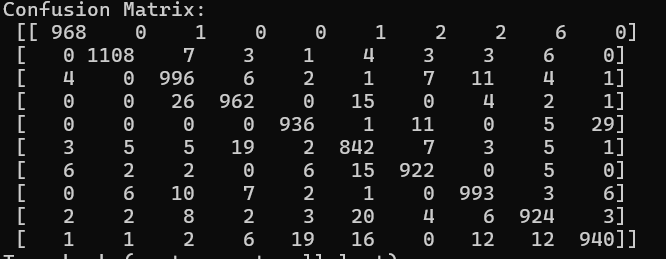

# 实验三 基于`LSTM`神经网络的手写体数字图片识别

班级：大数据分析2101                                      学号：202103151422                                      姓名：温家伟

[TOC]

## 一、实验目的

学习和理解`LSTM`神经网络的结构和基本工作原理，重点掌握`LSTM`神经网络算法对神经元的训练过程，通过构建`LSTM`神经网络实现手写体数字图片的识别，熟悉和掌握模型的工作原理及训练策略。

## 二、实验原理

1997年由`Hochreiter`和`Schmidhuber`提出的长短期记忆网络（`Long Short-Term Memory`, `LSTM`）是一种特殊类型的循环神经网络（`Recurrent Neural Network`, `RNN`），主要设计来解决传统`RNN`在处理长序列数据时出现的梯度消失或梯度爆炸问题。与传统的`RNN`相比，`LSTM`通过引入门控单元和记忆单元，能够更有效地记忆和传递长期信息，从而在处理时间序列数据、文本生成、语音识别等领域取得了显著成效。

`LSTM`模型主要由细胞状态、输入门、遗忘门和输出门四个部分组成。下面将结合模型结构图，详细解释各部分的功能和工作原理。

细胞状态（`Cell State`）：细胞状态是`LSTM`模型的核心，它贯穿整个网络结构，用于保存长期信息。在模型运行过程中，细胞状态会不断更新，以反映当前序列的状态。

输入门（`Input Gate`）：决定了哪些新的信息应该被加入到细胞状态中。它由`sigmoid`函数和一个点乘操作组成，用于控制输入信息的权重。当输入门的输出接近1时，表示新的信息被完全包含在细胞状态中；当输出接近0时，表示新的信息被忽略。

遗忘门（`Forget Gate`）：决定了哪些信息应该从细胞状态中删除。与输入门类似，遗忘门也由`sigmoid`函数和一个点乘操作组成。当遗忘门的输出接近1时，表示所有的信息都被保留；当输出接近0时，表示所有的信息都被遗忘。

输出门（`Output Gate`）：决定了从细胞状态中读取哪些信息并输出。它由sigmoid函数和一个`tanh`函数组成，首先通过`tanh`函数对细胞状态进行非线性变换，然后通过`sigmoid`函数控制输出的权重。最终，将`tanh`函数的输出与sigmoid函数的输出相乘，得到最终的输出结果。

## 三、`LSTM`的训练过程

在`LSTM`模型的训练过程中，每个时间步都会根据当前输入和前一时刻的隐藏状态进行前向传播。具体来说，每个时间步的`LSTM`单元会执行以下操作：

1.计算遗忘门、输入门和输出门的输出；

2.更新细胞状态，通过遗忘门和输入门对旧信息进行遗忘和更新；

3.计算当前时间步的隐藏状态，根据输出门对细胞状态进行非线性变换和权重控制；

4.将当前时间步的隐藏状态作为下一时间步的输入，进行下一轮的前向传播。

## 四、实验内容

1.设计并编程实现一个基于`LSTM`网络的手写体数字图片识别模型。

2.加载0-9等十种手写体数字图片的数据集，按8：2划分数据集为训练集和测试集样本数据。

3.对模型进行训练和测试，分别给出误差变化曲线图、`PR`曲线、`ROC`曲线和混淆矩阵。

- 训练过程如下：

  

  

- 误差变化曲线：

  误差变化曲线图显示的是模型训练过程中的误差如何随着训练迭代次数或时间的变化。通过观察误差变化曲线图，主要是观察模型是否收敛、训练是否过拟合。

  

- 准确率曲线：

  
  
  
  
- 混淆矩阵

  混淆矩阵是一种用于评估分类模型性能的工具，特别适合多类别分类问题。它展示了预测结果与实际标签的对应关系。

  

- `ROC`

  `ROC`曲线展示了不同阈值下的真正率和假正率之间的关系。

  

- `PR`

  `PR`曲线展示了不同阈值下的精确率和召回率之间的权衡关系。对于不平衡数据集（即正负类样本数量严重不均），`PR`曲线比`ROC`曲线更有用。

  

**特别说明**：因为这是手写数字识别的十分类，我在画`ROC`和`PR`的时候，我为每个类别分别计算曲线，然后求宏观平均和微观平均来得到整体的`PR`曲线和`ROC`曲线。