# 实验二 基于`GAN`神经网络的图片生成

班级：大数据分析2101                                      学号：202103151422                                      姓名：温家伟

[TOC]

## 一、实验目的     

​	学习和理解`GAN`神经网络的结构和基本工作原理，重点掌握`GAN`神经网络算法对生成器和判别器的训练过程，通过构建`GAN`神经网络实现花卉图片集中图片的生成，熟悉前馈网络和反馈网络的原理及结构。

## 二、实验原理

### 1.基本结构和工作原理

生成对抗网络（`Generative Adversarial Networks`）架构如图1所示，是一种深度学习模型，由生成器（`Generator`）和[判别器](https://m.baidu.com/s?word=判别器&sa=re_dqa_zy)（`Discriminator`）组成，它们通过相互竞争的方式共同学习和生成类似于训练数据的新样本。`GAN`的核心思想是通过对抗学习过程，使生成器能够不断提高生成逼真样本的能力，而判别器则不断提高辨别真伪样本的能力。

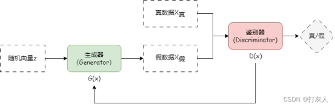

生成器：接收一个随机噪声向量作为输入，并将其转化为与真实数据相似的样本。生成器的任务是欺骗判别器，使其无法准确区分生成的样本和真实数据。

判别器：是一个二分类器，用于评估输入样本的真实性。它接收来自生成器的样本和真实数据，并尝试将它们正确分类为“真”或“假”。判别器的目标是尽可能准确地区分生成的样本和真实数据，使得生成器的输出更加逼真。

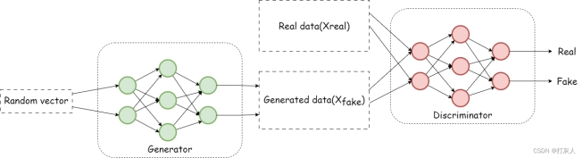


### 2.GAN的训练过程

`GAN`的训练过程涉及两个主要步骤：生成器通过接收随机噪声作为输入，并尝试生成与真实数据相似的样本，以欺骗判别器。判别器则试图区分这些样本是来自真实数据还是生成器生成的假样本。在训练过程中，生成器和判别器通过对抗学习相互博弈。这种对抗学习的过程持续进行，直到生成器生成的样本足够逼真，判别器无法有效区分真假为止。

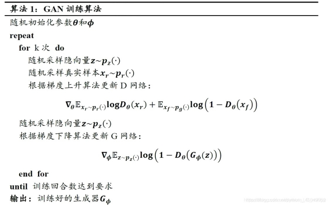

### 3.[GAN](https://so.csdn.net/so/search?q=GAN&spm=1001.2101.3001.7020)模型的性能评估参数

评估[GAN](https://so.csdn.net/so/search?q=GAN&spm=1001.2101.3001.7020)模型的性能和生成样本的质量是一个挑战性的任务，因为`GAN`没有明确的标准答案来衡量其生成结果的绝对质量。下面是一些常见的评估指标和方法，用于评估`GAN`模型的性能和生成样本的质量：

- **直观质量评估：**首先，可以通过直观观察和人工审查生成的样本来评估其质量。人工评估者可以判断生成样本的逼真程度、多样性和创造性等因素。
- **Inception Score（IS）：**`IS`是一种常用的`GAN`性能评估指标。它结合了两个方面：生成样本的多样性和判别器的分类准确性。较高的`IS`值表示生成样本多样性和真实性更好。`IS`值越高越好。
- **Fréchet Inception Distance（FID）：**`FID`是另一个常用的`GAN`性能评估指标。它通过比较生成样本的特征分布与真实样本的特征分布之间的距离来衡量生成样本的质量。较低的`FID`值表示生成样本与真实样本更接近。`FID`值越低越好。
- **Precision, Recall, and F1-score：**可以使用传统的分类度量指标（如精确度、召回率和`F1-score`）来评估`GAN`生成样本的质量。可以使用预训练的分类器或人工标记的数据集来计算这些指标。
- **人类评分：**可以邀请人类评审员对生成样本进行评分，以获取对样本质量的主观评价。可以使用标定或排名评分来衡量生成样本与真实样本的比较。
- **生成样本的应用效果：**`GAN`模型的生成样本可以在特定应用中使用，如图像生成。可以通过将生成样本应用于其他任务（如图像分类或目标检测）来评估生成样本在实际应用中的效果。

## 三、实验结果

修改了下代码，增加了画出判别器和生成器的`Loss`图的代码。

### 3.1 Loss曲线图

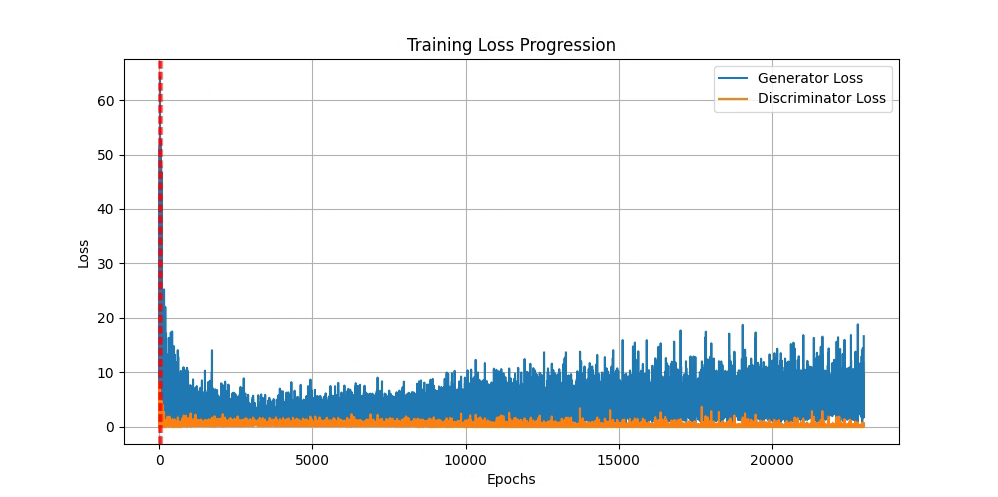

### 3.2  花卉生成图像

<center class="half">    
	<center class="half">
    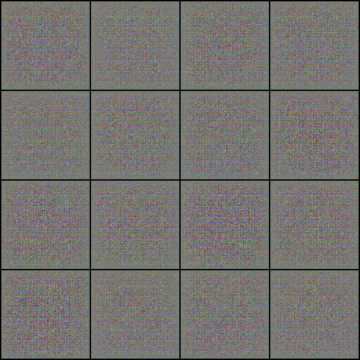
    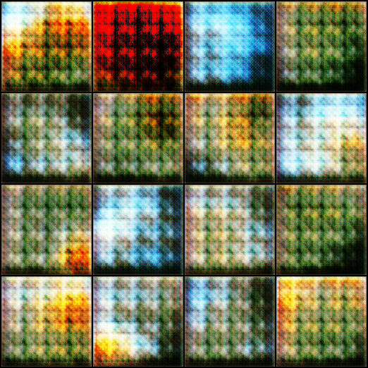
    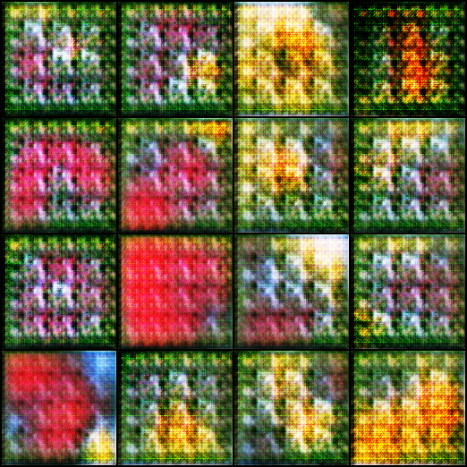
    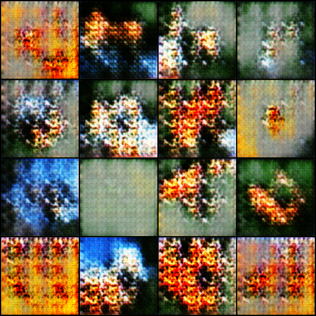
    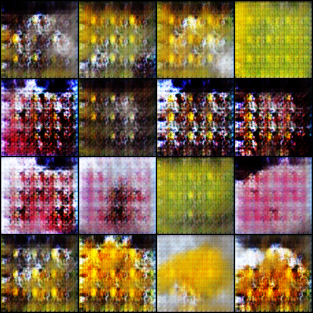
    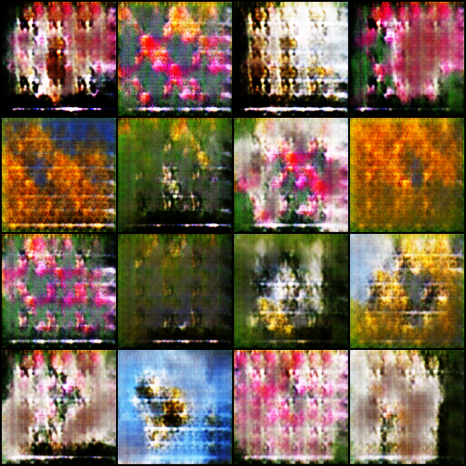
    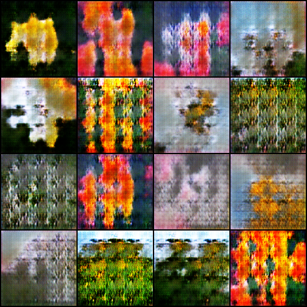
    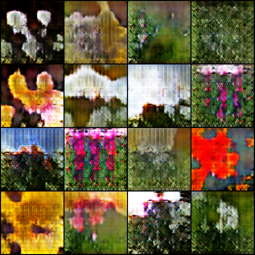
    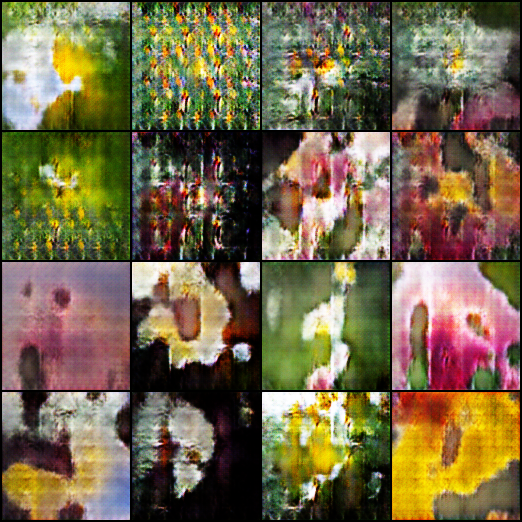
    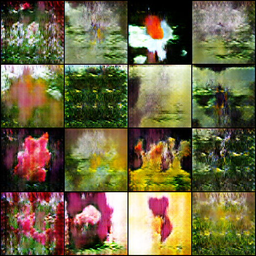
    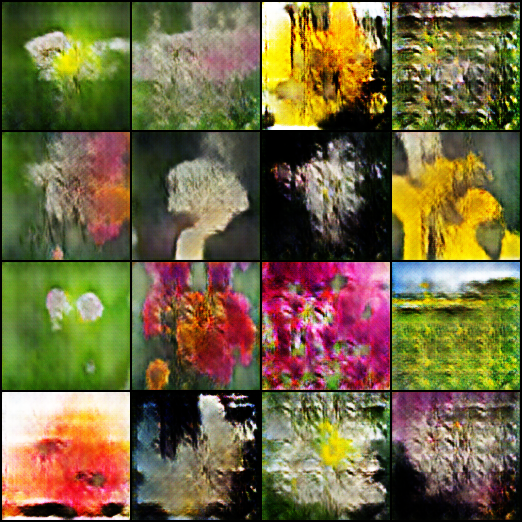
    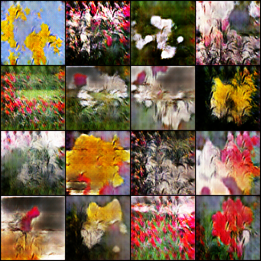
    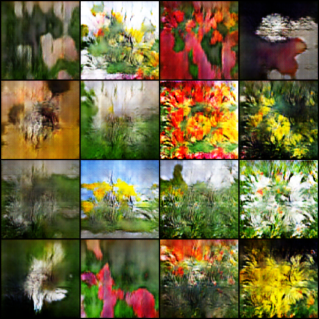
    
    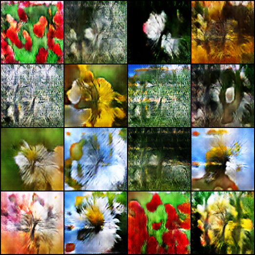
    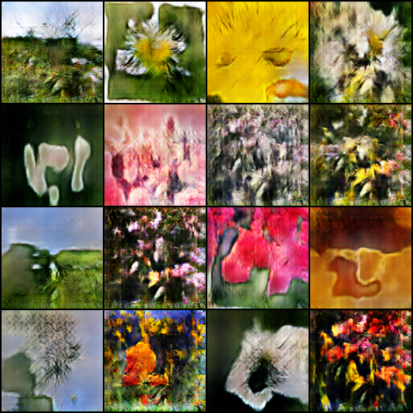
    
    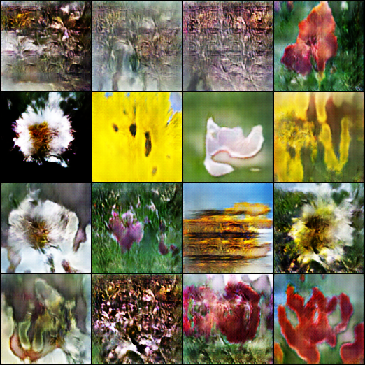
    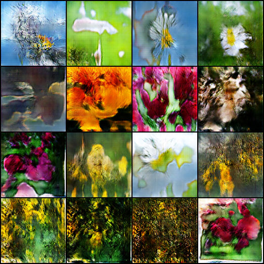
    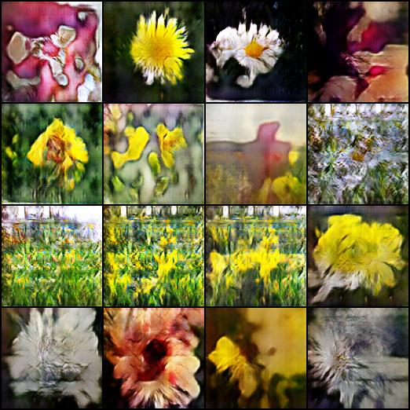
    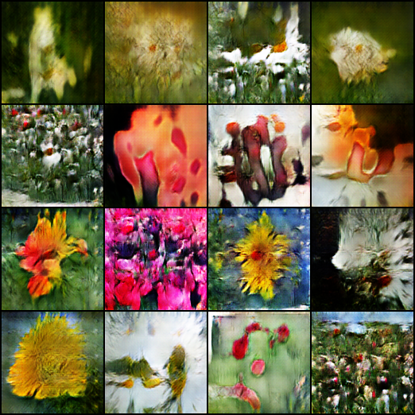
    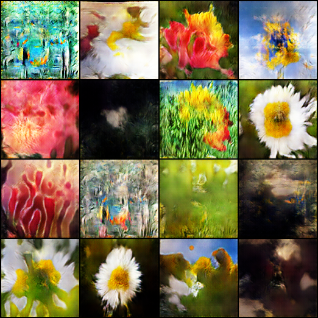
    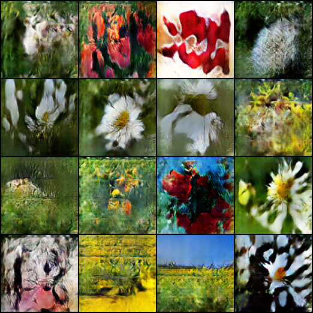
</center>
<h2>0.png 至 22000.png</h2>

## 四、实验总结

### 1.完成实验报告要求2

实验结果见第三部分。

### 2.总结实验心得体会

**结合代码分析模型训练过程中G和D的训练步骤，讨论实验结果中评估模型性能的指标的意义。**

#### 2.1 生成器（Generator, G）训练

1. **初始化**：首先，生成器会接收到从标准正态分布中采样的一组随机噪声向量`z`。
2. **生成图像**：利用这组噪声，生成器试图构建出看似真实的图像`gen_imgs`。
3. **计算损失**：然后，使用鉴别器对这些生成的图像进行评估，得到一个预测分数。理想情况下，生成器希望鉴别器误以为这些图像是真实的，因此其目标是最小化鉴别器给出的负`logit`（即判别为假的概率），这里通过`BCEWithLogitsLoss`来实现。
4. **反向传播与更新**：基于生成的损失`g_loss`，对生成器的参数进行梯度更新，使其逐渐学会生成更逼真的图像。

#### 2.2 判别器（Discriminator, D）训练

1. **真实图像评估**：判别器首先接收真实图像，并尝试给出尽可能高的概率（接近1），表明这是真实的。
2. **生成图像评估**：接着，判别器会评估由生成器产生的图像，但这次它应该给出低概率（接近0），表示这些是伪造的。
3. **计算综合损失**：真实图像和生成图像的鉴别损失被平均后作为判别器的整体损失`d_loss`。
4. **反向传播与更新**：根据这个综合损失，判别器的参数被更新，以增强其区分真伪图像的能力。

#### 2.3 模型性能评估指标的意义

- **鉴别器损失 (D Loss)**：反映了判别器区分真实图像和生成图像的能力。如果`D Loss`较低，说明判别器能较好地区分真实样本和生成样本，但这也可能意味着生成器未能充分欺骗判别器。
- **生成器损失 (G Loss)**：衡量生成器欺骗判别器的能力，理想情况下，`G Loss`降低表示生成器生成的样本越来越难以被D区分开，即生成图像的质量提高，更接近于真实数据。
- **样本图像质量**：在训练过程中，通过保存一定间隔的生成样本图像，可以直接观察到生成图像质量的变化，如清晰度、结构完整性等。这虽然是定性评估，但对于理解模型进展至关重要。

通过交替训练G和D，直到二者达到某种平衡状态，通常期望生成器能够生成与真实数据难以分辨的样本。评估模型性能时，不仅要关注损失值的下降，还要通过可视化生成样本、计算`Inception Score`、`Fréchet Inception Distance (FID) `等量化指标来综合判断生成图像的质量和多样性。

## 五、代码

```python
import argparse
import os
import numpy as np
import torchvision.transforms as transforms
from torchvision.utils import save_image
from torchvision import datasets
from torch.autograd import Variable
import torch.nn as nn
import torch
import matplotlib.pyplot as plt


parser = argparse.ArgumentParser()
parser.add_argument("--n_epochs", type=int, default=100, help="训练轮次")
parser.add_argument("--batch_size", type=int, default=16, help="单个训练批次大小")
parser.add_argument("--lr", type=float, default=0.0001, help="学习率")
parser.add_argument("--latent_dim", type=int, default=100, help="潜空间向量维度")
parser.add_argument("--img_size", type=int, default=128, help="图片尺寸")
parser.add_argument("--channels", type=int, default=3, help="图片通道")
parser.add_argument("--n_g_feature", type=int, default=128, help="G模型通道量")
parser.add_argument("--n_d_feature", type=int, default=128, help="G模型通道量")
parser.add_argument("--sample_interval", type=int, default=1000, help="每训练n次保存结果")
parser.add_argument("--save_dir", type=str, default="GAN_20240523/result", help="存放训练结果的地址")
opt = parser.parse_args()
print(opt)

os.makedirs(opt.save_dir, exist_ok=True)#创建存放训练结果的文件夹
cuda = True if torch.cuda.is_available() else False

g_losses = []
d_losses = []

# 生成器
class Generator(nn.Module):
    def __init__(self):
        super(Generator, self).__init__()

        n_g_feature = opt.n_g_feature
        def block(in_feat, out_feat, is_first=False):
            if is_first:
                layers = [
                    nn.ConvTranspose2d(in_feat, out_feat, kernel_size=4, bias=False),
                    nn.BatchNorm2d(out_feat),
                    nn.ReLU()
                ]
            else:
                layers = [
                    nn.ConvTranspose2d(in_feat, out_feat, kernel_size=4, stride=2, padding=1, bias=False),
                    nn.BatchNorm2d(out_feat),
                    nn.ReLU()
                ]
            return layers
        
        self.model = nn.Sequential(
            *block(opt.latent_dim, 16 * n_g_feature, is_first=True),
            *block(16 * n_g_feature, 8 * n_g_feature),
            *block(8 * n_g_feature, 4 * n_g_feature),
            *block(4 * n_g_feature, 2 * n_g_feature),
            *block(2 * n_g_feature, n_g_feature),
            nn.ConvTranspose2d(n_g_feature, opt.channels, kernel_size=4, stride=2, padding=1),
            nn.Sigmoid()
        )

    def forward(self, z):
        img = self.model(z)
        return img

# 判别器
class Discriminator(nn.Module):
    def __init__(self):
        super(Discriminator, self).__init__()

        def block(in_feat, out_feat, is_first=False):
            if is_first:
                layers = [
                    nn.Conv2d(in_feat, out_feat, kernel_size=4, stride=2, padding=1),
                    nn.LeakyReLU(0.2)
                ]
            else:
                layers = [
                    nn.Conv2d(in_feat, out_feat, kernel_size=4, stride=2, padding=1, bias=False),
                    nn.BatchNorm2d(out_feat),
                    nn.LeakyReLU(0.2),
                ]
            return layers

        n_d_feature = opt.n_d_feature
        self.model = nn.Sequential(
            *block(opt.channels, n_d_feature, is_first=True),
            *block(n_d_feature, 2 * n_d_feature),
            *block(2 * n_d_feature, 4 * n_d_feature),
            *block(4 * n_d_feature, 8 * n_d_feature),
            *block(8 * n_d_feature, 16 * n_d_feature),
            nn.Conv2d(16 * n_d_feature, 1, kernel_size=4)
        )


    def forward(self, img):
        out = self.model(img)
        return out

# 损失函数
adversarial_loss = torch.nn.BCEWithLogitsLoss()

# 够级生成器与判别器
generator = Generator()
discriminator = Discriminator()

# cuda加速
if cuda:
    generator.cuda()
    discriminator.cuda()
    adversarial_loss.cuda()

def weights_init_normal(m):
    if type(m) in [nn.ConvTranspose2d, nn.Conv2d]:
        torch.nn.init.xavier_normal_(m.weight)
    elif type(m) == nn.BatchNorm2d:
        torch.nn.init.normal_(m.weight, 1.0, 0.02)
        torch.nn.init.constant_(m.bias, 0)

# 初始化权重
generator.apply(weights_init_normal)
discriminator.apply(weights_init_normal)

# 装载数据
dataloader = torch.utils.data.DataLoader(
    datasets.ImageFolder(
        "GAN_20240523/flower_photos",
        transform=transforms.Compose([
                transforms.Resize((opt.img_size,opt.img_size)),
                transforms.ToTensor()
                ])
        ),
        batch_size=opt.batch_size,
        shuffle=True
)
# dataloader = torch.utils.data.DataLoader(
#    datasets.QMNIST(
#        "/home/vision/GAN_20240523",
#        transform=transforms.Compose([
#                transforms.Resize((opt.img_size,opt.img_size)),
#                transforms.ToTensor()
#                ])
#        ),
#        batch_size=opt.batch_size,
#        shuffle=True
#)

# 优化器
optimizer_G = torch.optim.Adam(generator.parameters(), lr=opt.lr, betas=(0.5, 0.999))
optimizer_D = torch.optim.Adam(discriminator.parameters(), lr=opt.lr, betas=(0.5, 0.999))

Tensor = torch.cuda.FloatTensor if cuda else torch.FloatTensor

# 训练循环开始前初始化绘图
plt.figure(figsize=(10, 5))

# 开始训练
for epoch in range(opt.n_epochs):
    for i, (imgs, _) in enumerate(dataloader):

        valid = Variable(Tensor(imgs.shape[0]).fill_(1.0), requires_grad=False)
        fake = Variable(Tensor(imgs.shape[0]).fill_(0.0), requires_grad=False)

        # 构造输入
        real_imgs = Variable(imgs.type(Tensor))

        # -----------------
        #  训练生成器
        # -----------------

        optimizer_G.zero_grad()

        # 生成随机噪声
        z = Variable(Tensor(np.random.normal(0, 1, (imgs.shape[0], opt.latent_dim,1,1))))

        # 生成一批图像
        gen_imgs = generator(z)

        # 衡量生成器欺骗鉴别器的能力
        g_loss = adversarial_loss(discriminator(gen_imgs).view(-1), valid)

        g_loss.backward()
        optimizer_G.step()

        # ---------------------
        #  训练鉴别器
        # ---------------------

        optimizer_D.zero_grad()

        # 衡量鉴别器鉴别图像的能力
        real_loss = adversarial_loss(discriminator(real_imgs).view(-1), valid)
        fake_loss = adversarial_loss(discriminator(gen_imgs.detach()).view(-1), fake)
        d_loss = (real_loss + fake_loss) / 2

        d_loss.backward()
        optimizer_D.step()

        print(
            "[Epoch %d/%d] [Batch %d/%d] [D loss: %f] [G loss: %f]"
            % (epoch, opt.n_epochs, i, len(dataloader), d_loss.item(), g_loss.item())
        )

        batches_done = epoch * len(dataloader) + i
        if batches_done % opt.sample_interval == 0:
            save_image(gen_imgs.data[:16], opt.save_dir+"/%d.png" % batches_done, nrow=4, normalize=True)

        # 记录每轮结束的Loss
        g_losses.append(g_loss.item())
        d_losses.append(d_loss.item())

        # 特定轮次的操作，如模型保存提示
        if epoch in [1, 10, 30, 60, 90]:
            print(f"Model state recorded at epoch {epoch}.")

    # 每个epoch结束时更新Loss曲线
    plt.clf()  # 清除当前图表以便重新绘制
    plt.plot(g_losses, label="Generator Loss")
    plt.plot(d_losses, label="Discriminator Loss")
    
    # 标记特定轮次
    epochs_to_mark = [1, 10, 30, 60, 90]
    current_epoch_index = epoch
    for marked_epoch in epochs_to_mark:
        if marked_epoch <= current_epoch_index:
            plt.axvline(x=marked_epoch, color='r', linestyle='--', alpha=0.5)
    
    plt.title("Training Loss Progression")
    plt.xlabel("Epochs")
    plt.ylabel("Loss")
    plt.legend()
    plt.grid(True)

plt.savefig("final_loss_curve.png")
```
