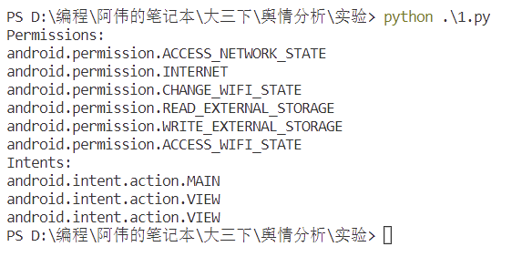
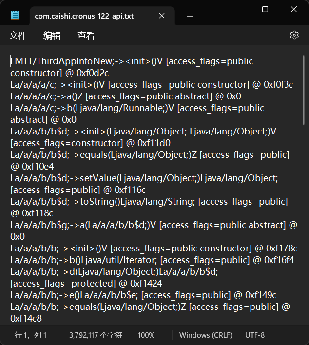

# 社交网络与舆情分析上机实验

## 题目：提取apk内的api、权限、intents

- 参考思路
  - 利用`androguard`、`apktool`反编译`apk`文件；
  - 解析`AndroidManifest.xml`，获取入`activity`、权限等关键信息；
- 实验要求
  - 安装`androguard`或`apktool`；
  - 反编译`apk`，`获取api`、`权限`、`intents`。

## 实验分析

通过查阅资料，`apk`就相当于`Windows`下的`exe`文件，本质上是一个压缩包，把他的后缀改成`.zip`后就可以打开看到里面的文件。

其中`api`位于`.dex`中，`dex`是`Java`的字节码文件，所以对他反编译后就可以看到里面的Java源码，从而获得`api`。

而权限和`intents`则位于`AndroidManifest.xml`中，所以解析`AndroidManifest.xml`文件获得权限和`intents`。

## 实验代码

```python
import os
import sys

androguard_module_path = os.path.join( os.path.dirname(os.path.abspath(__file__)), 'androguard' )
if not androguard_module_path in sys.path:
    sys.path.append(androguard_module_path)
    
from androguard.misc import AnalyzeAPK
from androguard.core.androconf import load_api_specific_resource_module

path = r"D:\编程\阿伟的笔记本\大三下\舆情分析\实验\apk"
out_path = r"D:\编程\阿伟的笔记本\大三下\舆情分析\实验\out"
files = []
path_list=os.listdir(path)
path_list.sort()
for name in path_list:
        if os.path.isfile(os.path.join(path, name)):
            files.append(name)

def main():
    for apkfile in files:
        file_name = os.path.splitext(apkfile)[0]   
        out = AnalyzeAPK(path + '\\' + apkfile) 
        # 权限
        a = out[0]
        permissions = a.get_permissions()
        print("Permissions:")
        print("\n".join(permissions))
        dx = out[2]
        # api，太多了，写入文件中      
        api_perm_filename = os.path.join(out_path, file_name + "_api.txt")
        api_perm_file = open(api_perm_filename, 'w', encoding='utf-8')
        results = []
        for meth_analysis in dx.get_methods():
            meth = meth_analysis.get_method()
            result = str(meth)
            api_perm_file.write(result + '\n')  
        api_perm_file.close()

        # intents
        android_manifest_xml = a.get_android_manifest_xml()
        print("Intents:")
        for activity in android_manifest_xml.findall(".//activity"):
            for intent_filter in activity.findall(".//intent-filter"):
                for action in intent_filter.findall(".//action"):
                    print(action.attrib['{http://schemas.android.com/apk/res/android}name'])

if __name__=='__main__':
    main()
```

## 实验结果

- 权限和`intents`：

  

- `api`写在文件中了：

  