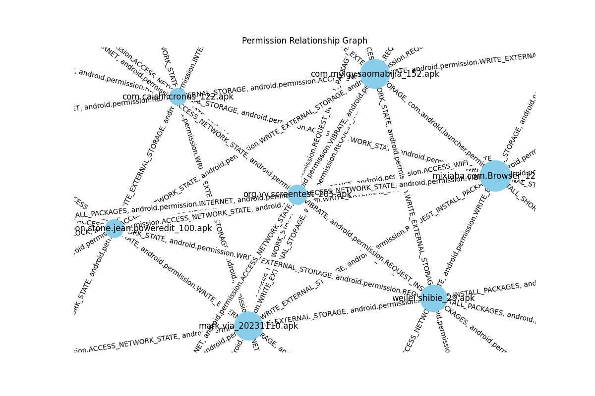
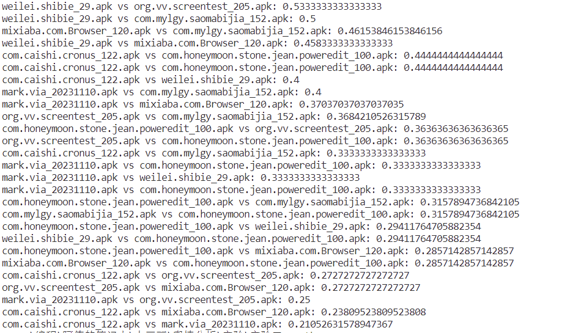

# 社交网络与舆情分析上机实验

## 题目：构建关于`apk`的关系图

构建关于`apk`的关系图

**参考思路：**

- 对提取出来的所有权限做交集，取前20个权限；

- 根据提取的权限，生成一个关于`apk`的关系图

**实验要求：**

- 生成`apk`的关系图；
- 根据权限关系图比较两个`apk`的相似度。

## 实验分析

`apk`之间的关系是指，以`apk`文件为节点，以`apk`权限为边的关系图，而相似度，我用了类似于`Jaccard`相似度的度量方法：
$$
相似度=\dfrac{两个apk共享权限数目}{两个apk总权限数目}
$$

## 实验代码

```python
import matplotlib.pyplot as plt
from collections import Counter
from androguard.misc import AnalyzeAPK
import networkx as nx
import os
# 可视化权限关系图
def visualize_permission_graph(graph):
    pos = nx.spring_layout(graph)
    plt.figure(figsize=(12, 8))
    node_sizes = [len(graph.nodes[node]["permissions"]) * 100 for node in graph.nodes]
    nx.draw_networkx_nodes(graph, pos, node_color='skyblue', node_size=node_sizes)
    nx.draw_networkx_labels(graph, pos)
    edges = graph.edges()
    nx.draw_networkx_edges(graph, pos, edgelist=edges, edge_color='k', width=1, alpha=0.5)
    edge_labels = {(n1, n2): ", ".join(permissions) for n1, n2, permissions in graph.edges(data="permissions")}
    nx.draw_networkx_edge_labels(graph, pos, edge_labels=edge_labels)
    plt.title("Permission Relationship Graph")
    plt.axis('off')
    plt.show()

# 提取apk权限
def extract_permissions(apk_files):
    all_permissions = []
    for apk_file in apk_files:
        try:
            a, _, _ = AnalyzeAPK(apk_file)
            permissions = a.get_permissions()
            all_permissions.extend(permissions)
        except Exception as e:
            print(f"Error analyzing {apk_file}: {e}")
    permissions_counter = Counter(all_permissions)
    top_permissions = permissions_counter.most_common(20)
    permission_list = [permission[0] for permission in top_permissions]
    return permission_list

# 权限关系
def generate_permission_graph(apk_files, top_permissions):
    graph = nx.Graph()
    for apk_file in apk_files:
        try:
            a, _, _ = AnalyzeAPK(apk_file)
            permissions = a.get_permissions()
            apk_name = os.path.basename(apk_file)
            graph.add_node(apk_name)
            graph.nodes[apk_name]["permissions"] = permissions
            for node in graph.nodes():
                if node != apk_name and graph.has_node(node):
                    shared_permissions = set(permissions) & set(graph.nodes[node]["permissions"])
                    if shared_permissions:
                        graph.add_edge(apk_name, node, permissions=shared_permissions)
        except Exception as e:
            print(f"Error analyzing {apk_file}: {e}")
    return graph

# 计算相似度
def calculate_similarity(graph, apk_files):
    similarities = []
    for apk1_index, apk1 in enumerate(apk_files):
        for apk2_index in range(apk1_index + 1, len(apk_files)):
            apk2 = apk_files[apk2_index]
            if apk1 not in graph.nodes or apk2 not in graph.nodes:
                print("APK not found in the graph.")
                continue
            shared_permissions = set(graph.nodes[apk1]["permissions"]) & set(graph.nodes[apk2]["permissions"])
            all_permissions = set(graph.nodes[apk1]["permissions"]) | set(graph.nodes[apk2]["permissions"])
            similarity = len(shared_permissions) / len(all_permissions)
            similarities.append(((apk1, apk2), similarity))
    similarities.sort(key=lambda x: x[1], reverse=True)
    return similarities

# 主程序
# apk_files = ["com.caishi.cronus_122.apk", "mark.via_20231110.apk"]
apk_files = ["com.caishi.cronus_122.apk", "mark.via_20231110.apk", "com.honeymoon.stone.jean.poweredit_100.apk", "weilei.shibie_29.apk", "org.vv.screentest_205.apk", "mixiaba.com.Browser_120.apk", "com.mylgy.saomabijia_152.apk"] 

top_permissions = extract_permissions(apk_files)
permission_graph = generate_permission_graph(apk_files, top_permissions)
similarities = calculate_similarity(permission_graph, apk_files)

# 可视化权限关系图
visualize_permission_graph(permission_graph)

print("APK similarities (descending order):")
for pair, similarity in similarities:
    print(f"{pair[0]} vs {pair[1]}: {similarity}")
```

## 实验结果

- 关系图

  

- 相似度降序排列

  