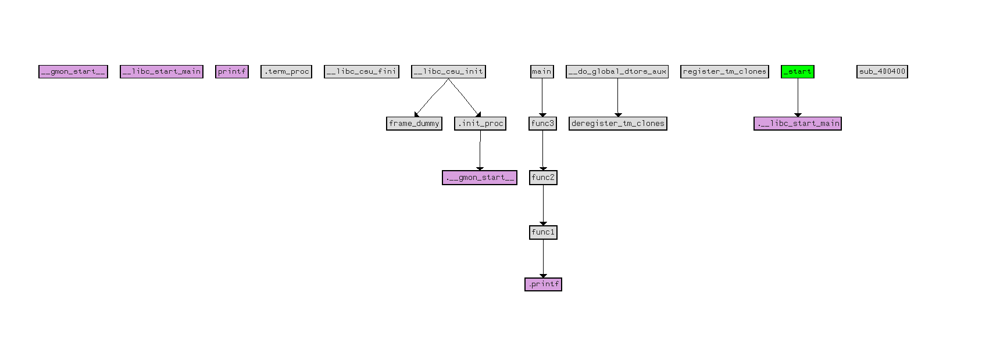

# 社交网络与舆情分析上机实验

## 题目：提取二进制文件的`structure characteristics`

**参考思路：**

- 利用`ida pro`反汇编二进制文件；

- 解析汇编后的文件，获取该二进制文件的`ACFG`；

**实验要求**：

- 安装`ida pro 7.5.0`或`pycharm`；
- 反编译二进制文件，获取`ACFG`。

## 实验过程

首先自己写一段`c`语言代码：

```c
#include <stdio.h>

void func1()
{
  int a = 1;
  int b = 1;
  int c = a + b;
  printf("%d\n", c);
}
void func2()
{
  func1();
}

void func3()
{
  func2();
}

int main()
{
  func3();   
  return 0;
}
```

然后用`gcc`生成`test.o`的目标文件，这个目标文件是二进制文件：

```shell
gcc -c test.c -o test.o
```

下载`ida pro`，分析`test.o`：

把`test.o`拖入软件，查看流程图和函数调用图：

流程图概览：


流程图细节：


函数调用：



然后使用`python`脚本分析，脚本代码见后：


结果如图所示：


用`echarts`渲染，发现和软件的结果一致：


同样的。用脚本分析函数调用，代码见后：


结果如下：


## 实验代码

### 流程图数据代码：

```python
import idaapi
import idc
import json
import random

# 定义一个空列表，用于存储所有基本块的信息
basic_blocks_info = []
# 定义两个字典，用于存储已经使用的name和block
used_names = {}
used_blocks = {}

# 遍历二进制文件中的所有函数
for function_ea in Functions():
    # 获取函数对象
    function = idaapi.get_func(function_ea)
    function_name = idc.get_func_name(function.start_ea)
    print(function_name)

    # 创建函数的ACFG
    acfg = idaapi.FlowChart(function)
    # 遍历每个基本块
    for block in acfg:
        # 获取基本块的名称
        block_name = idc.get_func_name(block.start_ea)
        # 创建一个字典来存储基本块的详细信息
        block_info = {
            "name": hex(block.start_ea),
            "x": random.randint(0, 1000),  # 使用随机坐标
            "y": random.randint(0, 1000),  # 使用随机坐标
            "block": block_name,
            "assemblyCode": "",
            "successors": []
        }

        # 检查name是否已经存在，如果存在，则设置为空字符串
        if block_info["name"] in used_names:
            block_info["name"] = ""
        else:
            used_names[block_info["name"]] = True

        # 检查block是否已经存在，如果存在，则设置为空字符串
        if block_info["block"] in used_blocks:
            block_info["block"] = ""
        else:
            used_blocks[block_info["block"]] = True

        # 获取基本块的指令信息
        for head in Heads(block.start_ea, block.end_ea):
            disasm_line = idc.GetDisasm(head)
            block_info["assemblyCode"] += disasm_line + "\n"

        # 获取当前基本块的后继基本块
        successors = [hex(succ.start_ea) for succ in block.succs()]
        block_info["successors"] = successors

        # 将基本块信息添加到列表中
        basic_blocks_info.append(block_info)

# 打开文件以写入基本块信息
output_file_path = r"C:\Users\20848\Desktop\basic_blocks_output.txt"
with open(output_file_path, "w") as output_file:
    # 将基本块信息列表转换为 JSON 格式并写入文件
    for i, block_info in enumerate(basic_blocks_info):
        if i > 0:
            output_file.write(",\n")
        output_file.write("{\n")
        output_file.write(f"    name: \'{block_info['name']}\',\n")
        output_file.write(f"    x: {block_info['x']},\n")
        output_file.write(f"    y: {block_info['y']},\n")
        output_file.write(f"    block: \'{block_info['block']}\',\n")
        output_file.write(f"    assemblyCode: `\n")
        output_file.write(f"    " + block_info['assemblyCode'].replace("\n", "\n    ") + "`,\n")
        output_file.write(f"    successors: [\n")
        for j, succ in enumerate(block_info['successors']):
            if j > 0:
                output_file.write(",\n")
            output_file.write(f"        \"{succ}\"")
        output_file.write("\n    ]\n}")

    output_file.write("\n}")
```

### 流程图用`echarts`渲染：

```javascript
<!DOCTYPE html>
<html lang="en">
<head>
    <meta charset="UTF-8">
    <title>Dynamic Graph</title>
    <script src="https://cdn.jsdelivr.net/npm/echarts@5.2.1/dist/echarts.min.js"></script>
</head>
<body>
<div id="main" style="width: 800px;height:600px;"></div>
<script type="text/javascript">
    var myChart = echarts.init(document.getElementById('main'));
    var data = [
    {
    name: '0x4003e0',
    x: 330,
    y: 306,
    block: '.init_proc',
    assemblyCode: `
    sub     rsp, 8; _init
    mov     rax, cs:__gmon_start___ptr
    test    rax, rax
    jz      short loc_4003F5
    `,
    successors: [
        "0x4003f0",
        "0x4003f5"
    ]
},
{
    name: '0x4003f0',
    x: 586,
    y: 14,
    block: '',
    assemblyCode: `
    call    ___gmon_start__
    `,
    successors: [
        "0x4003f5"
    ]
},
{
    name: '0x4003f5',
    x: 752,
    y: 356,
    block: '',
    assemblyCode: `
    add     rsp, 8
    retn
    `,
    successors: [

    ]
},
{
    name: '0x400400',
    x: 593,
    y: 7,
    block: 'sub_400400',
    assemblyCode: `
    push    cs:qword_601008
    jmp     cs:qword_601010
    `,
    successors: [

    ]
},
{
    name: '0x400410',
    x: 959,
    y: 0,
    block: '.printf',
    assemblyCode: `
    jmp     cs:off_601018
    `,
    successors: [
        "0x601040"
    ]
},
{
    name: '0x601040',
    x: 799,
    y: 822,
    block: 'printf',
    assemblyCode: `
    `,
    successors: [

    ]
},
{
    name: '0x400420',
    x: 440,
    y: 702,
    block: '.__libc_start_main',
    assemblyCode: `
    jmp     cs:off_601020
    `,
    successors: [
        "0x601048"
    ]
},
{
    name: '0x601048',
    x: 8,
    y: 6,
    block: '__libc_start_main',
    assemblyCode: `
    `,
    successors: [

    ]
},
{
    name: '0x400430',
    x: 837,
    y: 154,
    block: '.__gmon_start__',
    assemblyCode: `
    jmp     cs:off_601028
    `,
    successors: [
        "0x601050"
    ]
},
{
    name: '0x601050',
    x: 822,
    y: 148,
    block: '__gmon_start__',
    assemblyCode: `
    `,
    successors: [

    ]
},
{
    name: '0x400440',
    x: 570,
    y: 344,
    block: '_start',
    assemblyCode: `
    xor     ebp, ebp
    mov     r9, rdx; rtld_fini
    pop     rsi; argc
    mov     rdx, rsp; ubp_av
    and     rsp, 0FFFFFFFFFFFFFFF0h
    push    rax
    push    rsp; stack_end
    mov     r8, offset __libc_csu_fini; fini
    mov     rcx, offset __libc_csu_init; init
    mov     rdi, offset main; main
    call    ___libc_start_main
    hlt
    `,
    successors: [

    ]
},
{
    name: '0x400470',
    x: 858,
    y: 303,
    block: 'deregister_tm_clones',
    assemblyCode: `
    mov     eax, 60103Fh
    push    rbp
    sub     rax, offset _end
    cmp     rax, 0Eh
    mov     rbp, rsp
    ja      short loc_400487
    `,
    successors: [
        "0x400485",
        "0x400487"
    ]
},
{
    name: '0x400485',
    x: 532,
    y: 7,
    block: '',
    assemblyCode: `
    pop     rbp
    retn
    `,
    successors: [

    ]
},
{
    name: '0x400487',
    x: 824,
    y: 511,
    block: '',
    assemblyCode: `
    mov     eax, 0
    test    rax, rax
    jz      short loc_400485
    `,
    successors: [
        "0x400485",
        "0x400491"
    ]
},
{
    name: '0x400491',
    x: 230,
    y: 764,
    block: '',
    assemblyCode: `
    pop     rbp
    mov     edi, offset _end
    jmp     rax
    `,
    successors: [

    ]
},
{
    name: '0x4004a0',
    x: 748,
    y: 659,
    block: 'register_tm_clones',
    assemblyCode: `
    mov     eax, offset _end
    push    rbp
    sub     rax, offset _end
    sar     rax, 3
    mov     rbp, rsp
    mov     rdx, rax
    shr     rdx, 3Fh
    add     rax, rdx
    sar     rax, 1
    jnz     short loc_4004C4
    `,
    successors: [
        "0x4004c2",
        "0x4004c4"
    ]
},
{
    name: '0x4004c2',
    x: 292,
    y: 853,
    block: '',
    assemblyCode: `
    pop     rbp
    retn
    `,
    successors: [

    ]
},
{
    name: '0x4004c4',
    x: 140,
    y: 248,
    block: '',
    assemblyCode: `
    mov     edx, 0
    test    rdx, rdx
    jz      short loc_4004C2
    `,
    successors: [
        "0x4004c2",
        "0x4004ce"
    ]
},
{
    name: '0x4004ce',
    x: 393,
    y: 460,
    block: '',
    assemblyCode: `
    pop     rbp
    mov     rsi, rax
    mov     edi, offset _end
    jmp     rdx
    `,
    successors: [

    ]
},
{
    name: '0x4004e0',
    x: 398,
    y: 423,
    block: '__do_global_dtors_aux',
    assemblyCode: `
    cmp     cs:__bss_start, 0
    jnz     short locret_4004FA
    `,
    successors: [
        "0x4004e9",
        "0x4004fa"
    ]
},
{
    name: '0x4004e9',
    x: 340,
    y: 276,
    block: '',
    assemblyCode: `
    push    rbp
    mov     rbp, rsp
    call    deregister_tm_clones
    pop     rbp
    mov     cs:__bss_start, 1
    `,
    successors: [
        "0x4004fa"
    ]
},
{
    name: '0x4004fa',
    x: 618,
    y: 419,
    block: '',
    assemblyCode: `
    rep retn
    `,
    successors: [

    ]
},
{
    name: '0x400500',
    x: 354,
    y: 334,
    block: 'frame_dummy',
    assemblyCode: `
    cmp     cs:__JCR_LIST__, 0
    jz      short loc_400528
    `,
    successors: [
        "0x40050a",
        "0x400528"
    ]
},
{
    name: '0x40050a',
    x: 633,
    y: 697,
    block: '',
    assemblyCode: `
    mov     eax, 0
    test    rax, rax
    jz      short loc_400528
    `,
    successors: [
        "0x400514",
        "0x400528"
    ]
},
{
    name: '0x400514',
    x: 820,
    y: 367,
    block: '',
    assemblyCode: `
    push    rbp
    mov     edi, offset __JCR_LIST__
    mov     rbp, rsp
    call    rax
    pop     rbp
    jmp     register_tm_clones
    `,
    successors: [
        "0x4004a0"
    ]
},
{
    name: '0x400528',
    x: 86,
    y: 220,
    block: '',
    assemblyCode: `
    jmp     register_tm_clones
    `,
    successors: [
        "0x4004a0"
    ]
},

{
    name: '0x40052d',
    x: 725,
    y: 677,
    block: 'func1',
    assemblyCode: `
    push    rbp
    mov     rbp, rsp
    sub     rsp, 10h
    mov     [rbp+var_4], 1
    mov     [rbp+var_8], 1
    mov     eax, [rbp+var_8]
    mov     edx, [rbp+var_4]
    add     eax, edx
    mov     [rbp+var_C], eax
    mov     eax, [rbp+var_C]
    mov     esi, eax
    mov     edi, offset format; "%d\n"
    mov     eax, 0
    call    _printf
    leave
    retn
    `,
    successors: [

    ]
},
{
    name: '0x400564',
    x: 337,
    y: 150,
    block: 'func2',
    assemblyCode: `
    push    rbp
    mov     rbp, rsp
    mov     eax, 0
    call    func1
    pop     rbp
    retn
    `,
    successors: [

    ]
},
{
    name: '0x400574',
    x: 967,
    y: 774,
    block: 'func3',
    assemblyCode: `
    push    rbp
    mov     rbp, rsp
    mov     eax, 0
    call    func2
    pop     rbp
    retn
    `,
    successors: [

    ]
},
{
    name: '0x400584',
    x: 774,
    y: 458,
    block: 'main',
    assemblyCode: `
    push    rbp
    mov     rbp, rsp
    mov     eax, 0
    call    func3
    mov     eax, 0
    pop     rbp
    retn
    `,
    successors: [

    ]
},
{
    name: '0x4005a0',
    x: 275,
    y: 255,
    block: '__libc_csu_init',
    assemblyCode: `
    push    r15
    mov     r15d, edi
    push    r14
    mov     r14, rsi
    push    r13
    mov     r13, rdx
    push    r12
    lea     r12, __frame_dummy_init_array_entry
    push    rbp
    lea     rbp, __do_global_dtors_aux_fini_array_entry
    push    rbx
    sub     rbp, r12
    xor     ebx, ebx
    sar     rbp, 3
    sub     rsp, 8
    call    _init_proc
    test    rbp, rbp
    jz      short loc_4005F6
    `,
    successors: [
        "0x4005d8",
        "0x4005f6"
    ]
},
{
    name: '0x4005d8',
    x: 77,
    y: 73,
    block: '',
    assemblyCode: `
    nop     dword ptr [rax+rax+00000000h]
    `,
    successors: [
        "0x4005e0"
    ]
},
{
    name: '0x4005e0',
    x: 308,
    y: 459,
    block: '',
    assemblyCode: `
    mov     rdx, r13
    mov     rsi, r14
    mov     edi, r15d
    call    ds:(__frame_dummy_init_array_entry - 600E10h)[r12+rbx*8]
    add     rbx, 1
    cmp     rbx, rbp
    jnz     short loc_4005E0
    `,
    successors: [
        "0x4005f6",
        "0x4005e0"
    ]
},
{
    name: '0x4005f6',
    x: 104,
    y: 697,
    block: '',
    assemblyCode: `
    add     rsp, 8
    pop     rbx
    pop     rbp
    pop     r12
    pop     r13
    pop     r14
    pop     r15
    retn
    `,
    successors: [

    ]
},
{
    name: '0x400610',
    x: 363,
    y: 925,
    block: '__libc_csu_fini',
    assemblyCode: `
    rep retn
    `,
    successors: [

    ]
},
{
    name: '0x400614',
    x: 72,
    y: 301,
    block: '.term_proc',
    assemblyCode: `
    sub     rsp, 8; _fini
    add     rsp, 8
    retn
    `,
    successors: [

    ]
},
    ];
    var links = [];

    // 遍历节点数据，确定链接关系
    data.forEach(function(node) {
        node.successors.forEach(function(successor) {
            if (successor) {
                links.push({
                    target: node.name,
                    source: successor,
                    label: {
                        show: null
                    },
                    lineStyle: {
                        curveness: 0
                    }
                });
            }
        });
    });

    var option = {
        title: {
            text: 'ACFG图'
        },
        tooltip: {
            show: true,  // 鼠标悬停时显示tooltip
            formatter: function(params) {
                if (params.dataType === 'node') {
                    // 当dataType为'node'时，显示节点的详细信息
                    return ` <div style="color: purple;">${params.data.block}` +
                        `<div style="color: black;">${params.data.assemblyCode.replace(/\n/g, '<br>')}`;
                }
                return '';  // 其他情况不显示tooltip
            },
            backgroundColor: 'rgba(50, 50, 50, 0.7)',  // tooltip背景颜色
            textStyle: { color: '#fff' }  // tooltip文字颜色
        },
        animationDurationUpdate: 1500,
        animationEasingUpdate: 'quinticInOut',
        series: [
            {
                type: 'graph',
                layout: 'none',
                symbolSize: 50,
                roam: true,
                label: {
                    show: true
                },
                edgeSymbol: ['circle', 'arrow'],
                edgeSymbolSize: [4, 10],
                edgeLabel: {
                    fontSize: 20
                },
                data: data,
                links: links,
                lineStyle: {
                    opacity: 0.9,
                    width: 2,
                    curveness: 0
                }
            }
        ]
    };

    myChart.setOption(option);
</script>
</body>
</html>
```

### 函数调用数据代码：

```python
import idaapi
import idautils

def get_acfg():
    # 获取当前正在分析的二进制文件名
    file_name = idaapi.get_root_filename()

    # 创建一个空的控制流图
    acfg = {}

    # 遍历所有函数来构建控制流图
    for func_ea in idautils.Functions():
        func_name = idaapi.get_func_name(func_ea)

        # 如果函数名不在图中，添加节点
        if func_name not in acfg:
            acfg[func_name] = []

        # 遍历当前函数的所有调用
        for (startea, endea) in idautils.Chunks(func_ea):
            for head in idautils.Heads(startea, endea):
                for ref in idautils.CodeRefsTo(head, 0):
                    caller_func = idaapi.get_func(ref)
                    if caller_func is not None:  # 判断返回值是否为 None
                        caller = idaapi.get_func_name(caller_func.start_ea)
                        if caller not in acfg[func_name]:
                            acfg[func_name].append(caller)

    return acfg

if __name__ == '__main__':
    acfg = get_acfg()
    output_file = r'C:\Users\20848\Desktop\call.txt'
    print("ACFG for", idaapi.get_root_filename())
    with open(output_file, 'w') as f:
        for func_name, callees in acfg.items():
            f.write(func_name + " -> " + ", ".join(callees) + "\n")
    print("Results written to", output_file)
```

### 函数调用画图代码：

```python
from graphviz import Digraph

# 创建有向图
dot = Digraph()

# 添加节点和边
connections = {
    ".init_proc": ["__libc_csu_init"],
    "sub_400400": [],
    ".printf": ["func1"],
    ".__libc_start_main": ["_start"],
    ".__gmon_start__": [".init_proc"],
    "_start": [],
    "deregister_tm_clones": ["__do_global_dtors_aux"],
    "register_tm_clones": ["frame_dummy"],
    "__do_global_dtors_aux": [],
    "frame_dummy": ["__libc_csu_init"],
    "func1": ["func2"],
    "func2": ["func3"],
    "func3": ["main"],
    "main": [],
    "__libc_csu_init": [],
    "__libc_csu_fini": [],
    ".term_proc": [],
    "printf": [".printf"],
    "__libc_start_main": [".__libc_start_main"],
    "__gmon_start__": [".__gmon_start__"]
}

for node, edges in connections.items():
    dot.node(node)
    for edge in edges:
        dot.edge(edge, node)  # 反转箭头方向

# 保存为图片
dot.format = 'png'
dot.render('program_flowchart', view=True)
```

