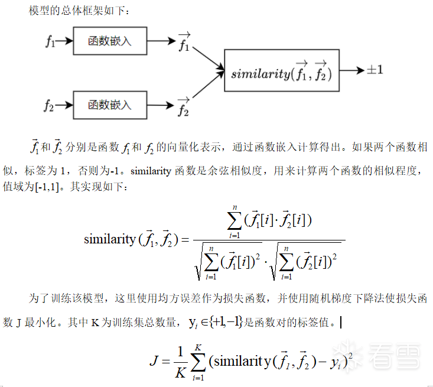
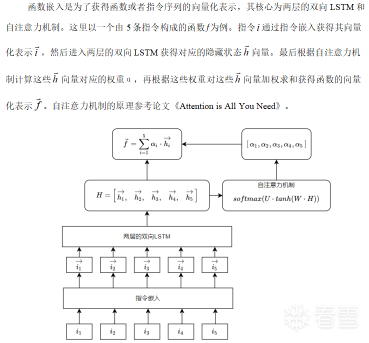
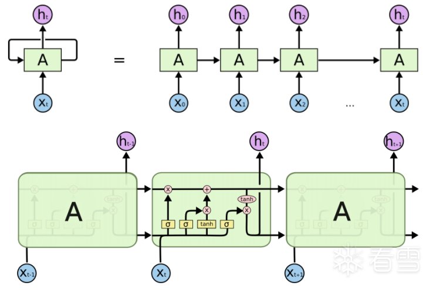
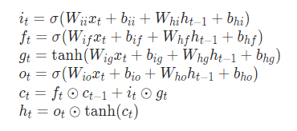
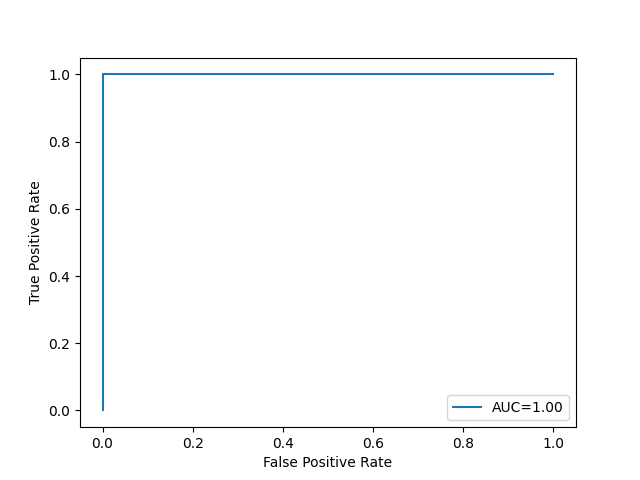
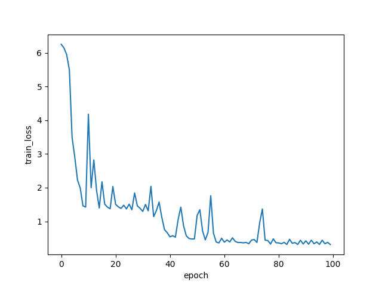
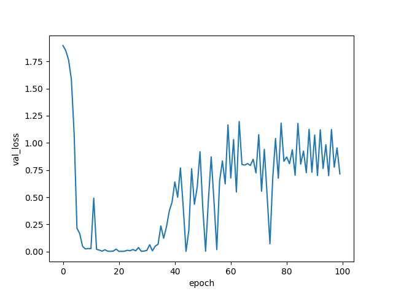
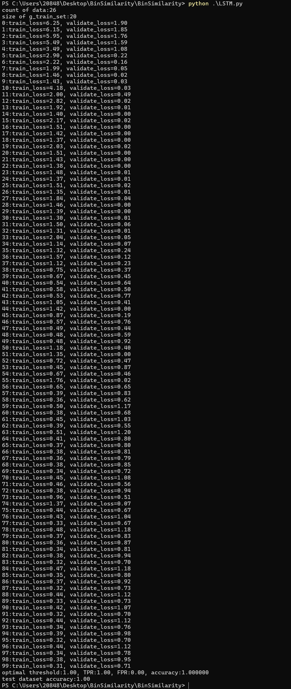

# 社交网络与舆情分析上机实验

## 题目：根据提取的二进制文件的`ACFG`计算`embedding`

写一个算法，根据提取的`ACFG`生成对应的`embedding`。

**参考思路：**

- 利用基于神经网络来生成`ACFG`嵌入,参考`Structure2Vec`计算`ACFG`的图嵌入


**实验要求**：

- 生成`ACFG`嵌入；
- 根据嵌入比较两个二进制文件的相似度。

## 实验原理

**总体框架**



**函数嵌入**



`LSTM`是`RNN`的一个变体，由于`RNN`容易梯度消失无法处理长期依赖的问题。`LSTM`在`RNN`的基础上增加了门结构，分别是输入门、输出门和遗忘门，在一定程度上可以解决梯度消失的问题，学习长期依赖信息。`LSTM`的结构如下：



运算规则如下：



`W`和`b`都是`LSTM`待学习的参数。

**指令嵌入**

指令嵌入的目的是也为了获得指令的向量化表示，方便`LSTM`等其它模型进行计算。这里使用`word2vec`的`skip-gram`模型实现。`word2vec`是谷歌公司开源的一个用于计算词嵌入的工具，包含`cbow`和`skip-gram`两个模型。指令嵌入具体实现细节如下：

(1)操作码、寄存器、加减乘符号以及中括号都看成一个词。比如`mov` `dowrd` `ptr` `[0x123456+eax*4]`, `ebx`这条指令可以得到`mov`，`dowrd`，`ptr`，`[`，`0x123456`，`+`，`eax`，`*`，`4`，`]`，`ebx`。然后这条指令看成一个句子送入`word2vec`进行训练，进而得到每一个词的向量化表示。

(2)为了减小词库的大小。操作数中超过`0x5000`的数值用`mem`，`disp`，`imm`代替

```shell
[0xXXXXXXXX] -> [mem]
[0xXXXXXXXX + index*scale + base] -> [disp + index*scale + base]
0xXXXXXXXX -> imm
```

(3)指令向量由一个操作码对应的向量和两个操作数对应的向量三部分组成，操作数不够的指令添加0向量补齐。对于超过两个操作数的指令，则最后两个操作数的向量求和取平均。操作数里面有多个词的情况下，各个词向量求和取平均表示当前操作数的向量。

## 代码实现

模型的代码实现用的是深度学习框架`pytorch`，`word2vec`的实现用的`gensim`库。`word2vec`的调用参数在`insn2vec.py`实现如下：

```python
model = Word2Vec(tokensList, vector_size=wordDim, negative=15, window=5, min_count=1, workers=1, epochs=10, sg=1)   
model.save('insn2vec.model')
```

`tokensList`的元素是一个列表，保存的是一条指令分词(`tokenization`)后的各个词序列。`word2vec`训练完成后保存到`insn2vec.model`文件，方便后续进行进一步的微调。
指令嵌入的实现在`lstm.py`文件中，实现如下：

```python
class instruction2vec(nn.Module):
    def __init__(self, word2vec_model_path:str):
        super(instruction2vec, self).__init__()
        word2vec = Word2Vec.load(word2vec_model_path)
        self.embedding = nn.Embedding.from_pretrained(torch.from_numpy(word2vec.wv.vectors))
        self.token_size = word2vec.wv.vector_size#维度大小
        self.key_to_index = word2vec.wv.key_to_index.copy()    #dict
        self.index_to_key = word2vec.wv.index_to_key.copy()    #list
        del word2vec
 
    def keylist_to_tensor(self, keyList:list):
        indexList = [self.key_to_index[token] for token in keyList]
        return self.embedding(torch.LongTensor(indexList))
 
    def InsnStr2Tensor(self, insnStr:str) -> torch.tensor:
        insnStr = RefineAsmCode(insnStr)
        tokenList = re.findall('\w+|[\+\-\*\:\[\]\,]', insnStr)
        opcode_tensor =  self.keylist_to_tensor(tokenList[0:1])[0]
        op_zero_tensor = torch.zeros(self.token_size)
        insn_tensor = None
        if(1 == len(tokenList)):
            #没有操作数
            insn_tensor = torch.cat((opcode_tensor, op_zero_tensor, op_zero_tensor), dim=0)
        else:
            op_token_list = tokenList[1:]
            if(op_token_list.count(',') == 0):
                #一个操作数
                op1_tensor = self.keylist_to_tensor(op_token_list)
                insn_tensor = torch.cat((opcode_tensor, op1_tensor.mean(dim=0), op_zero_tensor), dim=0)#tensor.mean求均值后变成一维
 
            elif(op_token_list.count(',') == 1):
                #两个操作数
                dot_index = op_token_list.index(',')
                op1_tensor = self.keylist_to_tensor(op_token_list[0:dot_index])
                op2_tensor = self.keylist_to_tensor(op_token_list[dot_index+1:])
                insn_tensor = torch.cat((opcode_tensor, op1_tensor.mean(dim=0), op2_tensor.mean(dim=0)), dim=0)
 
            elif(op_token_list.count(',') == 2):
                #三个操作数
                dot1_index = op_token_list.index(',')
                dot2_index = op_token_list.index(',', dot1_index+1)
                op1_tensor = self.keylist_to_tensor(op_token_list[0:dot1_index])
                op2_tensor = self.keylist_to_tensor(op_token_list[dot1_index+1:dot2_index])
                op3_tensor = self.keylist_to_tensor(op_token_list[dot2_index+1:])
 
                op2_tensor = (op2_tensor.mean(dim=0) + op3_tensor.mean(dim=0)) / 2
                insn_tensor = torch.cat((opcode_tensor, op1_tensor.mean(dim=0), op2_tensor), dim=0)
 
        if(None == insn_tensor):
            print("error: None == insn_tensor")
            raise
 
        insn_size = insn_tensor.shape[0]
        if(self.token_size * 3 != insn_size):
            print("error: (token_size)%d != %d(insn_size)" % (self.token_size, insn_size))
            raise
 
        return insn_tensor  #[len(tokenList), token_size]
 
    def forward(self, insnStrList:list) -> torch.tensor:
        insnTensorList = [self.InsnStr2Tensor(insnStr) for insnStr in insnStrList]
        return torch.stack(insnTensorList) #[insn_count, token_size]
```

`instruction2vec`类的作用就是指令嵌入，`token_size`是词的维度大小，指令维度的大小为`token_size*3`。初始过程中主要是加载`word2vec`训练好的词向量`word2vec.wv.vectors`，方便`InsnStr2Tensor`把字符串形式的指令转换到向量。
函数嵌入的代码实现如下：

```python
class SiameseNet(nn.Module):
    def __init__(self, hidden_size=60, n_layers=2, bidirectional = False):
        super(SiameseNet, self).__init__()
        self.insn_embedding = instruction2vec("./insn2vec.model")
        input_size = self.insn_embedding.token_size * 3
        #input_size为指令的维度, hidden_size为整个指令序列的维度
        self.lstm = nn.LSTM(input_size, hidden_size, n_layers, batch_first=True, bidirectional = bidirectional)
 
        self.D = int(bidirectional)+1
 
        self.w_omega = nn.Parameter(torch.Tensor(hidden_size * self.D, hidden_size * self.D))
        self.b_omega = nn.Parameter(torch.Tensor(hidden_size * self.D))
        self.u_omega = nn.Parameter(torch.Tensor(hidden_size * self.D, 1))
 
        nn.init.uniform_(self.w_omega, -0.1, 0.1)
        nn.init.uniform_(self.u_omega, -0.1, 0.1)
 
    def attention_score(self, x):
        #x:[batch_size, seq_len, hidden_size*D]
        u = torch.tanh(torch.matmul(x, self.w_omega))
        #u:[batch_size, seq_len, hidden_size*D]
        att = torch.matmul(u, self.u_omega)
        #att:[batch_size, seq_len, 1]
        att_score = F.softmax(att, dim=1)#得到每一个step的hidden权重
        #att_score:[batch_size, seq_len, 1]
        scored_x = x*att_score  #类似矩阵倍乘
        return torch.sum(scored_x, dim=1)#加权求和
 
    def forward_once(self, input:list) -> torch.tensor:
        lengths = []#记录每个指令序列的长度
        out = []
        for insnStrList in input:
            insnVecTensor = self.insn_embedding(insnStrList)#把指令转换到向量
            out.append(insnVecTensor)
            lengths.append(len(insnStrList))
 
        pad_out = pad_sequence(out, batch_first=True)#填充0使所有handler的seq_len相同
        pack_padded_out = pack_padded_sequence(pad_out, lengths, batch_first=True, enforce_sorted=False)
        packed_out,(hn,_) = self.lstm(pack_padded_out)#input shape:[batch_size, seq_len, input_size]
        #hn:[D*num_layers,batch_size,hidden_size]
        #out:[batch_size, seq_len, hidden_size*D]，此时out有一些零填充
        out,lengths = pad_packed_sequence(packed_out, batch_first=True)
        out = self.attention_score(out)
        return out
 
    def forward(self, input1, input2):
        out1 = self.forward_once(input1)#out1:[batch_size,hidden_size]
        out2 = self.forward_once(input2)
        out = F.cosine_similarity(out1, out2, dim=1)
        return out
```

因为函数嵌入的输入是一对函数，所以该模型也是一个共享参数的孪生神经网络。`hidden_size`是函数的维度大小，这里设置成60维。`attention_score`对应的是注意力机制，`w_omega`是`W`矩阵，`u_omega`是`U`矩阵。`pytorch`的`LSTM`输入类型为`[batch_size, seq_len, input_size]`的张量，相当于是一个`batch_size*seq_len*input_size`的矩阵，`batch_size`对应是函数个数，`seq_len`对应的是指令的个数。虽然`LSTM`可以处理任意长度的序列，但是为了加速运算，`pytorch`的`lstm`输入需要`seq_len`相同，所以需要添加0向量对齐。因为添加了0向量，对整个模型可能会有一定的影响。在经过`W`和`H`的点乘后，也就是`torch.tanh(torch.matmul(x, self.w_omega))`运算后需要一个特殊处理，需要把这些添加的0向量弄到负无穷大，这样在注意力机制的`softmax`运算中会使这部分向量对应的权重趋近于0，也就是注意力不应该放在这些0向量身上。

## 实验结果







