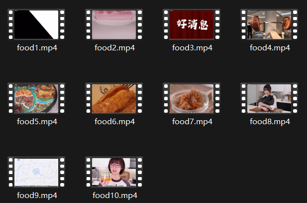
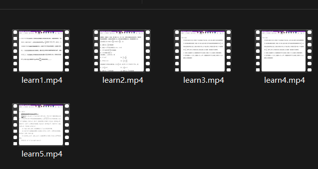
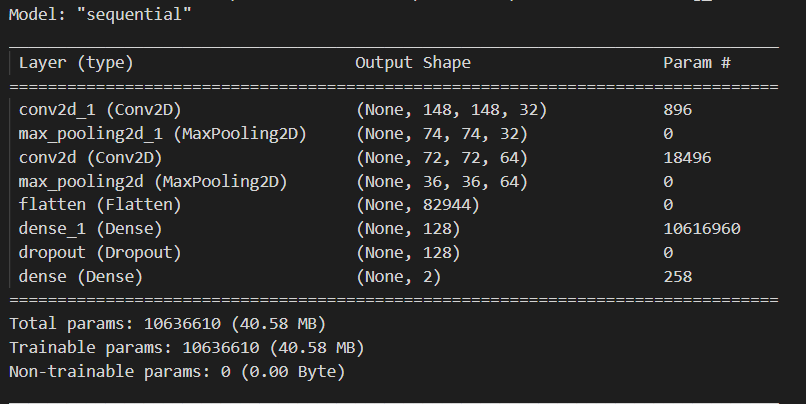
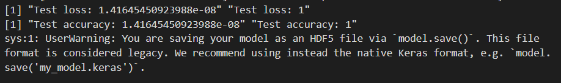
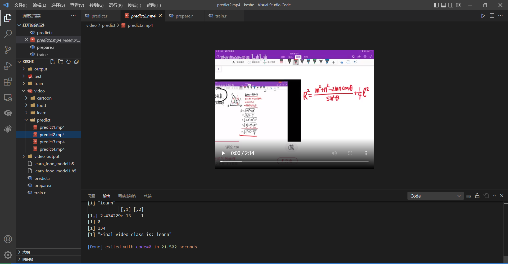

## 一、学习函数

### 1.implementation 

获取对用于实现Keras的Python模块的引用。

这个函数没有参数。

```shell
> library(keras)
> implementation()
Module(tensorflow.keras)
```

### 2.initializer_constant

生成初始化为常数值的张量的初始化器。

| 参数  |      含义      |
| :---: | :------------: |
| value | 生成器张量的值 |

```shell
> initializer_constant(value = 0)
2024-09-13 15:51:08.556584: I tensorflow/core/util/port.cc:113] oneDNN custom operations are on. You may see slightly different numerical results due to floating-point round-off errors from different computation orders. To turn them off, set the environment variable `TF_ENABLE_ONEDNN_OPTS=0`.
WARNING:tensorflow:From C:\Users\20848\DOCUME~1\VIRTUA~2\R-TENS~1\Lib\site-packages\keras\src\losses.py:2976: The name tf.losses.sparse_softmax_cross_entropy is deprecated. Please use tf.compat.v1.losses.sparse_softmax_cross_entropy instead.

<keras.src.initializers.initializers.Constant object at 0x000001C5CB4AAA10>
 signature: (shape, dtype=None, **kwargs)
```

### 3.initializer_glorot_normal

它从一个截断正态分布中抽样，该分布以0为中心，标准差为 `sqrt(2 / (fan_in + fan_out))`，其中`fan_in`是权重张量中的输入单元数量，`fan_out`是权重张量中的输出单元数量。

| 参数 |            含义            |
| :--: | :------------------------: |
| seed | 用于初始化随机生成器的整数 |

```shell
> initializer_glorot_normal(seed = NULL)
<keras.src.initializers.initializers.GlorotNormal object at 0x000001C5CB5F11D0>
 signature: (shape, dtype=None, **kwargs)
```

## 二、短视频分类

### 1.制作数据集

首先下载了B站up主绵羊料理和夏老师的数学课的视频，用视频分帧工具分好帧制放入文件夹中。





然后用以下代码分出训练集和测试集：

```R
# 加载必要的库
library(tidyverse)
library(imager)
library(caret)

# 获取所有图片路径
image_paths <- list.files("video_output/learn_output", full.names = TRUE)

# 获取标签信息
labels <- sapply(strsplit(image_paths, "/"), function(x) x[length(x)-1])

# 创建数据框用于存储路径和标签
df <- data.frame(path = image_paths, label = labels, stringsAsFactors = FALSE)

# 对标签进行因子编码
df$label <- as.factor(df$label)

# 划分训练集和测试集
set.seed(123) # 设置种子确保结果可复现
train_index <- createDataPartition(df$label, p = 0.8, list = FALSE)
train_set <- df[train_index, ]
test_set <- df[-train_index, ]

# 显示划分后的数据集大小
print(paste0("训练集大小: ", nrow(train_set)))
print(paste0("测试集大小: ", nrow(test_set)))

# 假定你的训练集和测试集文件夹已经创建好
train_dir <- "train/learn"
test_dir <- "test/learn"

# 创建函数以移动文件
move_files <- function(set, dest_dir) {
  for (i in 1:nrow(set)) {
    # 文件移动
    file.rename(set$path[i], file.path(dest_dir, basename(set$path[i])))
  }
}

# 移动训练集和测试集文件
move_files(train_set, train_dir)
move_files(test_set, test_dir)
```

至此，数据集制作完毕。

### 2.训练数据

接下来用keras训练一个CNN卷积神经网络模型，它主要适用于图片分类任务。

神经网络具体结构如下：

1. **`keras_model_sequential()`**：
   - 创建一个顺序模型，这是 Keras 中最简单的模型类型，它将各个层按顺序堆叠在一起。
2. **`layer_conv_2d(filters = 32, kernel_size = c(3, 3), activation = "relu", input_shape = c(150, 150, 3))`**：
   - 添加一个二维卷积层（2D Convolutional Layer）。`filters = 32` 表示使用 32 个卷积核，`kernel_size = c(3, 3)` 表示卷积核的大小为 3x3，`activation = "relu"` 使用 ReLU 激活函数，`input_shape = c(150, 150, 3)` 指定输入图像的尺寸为 150x150 像素，且有 3 个颜色通道（RGB）。
3. **`layer_max_pooling_2d(pool_size = c(2, 2))`**：
   - 添加一个最大池化层（Max Pooling Layer），`pool_size = c(2, 2)` 表示池化窗口的大小为 2x2。池化操作会缩小特征图的尺寸并减少计算复杂度。
4. **`layer_conv_2d(filters = 64, kernel_size = c(3, 3), activation = "relu")`**：
   - 添加另一个二维卷积层，`filters = 64` 表示使用 64 个卷积核，`kernel_size = c(3, 3)` 和 `activation = "relu"` 与第一个卷积层类似，但没有指定 `input_shape`，因为这层会自动推断输入形状。
5. **`layer_max_pooling_2d(pool_size = c(2, 2))`**：
   - 再次添加最大池化层，进一步缩小特征图的尺寸。
6. **`layer_flatten()`**：
   - 将多维的特征图展平成一维向量，以便可以连接到全连接层（Dense Layer）。
7. **`layer_dense(units = 128, activation = "relu")`**：
   - 添加一个全连接层，`units = 128` 表示该层有 128 个神经元，`activation = "relu"` 使用 ReLU 激活函数。
8. **`layer_dropout(rate = 0.5)`**：
   - 添加一个 Dropout 层，`rate = 0.5` 表示在训练过程中会随机丢弃 50% 的神经元，以防止过拟合。
9. **`layer_dense(units = 2, activation = "softmax")`**：
   - 添加输出层，全连接层，`units = 2` 表示模型用于二分类任务（例如分类为 2 个类别），`activation = "softmax"` 用于多分类问题，将输出转换为概率分布，使得所有类别的概率和为 1。

网络结构如下：



用以下代码进行训练：

```R
library(keras)
library(tidyverse)
library(magrittr)

# 读取所有图片路径
train_images <- list.files(file.path(getwd(), "train"), pattern = "\\.png$", full.names = TRUE)
test_images <- list.files(file.path(getwd(), "test"), pattern = "\\.png$", full.names = TRUE)

# 提取标签和路径
train_labels <- sapply(strsplit(train_images, "([_\\.])"), function(x) x[1])
test_labels <- sapply(strsplit(test_images, "([_\\.])"), function(x) x[1])

train_data <- data.frame(image_path = train_images, label = train_labels)
test_data <- data.frame(image_path = test_images, label = test_labels)

# 将标签转换为因子以便分类
train_data$label <- as.factor(train_data$label)
test_data$label <- as.factor(test_data$label)

# 创建数据生成器
# 创建一个ImageDataGenerator对象
train_datagen <- image_data_generator(rescale = 1/255)

# 使用flow_from_directory方法从目录加载数据
train_generator <- train_datagen %>% flow_images_from_directory(
  directory = file.path(getwd(), "train"),
  target_size = c(150, 150),
  batch_size = 32,
  class_mode = "categorical"
)

test_datagen <- image_data_generator(rescale = 1/255)

test_generator <- test_datagen %>% flow_images_from_directory(
  directory = file.path(getwd(), "test"),
  target_size = c(150, 150),
  batch_size = 32,
  class_mode = "categorical"
)

# 定义模型
model <- keras_model_sequential() %>%
  layer_conv_2d(filters = 32, kernel_size = c(3, 3), activation = "relu", input_shape = c(150, 150, 3)) %>%
  layer_max_pooling_2d(pool_size = c(2, 2)) %>%
  layer_conv_2d(filters = 64, kernel_size = c(3, 3), activation = "relu") %>%
  layer_max_pooling_2d(pool_size = c(2, 2)) %>%
  layer_flatten() %>%
  layer_dense(units = 128, activation = "relu") %>%
  layer_dropout(rate = 0.5) %>%
  layer_dense(units = 2, activation = "softmax")

# 编译模型
model %>% compile(
  loss = "categorical_crossentropy",
  optimizer = optimizer_rmsprop(lr = 2e-5),
  metrics = c("accuracy")
)
summary(model)

# 使用 fit 方法来训练模型
history <- model %>% fit(
  x = train_generator,
  steps_per_epoch = ceiling(train_generator$n / 32),
  epochs = 1,
  validation_data = test_generator,
  validation_steps = ceiling(test_generator$n / 32)
)

# 模型评估
scores <- model %>% evaluate(
  x = test_generator,
  steps = ceiling(test_generator$n / 32)
)
print(paste0("Test loss: ", scores))
print(paste0("Test accuracy: ", scores))

save_model_hdf5(model, "learn_food_model.h5")
```

训练结果如下：



### 3.预测

预测部分的原理十分简单，对未知类别的视频进行分帧，然后每一帧都用上面的模型做预测，把数量更多的那个标签作为最后视频的分类结果。

```R
# 1.清空视频帧文件夹

# 指定文件夹路径
folder_path <- "output"

# 删除文件夹中的所有文件
unlink(file.path(folder_path, "*"), recursive = TRUE)

# 2.视频分帧

# 设置视频文件路径和输出目录
video_path <- "video/predict/predict2.mp4"
output_dir <- "output"

# 创建输出目录（如果不存在的话）
if (!dir.exists(output_dir)) {
  dir.create(output_dir)
}

# 设置命令以每秒提取1帧
command <- sprintf(
  'ffmpeg -i "%s" -vf fps=1 "%s/frame_%%04d.png"',
  video_path, output_dir
)

# 执行命令
system(command)

# 3.预测视频标签

library(keras)
library(tidyverse)
library(magrittr)

# 加载模型
model <- load_model_hdf5("learn_food_model.h5")

# 提取帧
frames_path <- "output"  # 替换为你的帧目录
frames_list <- list.files(frames_path, full.names = TRUE)

food <- 0
learn <- 0

# 处理每一帧
for (frame in frames_list) {
  # 加载图片，并调整大小
  img <- image_load(frame, target_size = c(150, 150))
  
  # 预处理图片
  img_array <- image_to_array(img) / 255
  img_batch <- array_reshape(img_array, c(1, dim(img_array)))
  
  # 预测
  prediction <- predict(model, img_batch)
  
  # 获取类别标签
  labels <- c("food", "learn")
  predicted_class <- labels[max.col(prediction, ties.method = "first")]
  
  print(predicted_class)
  print(prediction)
  if (predicted_class == "food") {
    food = food + 1
  } else {
    learn = learn + 1
  }
}

print(food)
print(learn)
if (food > learn){
  print("Final video class is: food")
} else {
  print("Final video class is: learn")
}
```

我用一个未知的视频做测试，由下图所示，它很好的做出了预测：


