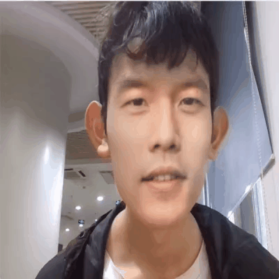

# 计算机视觉大作业

## 换脸相机📸

### 功能一 手势控制换明星脸


### 功能二 人脸🧔变动物🐈🐼🦧

注意上传图片需保证大小为400*400



## 安装方法

`conda`创建`python3.9`的虚拟环境

```shell
conda create --name test1 python=3.9.19
```

进入虚拟环境

```shell
conda activate test1
```

下载`dlib`

```shell
conda install -c conda-forge dlib
```

下载其他库

```shell
pip install -r requirements.txt
```

运行

```shell
streamlit run demo.py
```

