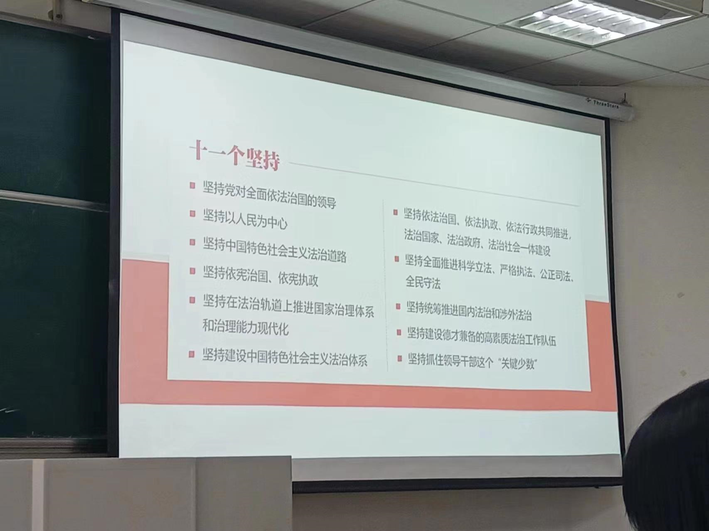

# 毛概复习

## 题型分布

- 简答4题20分

- 论述2题14分

- 材料分析2题16分

## 重点范围

### 1.习近平新时代中国特色社会主义思想回答了什么重大时代课题：

- 新时代坚持和发展什么样的中国特色社会主义、怎样坚持和发展中国特色社会主义
- 建设什么样的社会主义现代化强国、怎样建设社会主义现代化强国
- 建设什么样的长期执政的马克思主义政党、怎样建设长期执政的马克思主义政党
- 等

### 2.中国式现代化的科学内涵：与其他现代化的共同特征+五个特色

**科学内涵**

中国式现代化，是中国共产党领导的社会主义现代化，既有各国现代化的共同特征，更有基于自己国情的中国特色。

**五个特色**

- 人口规模巨大

- 全体人民共同富裕

- 物质文明和精神文明相协调

- 人与自然和谐共生

- 走和平发展道路

### 3、 我国社会主义经济制度的主要内容：

- 社会主义基本经济制度是我国经济发展的制度基础

- 坚持公有制为主体、多种所有制经济共同发展

- 坚持按劳分配为主体、多种分配方式并存

- 加快完善社会主义市场经济体制

### 4、 如何办好人民满意的教育（论述/简答？）

- 必须深化教育领域综合改革
  - 破解深层次体制机制障碍
  - 健全推动教育改革的 法定程序
  - 以内涵式的发展 统领各项改革
  - 促进各级各类教育 更符合教育规律

- 必须促进教育公平
  - 坚持教育公益性原则，把教育公平作为国家基本教育政策。

- 必须建设高质量教育体系
  - 加快建设中国特色、 世界一流的大学和优势学科，全面提高人才自主培养质量。

- 必须加强教师队伍建设 
  - 教师是立教之本、兴教之源。全国广大教师要做“四有”好老。
  - 全国广大教师要做“四有”好老师：有理想信念、有道德情操、有扎实学识、有仁爱之心

### 5、 中国特色社会主义法治体系的基本框架

- 完备的法律规范体系

- 高效的法治实施体系

- 严密的法治监督体系

- 有力的法治保障体系

- 完善的党内法规体系

**习近平法治思想的核心要义**

### 6、 绿水青山就是金山银山的内涵

**三句话**（要记住？）

- 我们既要绿水青山，也要金山银山。
- 宁要绿水青山，不要金山银山。
- 而且绿水青山就是金山银山。

**内涵**

- 这是重要的发展理念，也是推进现代化建设的重大原则。绿水青山就是金山银山，符合人类社会发展规律，顺应人民群众对美好生活的期盼，已经成为全党全社会的思想共识和行动自觉。

- 绿水青山就是金山银山，阐述了**经济发展**和**生态环境保护**的关系，揭示了保护生态环境就是保护生产力、改善生态环境就是发展生产力的道理，指明了实现发展和保护协同共生的新路径。生态环境保护和经济发展不是矛盾对立的关系，而是辩证统一的关系。生态环境保护也是要坚持在发展中保护、在保护中发展。

- 良好生态环境是最公平的公共产品，是最普惠的民生福祉。对人的生存来说，金山银山固然重要，但绿水青山是人民幸福生活的重要内容，是金钱不能代替的。发展经济是为了民生，保护生态环境同样也是为了民生。

### 7、 总体国家安全观（可能考？）

我们要坚持以人民安全为宗旨、以政治安全为根本、以经济安全为基 础、以军事科技文化社会安全为保障、以促进国际安全为依托，统筹外部 安全和内部安全、国土安全和国民安全、传统安全和非传统安全、自身安 全和共同安全，统筹维护和塑造国家安全，夯实国家安全和社会稳定基层 基础，完善参与全球安全治理机制，建设更高水平的平安中国，以新安全 格局保障新发展格局。 ——习近平在中国共产党第二十次全国代表大会上的报告 （2022年10月16日）

**总体国家安全观的丰富内涵**

- 强调大安全理念

-  强调科学统筹

  五个统筹

  - 统筹外部安全和内部安全 
  - 统筹国土安全和国民安全 
  - 统筹传统安全和非传统安全 
  - 统筹自身安全和共同安全 
  - 统筹维护国家安全和塑造国家安全
-  强调打总体战
-  强调统筹发展和安全两件大事

**总体国家安全观的核心要义：十个坚持**

- 党对国家安全工作的绝对领导
- 中国特色国家安全道路  
- 以人民安全为宗旨
- 统筹发展和安全  
- 把政治安全放在首位
- 统筹推进各领域安全  
- 把防范化解国家安全风险摆在突出位置
- 推进国际共同安全  
- 推进国家安全体系和能力现代化
- 加强国家安全干部队伍建设

**总体国家安全观的意义**

- 理论意义

  总体国家安全观深化了我们党对中国特色社会主义建设规律的认识， 为发展马克思主义国家安全理论作出了重大原创性贡献。

- 文化意义

  总体国家安全观提炼中华优秀传统战略文化，总结我们党维护国家安全的理论和实践成果，为 坚持把马克思主义基本原理同中国具体实际相结 合、同中华优秀传统文化相结合树立了光辉典范。

- 实践意义

  总体国家安全观经过实践检验、富有实践伟力，为维护和塑造新时 代国家安全提供了行动纲领。

- 世界意义

  总体国家安全观开辟了国家安全治理新路，为推动和完善全球安全治 理贡献了中国方案。

**贯彻总体国家安全观要统筹推进重点领域安全**

- 维护政治安全
- 维护国土安全
- 维护经济安全
- 维护社会安全
- 维护网络安全
- 维护外部安全

### 8、 人类命运共同体

**人类命运共同体的内涵**

人类命运共同体，顾名思义，就是每个民族、每个国家的前途 命运都紧紧联系在一起，应该风雨同舟，荣辱与共，努力把我们生于斯、长于斯的这个星球建成一个和睦的大家庭，把世界各国人民 对美好生活的向往变成现实。

**如何理解人类命运共同体的内涵**（可能考？）

人类生活在同一个地球村，生活在历史和现实交汇的同一个时空，越来越成为你中有我，我中有你的命运共同体。构建人类命运共同体是为解决世界之问、人类之问、时代之问而提出的中国方案，需要国际社会从伙伴关系、安全格局、 经济发展、文明交流、生态建设等方面作出努力。

**构建人类命运共同体的目标和原则**

- 中国坚持对话协商，推动建设一个持久和平的世界；

- 坚持共建共享， 推动建设一个普遍安全的世界；

- 坚持合作共赢，推动建设一个共同繁荣 的世界；

- 坚持交流互鉴，推动建设一个开放包容的世界；

- 坚持绿色低碳， 推动建设一个清洁美丽的世界。 

### 9、 全面从严治党

- 从严治党是马克思主义政党的政治优势

- 全面从严治党是实现民族复兴的根本保证

- 全面从严治党是决定党兴衰成败的关键因素

### 10、文化对国家和民族的重要性，如何推动社会主义文化大发展、大繁荣

**重要性**

- 文化兴国运兴，文化强民族强
- 文化是一个国家、一个民族的灵魂
- 中国文化具有独特性
- 文化自信是更基础、更广泛、更深厚的自信，是一个国家、 一个民族发展中最基本、最深沉、最持久的力量。
- 没有文化繁荣兴盛就没有中华民族伟大复兴
- 更好满足人民日益增长的精神文化需要

**如何推动社会主义文化大发展、大繁荣**

- 推动中华优秀传统文化创造性转化、创新性发展

- 用中国特色社会主义文化培根铸魂

- 推进文化事业和文化产业全面发展

-  讲好中国故事，传播好中国声音

### 11、全过程人民民主好在哪里，如何进一步发展全过程人民民主

**好在哪里**

- 全过程人民民主是最广泛、最真实、最管用的社会主义民主

- 人民民主参与不断扩大

- 国家治理高效

- 社会和谐稳定

-  权力运用得到有效制约和监督

**如何进一步发展全过程人民民主**

- 坚持走中国特色社会主义政治发展道路
- 加强人民当家作主制度保障
- 全面发展协商民主
- 积极发展基层民主
- 巩固和发展最广泛的爱国统一战线