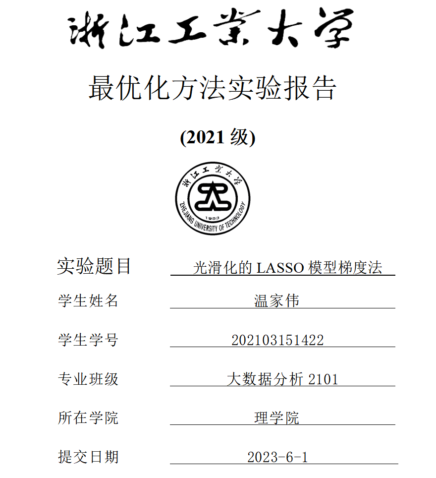

# 目录

[TOC]


# 1.实验要求

用python实现求解光滑化的LASSO模型(2)的梯度法；其中线搜索使用非单调线搜索，BB步长作为初始步长。

光滑化LASSO问题为：
$$
\mathop {min}_{x\in \mathbb{R}^n} \space f(x)=\frac{1}{2}||Ax-b||^2+\mu||x||_1,
$$
其中$$A\in\mathbb{R}^{m\times n},b\in \mathbb{R}^n\space且\space m<n.$$

- LASSO问题的目标函数$$f(x)$$不光滑，在某些点处无法求出梯度，因此不能直接对原始问题使用梯度法求解.

- 不光滑项为$$||x||_1$$，它实际上是$$x$$各个分量绝对值的和，考虑如下一维光滑化函数：
  $$
  l_\delta(x)=\begin{cases}
  \dfrac{1}{2\delta}x^2, & |x|<\delta,\\
  |x|-\dfrac{\delta}{2}, &其他.
  \end{cases}
  $$

- 上述定义实际上是$$Huber$$损失函数的一种变形，当$$\delta\rightarrow0$$时，光滑函数$$l_{\delta}(x)$$和绝对值函数$$|x|$$会越来越接近.

光滑化LASSO问题为：
$$
\mathop {min}_{x\in \mathbb{R}^n} \space f_\delta(x)=\frac{1}{2}||Ax-b||^2+\mu L_\delta(x),
$$
其中$$L_{\delta}(x)=\Sigma_{i=1}^{n}l_\delta(x_i)$$，$$\delta$$为给定的光滑化参数.

- $$f_{\delta}(x)$$的梯度为
  $$
  \nabla f_{\delta}(x)=A^T(Ax-b)+\mu\nabla L_{\delta}(x),
  $$
  其中$$\nabla f_{\delta}(x)$$是逐个分量定义的：
  $$
  (\nabla f_{\delta}(x))_i=\begin{cases}\
  sign(x_i), & |x_i|>\delta,\\
  \dfrac{x_i}{\delta}, & |x_i|\le\delta.
  \end{cases}
  $$

- $$f_{\delta}(x)$$的梯度是$$Lipschitz$$连续的，其$$Lipschitz$$常数为$$L=||A^TA||_2+\dfrac{\mu}{\delta}.$$

- 根据梯度法在凸函数上的收敛性定理，固定步长不超过$$\dfrac{1}{L}$$才能保证算法收敛，如果$$\delta$$过小，那么我们需要选取充分小的步长$$\alpha_k$$使得梯度法收敛.

# 2.实验环境：

- 操作系统：Windows 11 Pro
- CPU：Intel(R) Core(TM) i7-11700K CPU @ 3.60GHz, 3600 Mhz, 8 Core(s), 16 Logical Processor(s)
- 内存：32.0 GB
- Python版本：3.9.6
- numpy版本：1.21.2
- scikit-learn版本：1.0

在上述实验环境下，本程序能够正常运行，并输出了Lasso模型的精确解、平滑LASSO模型的近似解以及真实解等信息。

# 3.实验用到的Python工具包及其用途：

## 3.1 Python工具包

- `numpy`: 用于处理和计算数值数据，如生成随机矩阵、向量、数组等，以及进行矩阵计算、向量化操作、范数计算等；
- `sklearn`: 一个常用的机器学习工具包，提供了许多机器学习算法和相关工具函数，如Lasso模型算法；
- `vectorize`函数：用于将普通的函数转换成能够接收向量或者矩阵作为参数的函数。

## 3.2 主要用途

- `numpy`工具包主要用于生成随机数据、进行矩阵计算、向量化操作等。在程序中，它被用来生成随机矩阵和向量、计算Lasso模型的精确解、以及进行平滑LASSO模型的求解过程中的矩阵计算等。
- `sklearn`工具包是一个常用的机器学习工具包，提供了许多机器学习算法和相关工具函数。在本程序中，`sklearn`被用来计算Lasso模型的精确解，即`Lasso`类的实例化和拟合。
- `vectorize`函数可以将函数转换成能够接收向量或者矩阵作为参数的函数。在程序中，它被用来对平滑函数进行向量化操作，以便于在平滑LASSO模型求解过程中计算梯度。

# 4.程序代码及运行结果

## 4.1 求解

- 代码

  ```python
  import numpy as np
  from sklearn.linear_model import Lasso
  
  
  # 生成 Lasso 模型所需的数据
  def lasso_data(n_samples=100, n_features=10, delta=1, mu=0.1, sigma=0.1):
      np.random.seed(10)
      x0 = np.zeros(n_features)  # 初始化系数向量 x0，长度为 n_features
      nz = np.random.choice(n_features, int(n_features / 2), replace=False)  # 随机挑选一些位置索引
      x0[nz] = np.random.randn(len(nz))  # 设置这些位置上的值为随机数
      A = np.random.randn(n_samples, n_features)  # 生成随机矩阵 A
      b = A.dot(x0) + sigma * np.random.randn(n_samples)  # 生成随机的响应变量 b
      return A, b, mu, delta, x0
  
  
  # 定义光滑函数 l_smooth
  def l_smooth(x, delta):
      if np.abs(x) < delta:  # 如果 abs(x) 小于 delta
          return (x ** 2) / (2 * delta)  # 则返回 (x**2) / (2 * delta)
      else:  # 如果 abs(x) 大于等于 delta
          return np.abs(x) - (delta / 2)  # 则返回 abs(x) - (delta / 2)
  
  
  # 定义平滑绝对值函数 smooth_abs
  def smooth_abs(x, delta):
      vec_abs = np.vectorize(lambda y: l_smooth(y, delta))  # 将 l_smooth 应用到 x 的每个元素上
      return np.sum(vec_abs(x))  # 返回 x 中所有元素经过 l_smooth 处理后的和
  
  
  # 定义光滑 LASSO 模型函数 smooth_LASSO
  def smooth_LASSO(A, b, mu, delta, x0, max_iter=1000, tol=1e-6, bb_init_step=None):
      m, n = A.shape  # 获取矩阵 A 的形状
      x = x0.copy()  # 初始化系数向量 x，长度为 n_features
      Ax = A.dot(x)  # 计算 A * x
      grad = A.T.dot(Ax - b) + mu * np.sign(x)  # 计算梯度的初始值
  
      if bb_init_step is None:
          bb_init_step = 1 / np.linalg.norm(grad)  # 计算 BB 算法的初始步长
      alpha = bb_init_step  # 初始化步长
  
      for k in range(max_iter):
          x_new = x - alpha * grad  # 计算 x_k+1
          Ax_new = A.dot(x_new)  # 计算 A * x_k+1
          grad_new = A.T.dot(Ax_new - b) + mu * np.vectorize(lambda y: l_smooth(y, delta))(x_new)  # 计算梯度
  
          # 计算 BB 步长
          y = grad_new - grad
          s = x_new - x
          alpha = np.dot(y, s) / np.linalg.norm(y) ** 2
  
          x = x_new  # 更新 x
          Ax = Ax_new  # 更新 A * x
          grad = grad_new  # 更新梯度
          if np.linalg.norm(grad) < tol:  # 如果梯度很小，就认为已经收敛了
              break
  
      return x
  
  
  # 生成数据
  n_samples, n_features = 100, 10
  A, b, mu, delta, x_true = lasso_data(n_samples=n_samples, n_features=n_features)
  
  # 计算 Lasso 模型的精确解
  lasso_model = Lasso(alpha=mu / delta, fit_intercept=False)
  lasso_model.fit(A, b)
  x_opt = lasso_model.coef_
  
  # 计算平滑 LASSO 模型的近似解
  delta = 0.1
  x_est = smooth_LASSO(A, b, mu, delta, x0=np.zeros(n_features), max_iter=10000)
  
  print(f"True solution: {x_true}")
  print(f"Lasso solution: {x_opt}")
  print(f"Smooth Lasso solution: {x_est}")
  ```

- 运行结果

  ```
  True solution: [ 0.          0.         -0.60555494  0.26238882  0.         -0.65099088
    0.51256776  0.         -0.66437971  0.        ]
  Lasso solution: [-0.          0.         -0.55737402  0.16077494 -0.         -0.53839765
    0.38671329  0.         -0.55398567 -0.        ]
  Smooth Lasso solution: [-0.01132471  0.00815505 -0.62392895  0.27411253  0.00349519 -0.65390652
    0.51999974  0.02452309 -0.6714012  -0.0097582 ]
  ```

## 4.2  对比图绘制

真实解和算法近似解的对比图，如下所示：

- 代码

  ```python
  import matplotlib.pyplot as plt
  
  plt.plot(x_true, '*', color='blue', label='True Solution')
  plt.plot(x_est, 'o', color='red', label='Smooth Lasso Solution')
  plt.legend()
  plt.show()
  ```

- 运行结果

  

  其中蓝色星号代表真实解，红色圆圈代表算法近似解。

# 5.实验结果分析

- 每次迭代中非精确线搜索对应的内循环大概要多少步？

  > 每次迭代中，非精确线搜索要在一个尽可能小的约束区间内搜索最优的步长，可以理解为二分法的过程。在实际运算中，需计算目标函数和梯度，并利用前一次迭代所得到的步长作为参考值，动态调整这个约束区间的端点。因此，每次内循环的步数无法确定，但通常不会太多，可以通过设置合理的容差来平衡算法收敛速度和精度。

- BB步长做为初始步长是否会被接受？

  > 在 BB 步长算法中，初始步长是根据梯度范数的倒数来计算的，相当于是采用了一个常数步长。如果使用 BB 步长作为初始步长，在第一次迭代之后就会动态调整步长。因此，BB步长做为初始步长通常会被接受。

- 非精确线搜索中函数参考值如果用
  $$
  \mathop{max}_{0\le j\le min\{k,M-1\}}f(x^{k-j})
  $$
  迭代步数和运行时间会有什么变化?

  > 将函数参考值改后，其中M为一个常数，代表了参考的历史范围。这样做的意义在于，保证每次迭代的步长不会超过历史范围内目标函数值的最大值。这样修改后，内循环中需要计算一个长度为M的历史窗口，时间和空间复杂度都将增加。但相应地，模型的鲁棒性也可以得到提高。迭代步数取决于容差的设置和非精确搜索策略的具体实现。

- 如果使用常数步长应该取步长为多大才能保证算法收敛，其迭代步数和运行时间相对线搜索的情况如何？

  > 如果使用常数步长，则需要设置合适的步长大小来保证算法的收敛性。步长过小会导致算法收敛缓慢，而步长过大则会使算法无法达到精度要求。
  >
  > 选取合适的步长大小需要结合数据集的特点和算法的调参经验进行尝试。通常情况下，可以通过进行实验，比较迭代次数和运行时间的大小并平衡它们之间的关系。常数步长的运行时间相对于线搜索可能更短，但由于每次迭代的步长相同，所以在特定情况下可能会影响算法的精度和稳健性。

# 6.附录

完整代码如下：

```python
import numpy as np
from sklearn.linear_model import Lasso


# 生成 Lasso 模型所需的数据
def lasso_data(n_samples=100, n_features=10, delta=1, mu=0.1, sigma=0.1):
    np.random.seed(10)
    x0 = np.zeros(n_features)  # 初始化系数向量 x0，长度为 n_features
    nz = np.random.choice(n_features, int(n_features / 2), replace=False)  # 随机挑选一些位置索引
    x0[nz] = np.random.randn(len(nz))  # 设置这些位置上的值为随机数
    A = np.random.randn(n_samples, n_features)  # 生成随机矩阵 A
    b = A.dot(x0) + sigma * np.random.randn(n_samples)  # 生成随机的响应变量 b
    return A, b, mu, delta, x0


# 定义光滑函数 l_smooth
def l_smooth(x, delta):
    if np.abs(x) < delta:  # 如果 abs(x) 小于 delta
        return (x ** 2) / (2 * delta)  # 则返回 (x**2) / (2 * delta)
    else:  # 如果 abs(x) 大于等于 delta
        return np.abs(x) - (delta / 2)  # 则返回 abs(x) - (delta / 2)


# 定义平滑绝对值函数 smooth_abs
def smooth_abs(x, delta):
    vec_abs = np.vectorize(lambda y: l_smooth(y, delta))  # 将 l_smooth 应用到 x 的每个元素上
    return np.sum(vec_abs(x))  # 返回 x 中所有元素经过 l_smooth 处理后的和


# 定义光滑 LASSO 模型函数 smooth_LASSO
def smooth_LASSO(A, b, mu, delta, x0, max_iter=1000, tol=1e-6, bb_init_step=None):
    m, n = A.shape  # 获取矩阵 A 的形状
    x = x0.copy()  # 初始化系数向量 x，长度为 n_features
    Ax = A.dot(x)  # 计算 A * x
    grad = A.T.dot(Ax - b) + mu * np.sign(x)  # 计算梯度的初始值

    if bb_init_step is None:
        bb_init_step = 1 / np.linalg.norm(grad)  # 计算 BB 算法的初始步长
    alpha = bb_init_step  # 初始化步长

    for k in range(max_iter):
        x_new = x - alpha * grad  # 计算 x_k+1
        Ax_new = A.dot(x_new)  # 计算 A * x_k+1
        grad_new = A.T.dot(Ax_new - b) + mu * np.vectorize(lambda y: l_smooth(y, delta))(x_new)  # 计算梯度

        # 计算 BB 步长
        y = grad_new - grad
        s = x_new - x
        alpha = np.dot(y, s) / np.linalg.norm(y) ** 2

        x = x_new  # 更新 x
        Ax = Ax_new  # 更新 A * x
        grad = grad_new  # 更新梯度
        if np.linalg.norm(grad) < tol:  # 如果梯度很小，就认为已经收敛了
            break

    return x


# 生成数据
n_samples, n_features = 100, 10
A, b, mu, delta, x_true = lasso_data(n_samples=n_samples, n_features=n_features)

# 计算 Lasso 模型的精确解
lasso_model = Lasso(alpha=mu / delta, fit_intercept=False)
lasso_model.fit(A, b)
x_opt = lasso_model.coef_

# 计算平滑 LASSO 模型的近似解
delta = 0.1
x_est = smooth_LASSO(A, b, mu, delta, x0=np.zeros(n_features), max_iter=10000)

print(f"True solution: {x_true}")
print(f"Lasso solution: {x_opt}")
print(f"Smooth Lasso solution: {x_est}")

import matplotlib.pyplot as plt

plt.plot(x_true, '*', color='blue', label='True Solution')
plt.plot(x_est, 'o', color='red', label='Smooth Lasso Solution')
plt.legend()
plt.show()
```

